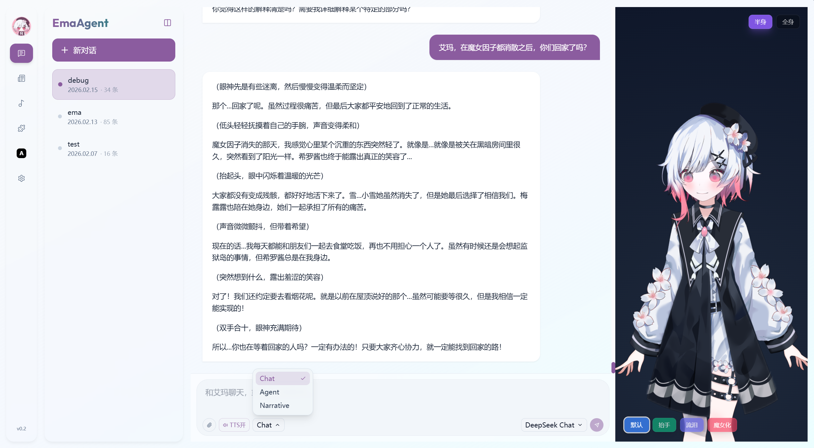
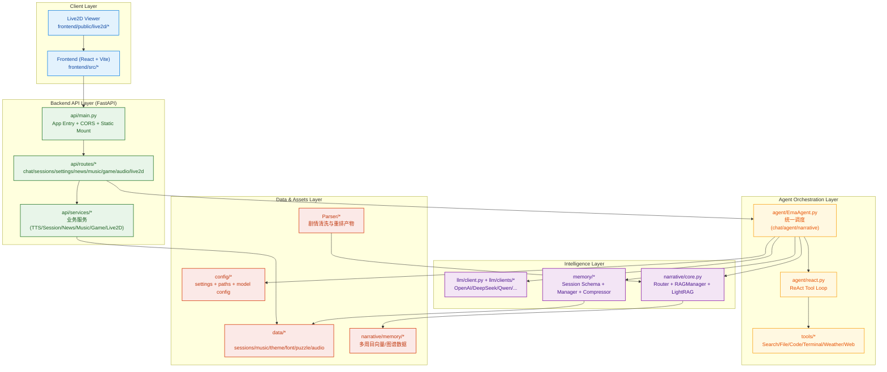
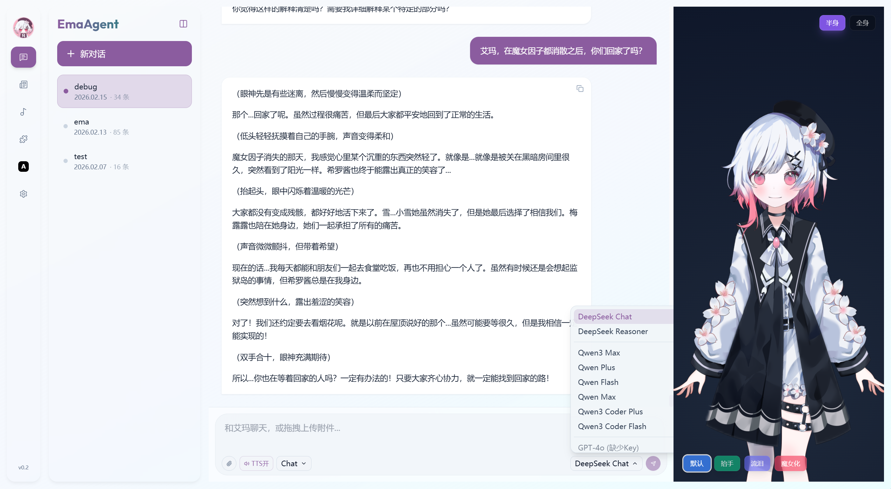
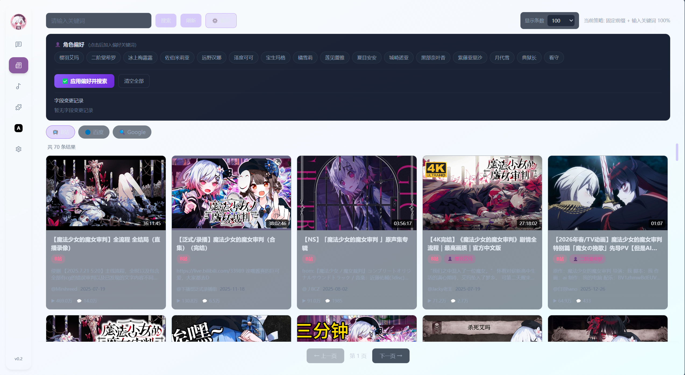
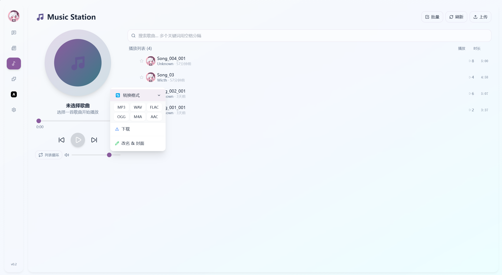
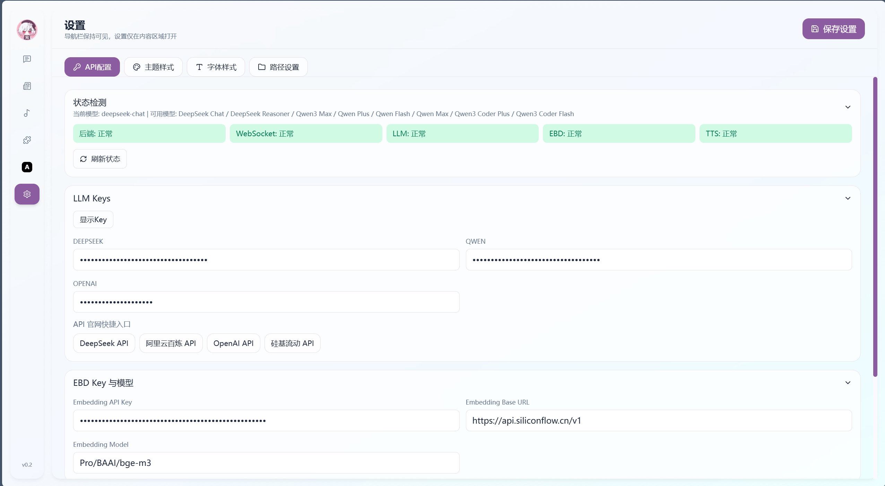
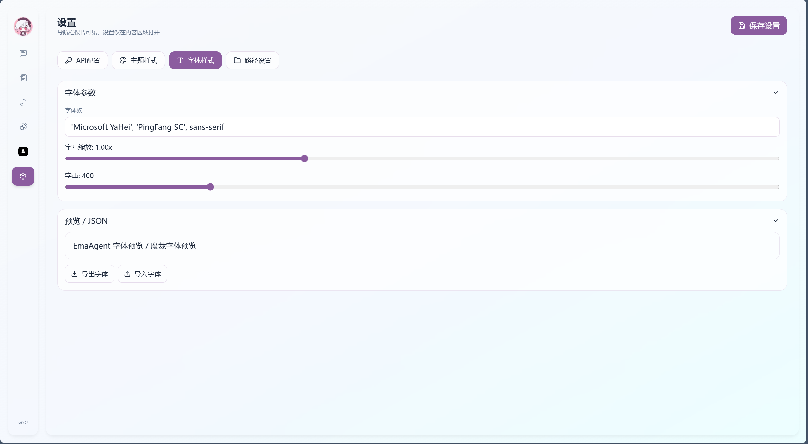
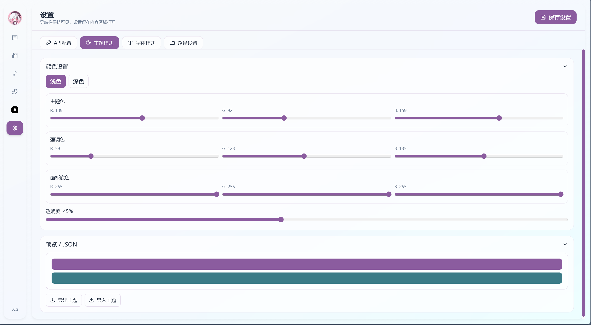

# EmaAgent 


始于 EmaAgent 但不止于只有 Ema 的 Agent

换上其他角色的 `人设Prompt` `Live2D` `参考音频` 并更改少部分文件内容 就可以是任何角色的Agent

做齐魔裁所有角色的智能体 就能开`线上魔女审判`


---

EmaAgent 是一个多模式智能助手系统 也是我的第一个智能体项目 核心包含：

- `chat` 普通对话模式
- `agent` 工具调用模式(ReAct)
- `narrative` 叙事检索模式(Router + LightRAG) 支持不含BE的全剧情检索
- WebSocket 流式输出 + 分段 TTS + 合并回放
- 会话持久化与上下文压缩
- Live2D 状态联动



---

## AI使用情况
### 后端
`api`文件夹的全部文件

其余文件夹均进行内容扩写, 约 `60%`

### 前端
全部 前端是梅露露教的 


---

## 更新计划 
- [ ] 详细的使用教程
- [x] 一键部署
- [ ] 日文语音输出
- [ ] 拓展 `Tool` 功能 实现更强大的 Agent 模式
- [ ] UI美化 自选主题
- [ ] Live2D 优化(Live2D没做好)
- [ ] 架构优化
- [ ] 增加更多`LLM` `EBD` `TTS` 模型接口

总之有很多要更新

能做EmaAgent 肯定能做其他角色的智能体

魔裁所有角色智能体 `subAgent` 都做完后 可以集成到一个大的智能体中 `MainAgent`

可以开线上魔女审判`agent to agent` 让她们自主聊天

就是 `Token` 消耗要上天了

---

## 更新日志

<details>

### v0.2 - 2026-02-21
- TTS模块改为Factory模式 感谢[CodeCCsky](https://github.com/CodeCCsky)
- 修复narrative中莫名显示周目剧情查询内容无效的部分bug

### v0.2 - 2026-02-16
- 使用 `uv` 进行快速部署
- 新增 `react.py` 同一错误连续出现的检测

### v0.2 - 2026-02-15
- 开源

### v0.1 - 2026-01-14
- 实现 `narrative` 功能
- 只能在终端上运行

### 2025-12-09
- 准备开发

### 2025-11
- 刚学 Agent
  
</details>

---

## 架构总览



---

## 文档导航

| 文档 | 说明 |
|---|---|
| [`agent/README.md`](./agent/README.md) | Agent 编排层与 ReAct 执行流 |
| [`api/README.md`](./api/README.md) | API 分层与入口说明 |
| [`api/routes/README.md`](./api/routes/README.md) | 全部 REST/WS 路由说明 |
| [`api/services/README.md`](./api/services/README.md) | 业务服务层说明 |
| [`config/README.md`](./config/README.md) | 路径 配置与环境变量体系 |
| [`llm/README.md`](./llm/README.md) | LLM 配置与统一客户端 |
| [`memory/README.md`](./memory/README.md) | 会话模型 持久化与压缩 |
| [`narrative/README.md`](./narrative/README.md) | 叙事路由与 LightRAG 管理 |
| [`Parser/README.md`](./Parser/README.md) | 剧情脚本清洗 重排与入库前处理 |
| [`tools/README.md`](./tools/README.md) | 工具系统与可扩展能力 |

---

## 配置API Key
基础LLM模型可选`DeepSeek` `Qwen` `OpenAI` 三类接入 三选一即可
- `DeepSeek` [API](https://platform.deepseek.com/api_keys)
- `Qwen` [API](https://bailian.console.aliyun.com/cn-beijing?tab=model&utm_content=se_1023046479#/api-key)
- `OpenAI` [API](https://platform.openai.com/settings/organization/api-keys)

Embedding向量编码模型与TTS文本转语音模型目前使用`siliconflow`

后续更新会增加更多接入模型
- `siliconflow`[API](https://cloud.siliconflow.cn/me/account/ak)

获取Key后,直接在`.env`文件下修改即可

如果没找到`.env`文件 在根目录下新建 `.env` 文件并复制粘贴以下内容

记得配置API的时候充点钱

```text
# LLM API Keys
DEEPSEEK_API_KEY=your_deepseek_key_here
OPENAI_API_KEY=your_openai_key_here
QWEN_API_KEY=your_qwen_key_here

# Embeddings & TTS
SILICONFLOW_API_KEY=your_siliconflow_key_here
```

---

## 一键启动
默认使用 [uv 启动](#uv-启动)

目前只测试了 Windows 环境 Linux 环境还没测试

### Windows 系统

进入根目录下

点击 `install.bat` 执行安装命令 会自动执行[uv 启动](#uv-启动)的 `setup.ps1` 命令

安装完毕后 再点击 `start.bat` 一键启动 会自动执行[uv 启动](#uv-启动)的 `start.ps1` 命令

---

## uv 启动
目前只测试了 Windows 环境 Linux 环境还没测试

### Windows系统
进入到根目录下

先安装环境
```shell
# 一键环境安装（uv + Python + nvm + Node + 前端依赖）
powershell -ExecutionPolicy Bypass -File .\setup.ps1
```

再一键启动
```shell
# 一键启动（后端8000 + 前端5173）
powershell -ExecutionPolicy Bypass -File .\start.ps1
```

---

## 正常启动

### 1. 环境准备

- Python 3.12+
- Node.js 18+
- AnaConda(可选)

### 2. 下载并安装依赖包

你可以二选一：

方式 A：直接使用系统 Python 环境

```bash
python -m pip install -r requirements.txt
```

方式 B：使用 Conda 新建独立环境

需要你下载AnaConda

```bash
conda create -n Ema python=3.12 -y
conda activate Ema
python -m pip install -r requirements.txt
```

后端:

```bash
python -m pip install -r requirements.txt
```

前端:

```bash
cd frontend
npm install
cd ..
```

---

### 3. 启动
进入文件根目录

后端:

```bash
uvicorn api.main:app --host 0.0.0.0 --port 8000
```

前端:

```bash
cd frontend
npm install
npm run dev
```

---

### 4. 访问地址

- 前端: `http://localhost:5173`
- 后端: `http://localhost:8000`

---

## 演示

### Chat
可选择三个模式 
- `agent`智能体模式 目前工具较为单一
- `chat`日常聊天模式 
- `narrative`剧情模式 支持不含BE的三个周目剧情问答

目前支持 `DeepSeek` `Qwen` `OpenAI` 三类模型接入


由衷感谢B站UP主[露姆娅](https://space.bilibili.com/1384755?spm_id_from=333.788.upinfo.head.click)提供的艾玛Live2D

--- 

### News
从`B站` `百度` `Google`三个网站进行内容爬取

方法为事先写入`魔法少女的魔女审判`作为默认关键字再进行爬取

目前爬取Google的代码似乎有小Bug



---

### Music
音乐播放

上传自己的音乐文件进行播放

支持`收藏` `文件格式转换` `更改歌手 封面`功能



---

### Game
拼图游戏 玩到一半nnk会来开你盒

上传你自己的图片就可以玩

可选`3x3` `4x4` `10x10` `20x20`等模式


---

### Setting

配置你的`API Key` 修改配色 

更改文件路径(这个不建议)





在`EmaAgent`的`data`文件夹下
- `audio`存放`chat`页面中TTS合成的音频
- `font`存放`setting`页面中的字体样式
- `music`存放`music`页面下的音乐
- `puzzle_images`存放`game`页面下的拼图图片
- `sessions`存放`chat`侧栏的会话数据
- `theme`存放`setting`页面中的主题设置

---


## 项目结构

```text
EmaAgent/
├─ README.md # 项目总览、启动说明、架构图、模块说明与演示文档
├─ requirements.txt # 后端 Python 依赖清单
├─ .env # API Key 与模型相关环境变量配置
├─ main.py # 旧版 CLI 启动入口（v0.2 已迁移到 api/main.py）
│
├─ agent/ # Agent 编排层
│ ├─ EmaAgent.py # 统一调度 chat/agent/narrative 模式的核心入口
│ └─ react.py # ReAct 思考-行动循环与工具调用流程
│
├─ api/ # FastAPI 接口层与服务层
│ ├─ main.py # FastAPI 应用入口、路由注册、静态资源挂载
| |
│ ├─ routes/ # HTTP/WS 路由层
| | 
│ └─ services/ # 业务服务层
│
├─ audio/ # TTS 相关模块与参考音频(audio文件夹已不打算 后续更新会处理)
│ ├─ tts_manager.py # TTS 生成与管理逻辑
│ └─ Reference_audio/ # 参考音频素材目录
│
├─ config/ # 配置与路径管理
│ ├─ config.json # JSON 格式项目配置
│ ├─ config.yaml # YAML 格式项目配置
│ ├─ paths.py # 项目路径初始化与路径工具
│ ├─ settings.json # 运行参数/设置项持久化配置
│ └─ README.md # config 模块说明文档
│
├─ data/ # 运行时数据目录
| |
│ ├─ audio/ # TTS 运行时音频数据
│ ├─ covers/ # 音乐封面资源目录
│ ├─ font/ # 字体配置目录
│ ├─ music/ # 音乐文件存储目录
│ ├─ puzzle_images/ # 拼图游戏图片目录
│ ├─ sessions/ # 会话数据持久化目录
│ └─ theme/ # 主题配置目录
│
├─ frontend/ # React + Vite 前端工程
│ ├─ index.html # 前端入口 HTML
│ ├─ package.json # 前端依赖与脚本配置
│ ├─ public/ # 静态资源目录
│ │ ├─ live2d-viewer.html # Live2D Viewer 页面
│ │ ├─ live2dcubismcore.min.js # Live2D Cubism Core 脚本
│ │ └─ live2d/
│ │ └─ ema/ # 艾玛 Live2D 模型资源
| |
│ └─ src/ # 前端源码
| |
│ ├─ App.tsx # 前端应用根组件
│ ├─ index.css # 全局样式
│ ├─ main.tsx # React 挂载入口
│ ├─ components/ # 前端组件
| |
│ └─ styles/ # CSS样式
│
├─ images/ # README 演示图片资源
|
├─ llm/ # 模型配置与统一客户端
│ ├─ client.py # LLM 统一调用入口
│ ├─ config.py # 模型参数与提供商配置
| |
│ └─ clients/ # 三种客户端
│
├─ logs/ # 运行日志目录（当前为空）
│
├─ memory/ # 会话模型、压缩与持久化
│
├─ narrative/ # 叙事检索与多周目 RAG
│ └─ memory/ # LightRAG 持久化数据
│ ├─ 1st_Loop/ # 一周目剧情检索文件
│ ├─ 2nd_Loop/ # 二周目剧情检索文件
│ └─ 3rd_Loop/ # 三周目剧情检索文件
│
├─ Parser/ # 剧情数据清洗与重排流程
│
├─ prompts/ # 提示词模板
│ ├─ agent_system_prompt.py # Agent 系统提示词模板
│ ├─ ema_prompt.py # Ema 角色/对话提示词模板
│ └─ story_summary_prompt.py # 剧情摘要提示词模板
│
├─ tools/ # 工具系统
│ ├─ base.py # 工具抽象基类与通用接口
│ ├─ time.py # 时间工具实现
│ ├─ tool_collection.py # 工具注册与集合管理
│ ├─ tool_error.py # 工具异常封装与错误定义
│ ├─ webscraper.py # 网页抓取工具实现
| |
│ ├─ builtin/ # 内置工具
| |
│ ├─ file_analysis/ # 文件分析工具
│ │ ├─ CodeAnalyzer.py # 代码文件分析器
│ │ └─ DocumentAnalyzer.py # 文档文件分析器
| |
│ └─ search/ # 搜索工具
│
└─ utils/ # 通用工具模块
└─ logger.py # 全局日志器与日志格式配置
```

---

## 补充说明
### 1. 剧情数据清洗与重排（Parser）

原始脚本数据来自 Naninovel，单条记录通常是这种格式：

```text
# 0101Adv01_Narrative002
; <ruby="さくらば">桜羽</ruby>エマは周囲の悪意に<br>耳を塞ぎたかった。
樱羽艾玛只想捂紧耳朵，<br>
抵挡身边涌现的恶意。
```

这类数据直接用于 RAG 会遇到三个核心问题：

1. 周目顺序问题：理论上是 `1周目(5章) -> 2周目(4章) -> 3周目(2章)`，但原始数据里第三周目的两章常被接在第二周目后面。  
2. 场景切分问题：剧情由 `Adv` 与 `Trial` 组成，正确顺序里 `Trial` 通常插在章节内 `Adv` 的倒数第二或第三段附近，但原始数据里二者经常被完全分离。  
3. 目录分散问题：第三周目有部分数据在另一个文件夹，需要额外映射与合并。  

为了解决这些问题，项目使用 `Parser/` 的分步流程：

1. `build_dataset.py`：全量提取脚本，做角色识别与文本清洗，标注 `timeline/chapter/type(Adv|Trial)`。  
2. `merger.py`：用滑动窗口合并为可检索 chunk，保留章节边界与剧情位置信号。  
3. `new.py`：把被放错位置的第三周目章节重映射回 `Act03`，统一周目结构。  

最终产物（如 `norm_merged_cleaned.json`）才会送入 narrative 记忆库使用。

### 2. Narrative RAG 设计与演进

剧情检索模块是本项目和通用聊天助手最大的差异点之一。

- 当前实现：三个周目分别由三个 LightRAG 实例维护（`1st_Loop`、`2nd_Loop`、`3rd_Loop`）。  
- 路由策略：`narrative/router.py` 先把用户问题拆分并路由到对应周目，再由 `narrative/rag_manager.py` 并发查询并聚合结果。  
- 架构入口：`narrative/core.py`（`NarrativeMemory`）统一封装 `Router + RAGManager`。  

演进说明：

- 在 `2026年1月` 的方案中，曾尝试对清洗后数据增加 `progress_score`，并在用户问“开始/结束/中途”等关键词时做进度过滤。  
- 该方案在实际对话中效果不稳定（召回与语义匹配不够理想）。  
- 后续切换到 LightRAG 后，实际效果更好，因此当前版本以 LightRAG 路由检索为主。  

### 3. Session 管理服务化改造

为贴近网页端大模型产品的会话体验（新建、列表、重命名、删除、历史回放），会话管理从 Agent 内部能力拆分为独立服务：

- 服务层：`api/services/session_service.py`  
- 路由层：`api/routes/sessions.py`  
- 底层存储：`memory/manager.py` + `memory/schema.py`  

现有会话接口包括：

- `GET /api/sessions`：会话列表  
- `POST /api/sessions/new`：新建会话  
- `GET /api/sessions/{session_id}/messages`：读取消息历史  
- `POST /api/sessions/{session_id}/rename`：重命名会话  
- `DELETE /api/sessions/{session_id}`：删除会话  

### 4. `memory/schema.py` 数据类说明

`memory/schema.py` 是会话与 Agent 运行态的核心数据契约，主要类如下：

- `Message`：通用消息基类，统一 `role/content/timestamp` 以及工具调用字段序列化逻辑。  
- `SystemMessage` / `UserMessage` / `AssistantMessage` / `ToolMessage`：四类标准消息子类，对应 LLM 聊天与工具调用链。  
- `CompressionRecord`：单次压缩记录（压缩时间、范围、摘要、压缩前后消息数）。  
- `CompressionHistory`：压缩历史聚合（当前摘要、最近压缩时间、累计压缩次数）。  
- `Session`：完整会话对象（消息列表、压缩游标、上下文裁剪参数、统计字段），并提供：
  - `get_context_for_llm()`：构造模型输入上下文（含摘要注入、tool 消息过滤）
  - `compress_if_needed()`：按阈值触发上下文压缩
  - `to_dict()/from_dict()`：会话元信息持久化
- `AgentStatus`：运行状态枚举（`idle/thinking/acting/finished/error`）。  
- `AgentRuntimeState`：单次 ReAct 运行时状态容器（步骤计数、工具结果、最终答案、时长与错误信息）。  

### 5. API 与 Service 分层

项目后端采用典型的 Route-Service 分层：
(注):这部分代码AI写的,我尽量把注释写全

- `api/routes/*`：参数校验、HTTP 协议层、响应模型。  
- `api/services/*`：业务逻辑与文件系统操作。  

主要模块分工如下：

| 模块 | 作用 |
|---|---|
| `chat` | `chat/agent/narrative` 三模式统一入口，含 WS 流式返回与 TTS 片段合成 |
| `sessions` | 会话生命周期管理（列表/新建/重命名/删除/历史） |
| `music` | 音乐上传、播放列表、收藏、转换、封面、重命名、删除 |
| `game` | 拼图图片上传、列表、单删、批量删除 |
| `news` | 多来源资讯抓取与聚合 |
| `settings` | 模型配置、主题字体、路径与系统状态 |
| `audio/live2d` | 音频静态访问与 Live2D 状态联动 |

### 6. Tools 与 Agent 关系（简述）

`tools/` 的整体组织方式参考了 OpenManus 的工具集合思路：统一抽象、统一调度、统一错误包装。  
在本项目里：

- `agent/react.py` 负责 ReAct 的 `think -> act` 循环与工具调用。  
- `agent/EmaAgent.py` 在 ReAct 之外再做一层业务封装：统一接入日常聊天、剧情问答、基础工具调用、会话保存与流式回传。  

这也是为什么前端只需选择 `chat / agent / narrative` 模式，而不需要关心底层工具与检索细节。

---

## 共犯名单 (Contributors Stargazers Forks)
感谢所有卷入这场 `审判` 的人员 排名不分先后


### Contributor
<a href="https://github.com/chengyuZou/EmaAgent/graphs/contributors">
  <picture>
    <source media="(prefers-color-scheme: dark)" srcset="https://contrib.rocks/image?repo=chengyuZou/EmaAgent&antml=dark" />
    <source media="(prefers-color-scheme: light)" srcset="https://contrib.rocks/image?repo=chengyuZou/EmaAgent" />
    
  </picture>
</a>

---

<a href="https://github.com/chengyuZou/EmaAgent/stargazers">
  <picture>
    <source media="(prefers-color-scheme: dark)" srcset="https://reporoster.com/stars/dark/chengyuZou/EmaAgent" />
    <source media="(prefers-color-scheme: light)" srcset="https://reporoster.com/stars/chengyuZou/EmaAgent" />
    
  </picture>
</a>

<a href="https://github.com/chengyuZou/EmaAgent/network/members">
  <picture>
    <source media="(prefers-color-scheme: dark)" srcset="https://reporoster.com/forks/dark/chengyuZou/EmaAgent" />
    <source media="(prefers-color-scheme: light)" srcset="https://reporoster.com/forks/chengyuZou/EmaAgent" />
    
  </picture>
</a>

---

## 致谢名单

注:排名不分先后顺序
| name | describe |
| - | - |
| [柏斯阔落](https://space.bilibili.com/266938091?spm_id_from=333.1387.follow.user_card.click)| [NagaAgent](https://github.com/RTGS2017/NagaAgent) |
| [无头鬼艾伦](https://space.bilibili.com/352089037?spm_id_from=333.1387.follow.user_card.click) | [MikuChat](https://www.bilibili.com/video/BV1DkzABZEoe/?spm_id_from=333.1387.homepage.video_card.click&vd_source=3151b98d67ade6395736508def783435) |
| [露姆娅](https://space.bilibili.com/1384755?spm_id_from=333.788.upinfo.head.click) | [艾玛Live2D](https://www.bilibili.com/video/BV1rF6QB1EqW/?spm_id_from=333.337.search-card.all.click) |
| [貳階堂希罗](https://space.bilibili.com/434748403?spm_id_from=333.788.upinfo.head.click) | [魔法少女的魔女审判 CG/PV/美术/音声资源提取解包](https://www.bilibili.com/video/BV1Zu4czJENM/?spm_id_from=333.1007.top_right_bar_window_history.content.click&vd_source=3151b98d67ade6395736508def783435) |
| [OpenManus](https://github.com/FoundationAgents/OpenManus) | 参考Tool架构 |
| [LightRAG](https://github.com/HKUDS/LightRAG) | Simple and Fast Retrieval-Augmented Generation |
| [Acacia](https://acacia-create.com/) | - |
| [Serism_official](https://space.bilibili.com/1050531840?spm_id_from=333.788.upinfo.detail.click) | 孩子们 猜猜艾玛的[参考音频](https://www.bilibili.com/video/BV1NCqqBuE9M/?buvid=XXC3D36CA77C347443C8E1BE9ABDA72C8EE56&from_spmid=search.search-result.0.0&is_story_h5=false&mid=SCkMrA1jFnwwFjYh6jhhHg%3D%3D&plat_id=116&share_from=ugc&share_medium=android&share_plat=android&share_session_id=73cd231c-acfa-4a3c-a6d0-2e3e162b4b12&share_source=WEIXIN&share_tag=s_i&spmid=united.player-video-detail.0.0&timestamp=1771042359&unique_k=LuTRc12&up_id=1050531840&vd_source=3151b98d67ade6395736508def783435)哪来的? |

## 免责声明
仅供个人、爱好者之间的学习、研究与技术交流用

不适用于任何商业或盈利性活动

本项目中展示的部分图像、声音、模型、脚本等素材

其著作权及相关权利均归原始权利人所有

本次开源目的在于探讨智能体开发、游戏开发、美术、音频设计、技术实现原理

以促进教育与创作交流 不构成对任何原作、商标或品牌的商业使用、再分发或暗示性授权

若项目中包含的素材被认定涉嫌侵犯他人版权或违反相关使用条款请及时联系

我会在接收到正式通知后立即移除相关内容 避免后续再次使用

---


