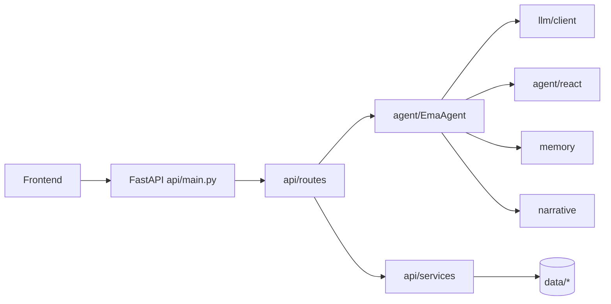

# EmaAgent v0.2


EmaAgent 是一个多模式智能助手系统，核心包含：

- `chat` 普通对话模式
- `agent` 工具调用模式(ReAct)
- `narrative` 叙事检索模式(Router + LightRAG) 支持不含BE的全剧情检索
- WebSocket 流式输出 + 分段 TTS + 合并回放
- 会话持久化与上下文压缩
- Live2D 状态联动

## AI使用情况
### 后端
`api`文件夹的全部文件

其余文件夹均进行内容扩写, 约 `60%`

### 前端
全部

---

## 架构总览



---

## 文档导航

| 文档 | 说明 |
|---|---|
| [`agent/README.md`](./agent/README.md) | Agent 编排层与 ReAct 执行流 |
| [`api/README.md`](./api/README.md) | API 分层与入口说明 |
| [`api/routes/README.md`](./api/routes/README.md) | 全部 REST/WS 路由说明 |
| [`api/services/README.md`](./api/services/README.md) | 业务服务层说明 |
| [`config/README.md`](./config/README.md) | 路径 配置与环境变量体系 |
| [`llm/README.md`](./llm/README.md) | LLM 配置与统一客户端 |
| [`memory/README.md`](./memory/README.md) | 会话模型 持久化与压缩 |
| [`narrative/README.md`](./narrative/README.md) | 叙事路由与 LightRAG 管理 |
| [`Parser/README.md`](./Parser/README.md) | 剧情脚本清洗 重排与入库前处理 |
| [`tools/README.md`](./tools/README.md) | 工具系统与可扩展能力 |

---

## 快速启动

## 1. 环境准备

- Python 3.12+
- Node.js 18+
- AnaConda(可选)

## 2. 下载并安装依赖包

你可以二选一：

方式 A：直接使用系统 Python 环境（最简单）

```bash
python -m pip install -r requirements.txt
```

方式 B：使用 Conda 新建独立环境（可选）

需要你下载AnaConda

```bash
conda create -n Ema python=3.12 -y
conda activate Ema
python -m pip install -r requirements.txt
```

Backend:

```bash
python -m pip install -r requirements.txt
```

Frontend:

```bash
cd frontend
npm install
cd ..
```

## 3. 配置API Key
基础LLM模型可选`DeepSeek` `Qwen` `OpenAI` 三类接入 三选一即可
- `DeepSeek` [API](https://platform.deepseek.com/api_keys)
- `Qwen` [API](https://bailian.console.aliyun.com/cn-beijing?tab=model&utm_content=se_1023046479#/api-key)
- `OpenAI` [API](https://platform.openai.com/settings/organization/api-keys)

Embedding向量编码模型与TTS文本转语音模型目前使用`siliconflow`

后续更新会增加更多接入模型
- `siliconflow`[API](https://cloud.siliconflow.cn/me/account/ak)

获取Key后,直接在`.env`文件下修改即可

---

## 4. 启动
进入文件根目录

Backend:

```bash
uvicorn api.main:app --host 0.0.0.0 --port 8000
```

Frontend:

```bash
cd frontend
npm install
npm run dev
```

---

一键启动后续会更新

## 4. 访问地址

- Frontend: `http://localhost:5173`
- Backend: `http://localhost:8000`

---

## 项目结构

```text
EmaAgent-v0.2/
├─ agent/                # EmaAgent 与 ReAct
├─ api/                  # FastAPI 入口 路由 服务
├─ config/               # 路径 配置 设置
├─ llm/                  # 模型配置与统一客户端
├─ memory/               # 会话模型 持久化 压缩
├─ narrative/            # 叙事路由与多周目 RAG
├─ tools/                # 工具系统
├─ frontend/             # 前端界面
└─ data/                 # 运行时数据 会话 音频 上传

原audio文件夹已不在使用 后续更新会处理
```

---

## 补充说明

本节补充项目里最关键、也最容易和普通聊天机器人项目混淆的实现细节。

### 1. 剧情数据清洗与重排（Parser）

原始脚本数据来自 Naninovel，单条记录通常是这种格式：

```text
# 0101Adv01_Narrative002
; <ruby="さくらば">桜羽</ruby>エマは周囲の悪意に<br>耳を塞ぎたかった。
樱羽艾玛只想捂紧耳朵，<br>
抵挡身边涌现的恶意。
```

这类数据直接用于 RAG 会遇到三个核心问题：

1. 周目顺序问题：理论上是 `1周目(5章) -> 2周目(4章) -> 3周目(2章)`，但原始数据里第三周目的两章常被接在第二周目后面。  
2. 场景切分问题：剧情由 `Adv` 与 `Trial` 组成，正确顺序里 `Trial` 通常插在章节内 `Adv` 的倒数第二或第三段附近，但原始数据里二者经常被完全分离。  
3. 目录分散问题：第三周目有部分数据在另一个文件夹，需要额外映射与合并。  

为了解决这些问题，项目使用 `Parser/` 的分步流程：

1. `build_dataset.py`：全量提取脚本，做角色识别与文本清洗，标注 `timeline/chapter/type(Adv|Trial)`。  
2. `merger.py`：用滑动窗口合并为可检索 chunk，保留章节边界与剧情位置信号。  
3. `new.py`：把被放错位置的第三周目章节重映射回 `Act03`，统一周目结构。  

最终产物（如 `norm_merged_cleaned.json`）才会送入 narrative 记忆库使用。

### 2. Narrative RAG 设计与演进

剧情检索模块是本项目和通用聊天助手最大的差异点之一。

- 当前实现：三个周目分别由三个 LightRAG 实例维护（`1st_Loop`、`2nd_Loop`、`3rd_Loop`）。  
- 路由策略：`narrative/router.py` 先把用户问题拆分并路由到对应周目，再由 `narrative/rag_manager.py` 并发查询并聚合结果。  
- 架构入口：`narrative/core.py`（`NarrativeMemory`）统一封装 `Router + RAGManager`。  

演进说明：

- 在 `2026年1月` 的方案中，曾尝试对清洗后数据增加 `progress_score`，并在用户问“开始/结束/中途”等关键词时做进度过滤。  
- 该方案在实际对话中效果不稳定（召回与语义匹配不够理想）。  
- 后续切换到 LightRAG 后，实际效果更好，因此当前版本以 LightRAG 路由检索为主。  

### 3. Session 管理服务化改造

为贴近网页端大模型产品的会话体验（新建、列表、重命名、删除、历史回放），会话管理从 Agent 内部能力拆分为独立服务：

- 服务层：`api/services/session_service.py`  
- 路由层：`api/routes/sessions.py`  
- 底层存储：`memory/manager.py` + `memory/schema.py`  

现有会话接口包括：

- `GET /api/sessions`：会话列表  
- `POST /api/sessions/new`：新建会话  
- `GET /api/sessions/{session_id}/messages`：读取消息历史  
- `POST /api/sessions/{session_id}/rename`：重命名会话  
- `DELETE /api/sessions/{session_id}`：删除会话  

### 4. `memory/schema.py` 数据类说明

`memory/schema.py` 是会话与 Agent 运行态的核心数据契约，主要类如下：

- `Message`：通用消息基类，统一 `role/content/timestamp` 以及工具调用字段序列化逻辑。  
- `SystemMessage` / `UserMessage` / `AssistantMessage` / `ToolMessage`：四类标准消息子类，对应 LLM 聊天与工具调用链。  
- `CompressionRecord`：单次压缩记录（压缩时间、范围、摘要、压缩前后消息数）。  
- `CompressionHistory`：压缩历史聚合（当前摘要、最近压缩时间、累计压缩次数）。  
- `Session`：完整会话对象（消息列表、压缩游标、上下文裁剪参数、统计字段），并提供：
  - `get_context_for_llm()`：构造模型输入上下文（含摘要注入、tool 消息过滤）
  - `compress_if_needed()`：按阈值触发上下文压缩
  - `to_dict()/from_dict()`：会话元信息持久化
- `AgentStatus`：运行状态枚举（`idle/thinking/acting/finished/error`）。  
- `AgentRuntimeState`：单次 ReAct 运行时状态容器（步骤计数、工具结果、最终答案、时长与错误信息）。  

### 5. API 与 Service 分层

项目后端采用典型的 Route-Service 分层：
(注):这部分代码AI写的,我尽量把注释写全

- `api/routes/*`：参数校验、HTTP 协议层、响应模型。  
- `api/services/*`：业务逻辑与文件系统操作。  

主要模块分工如下：

| 模块 | 作用 |
|---|---|
| `chat` | `chat/agent/narrative` 三模式统一入口，含 WS 流式返回与 TTS 片段合成 |
| `sessions` | 会话生命周期管理（列表/新建/重命名/删除/历史） |
| `music` | 音乐上传、播放列表、收藏、转换、封面、重命名、删除 |
| `game` | 拼图图片上传、列表、单删、批量删除 |
| `news` | 多来源资讯抓取与聚合 |
| `settings` | 模型配置、主题字体、路径与系统状态 |
| `audio/live2d` | 音频静态访问与 Live2D 状态联动 |

### 6. Tools 与 Agent 关系（简述）

`tools/` 的整体组织方式参考了 OpenManus 的工具集合思路：统一抽象、统一调度、统一错误包装。  
在本项目里：

- `agent/react.py` 负责 ReAct 的 `think -> act` 循环与工具调用。  
- `agent/EmaAgent.py` 在 ReAct 之外再做一层业务封装：统一接入日常聊天、剧情问答、基础工具调用、会话保存与流式回传。  

这也是为什么前端只需选择 `chat / agent / narrative` 模式，而不需要关心底层工具与检索细节。

---

## 演示

### Chat
可选择三个模式 
- `agent`智能体模式 目前工具较为单一
- `chat`日常聊天模式 
- `narrative`剧情模式 支持不含BE的三个周目剧情问答


目前支持 `DeepSeek` `Qwen` `OpenAI` 三类模型接入


由衷感谢B站UP主[露姆娅](https://space.bilibili.com/1384755?spm_id_from=333.788.upinfo.head.click)提供的艾玛Live2D


--- 

### News
从`B站` `百度` `Google`三个网站进行内容爬取

方法为事先写入`魔法少女的魔女审判`作为默认关键字再进行爬取

目前爬取Google的代码似乎有小Bug


---

### Music
音乐播放

上传自己的音乐文件进行播放

支持`收藏` `文件格式转换` `更改歌手 封面`功能


---

### Game
拼图游戏 玩到一半nnk会来开你盒

上传你自己的图片就可以玩

可选`3x3` `4x4` `10x10` `20x20`等模式


---

### Setting

配置你的`API Key` 修改配色 

更改文件路径(这个不建议)


在`EmaAgent`的`data`文件夹下
- `audio`存放`chat`页面中TTS合成的音频
- `font`存放`setting`页面中的字体样式
- `music`存放`music`页面下的音乐
- `puzzle_images`存放`game`页面下的拼图图片
- `sessions`存放`chat`侧栏的会话数据
- `theme`存放`setting`页面中的主题设置

---

## 致谢名单

注:排名不分先后顺序
| name | describe |
| - | - |
| [柏斯阔落](https://space.bilibili.com/266938091?spm_id_from=333.1387.follow.user_card.click)| [NagaAgent](https://github.com/RTGS2017/NagaAgent) |
| [无头鬼艾伦](https://space.bilibili.com/352089037?spm_id_from=333.1387.follow.user_card.click) | [MikuChat](https://www.bilibili.com/video/BV1DkzABZEoe/?spm_id_from=333.1387.homepage.video_card.click&vd_source=3151b98d67ade6395736508def783435) |
| [露姆娅](https://space.bilibili.com/1384755?spm_id_from=333.788.upinfo.head.click) | [艾玛Live2D](https://www.bilibili.com/video/BV1rF6QB1EqW/?spm_id_from=333.337.search-card.all.click) |
| [貳階堂希罗](https://space.bilibili.com/434748403?spm_id_from=333.788.upinfo.head.click) | [魔法少女的魔女审判 CG/PV/美术/音声资源提取解包](https://www.bilibili.com/video/BV1Zu4czJENM/?spm_id_from=333.1007.top_right_bar_window_history.content.click&vd_source=3151b98d67ade6395736508def783435) |
| [OpenManus](https://github.com/FoundationAgents/OpenManus) | 参考Tool架构 |
| [LightRAG](https://github.com/HKUDS/LightRAG) | Simple and Fast Retrieval-Augmented Generation |
| [Acacia](https://acacia-create.com/) |  |


如有侵权请联系删除

---

## 许可证

MIT
