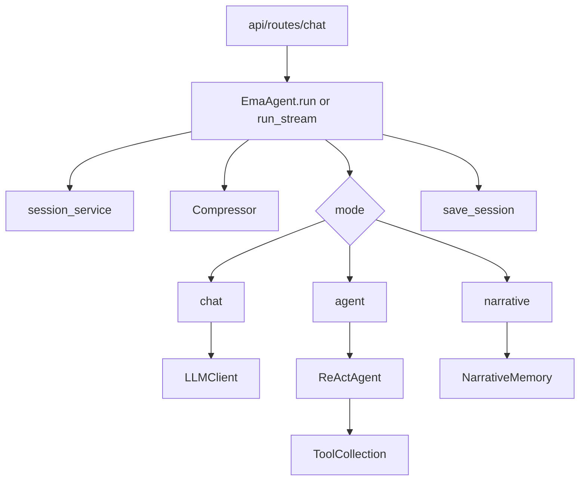

# agent 模块

`agent/` 是系统编排核心，负责把会话、模型、工具、叙事检索、TTS 和 Live2D 联动起来

---

## 目录内容

| 文件 | 作用 |
|---|---|
| `EmaAgent.py` | 总调度器 统一入口 `run` 与 `run_stream` |
| `react.py` | ReAct 推理执行器 负责工具调用循环 |
| `__init__.py` | 模块导出 |

---

## 核心调用链

---

## `EmaAgent` 主要职责

- 加载运行配置并初始化依赖
- 管理会话生命周期与压缩触发
- 模式分发：`chat` `agent` `narrative` `finish`
- 流式 token 回调和中断控制
- 根据回复意图和文本驱动 Live2D 情绪

关键方法：

- `run(...)`
- `run_stream(...)`
- `_handle_chat[_stream](...)`
- `_handle_agent[_stream](...)`
- `_handle_narrative[_stream](...)`
- `_build_chat_messages(...)`

---

## `ReActAgent` 主要职责

- 执行 `think -> act` 循环
- 调用 `LLMClient.chat_with_tools(...)` 解析工具请求
- 通过 `ToolCollection.execute(...)` 执行工具
- 回写 `ToolMessage` 到会话，形成下一步上下文

关键方法：

- `run(...)`
- `_think(...)`
- `_act(...)`
- `_parse_tool_call(...)`
- `_parse_arguments(...)`

---

## 上下游依赖

上游调用：

- `api/routes/chat.py`

下游依赖：

- `llm/`
- `memory/`
- `narrative/`
- `api/services/live2d_service.py`
- `api/services/session_service.py`

