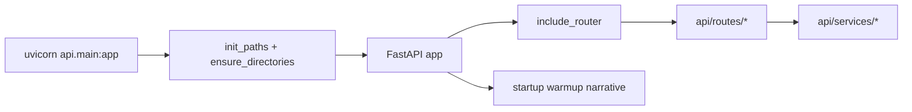

# api 模块

`api/` 提供对外服务入口，分为三层：

- 入口层：`main.py`
- 协议层：`routes/`
- 业务层：`services/`

---

## 结构

```text
api/
├─ main.py          # FastAPI 入口 路由注册 启动预热 静态挂载
├─ routes/          # REST/WS 协议层
└─ services/        # 业务服务层
```

---

## 入口流程



---

## 关键职责

`main.py` 负责：

- 初始化全局路径配置
- 注册路由
- startup 预热 Narrative LightRAG
- 提供音频与静态资源文件服务
- 前端 SPA 路由回退

---

## 子文档

- [`api/routes/README.md`](./routes/README.md)
- [`api/services/README.md`](./services/README.md)

