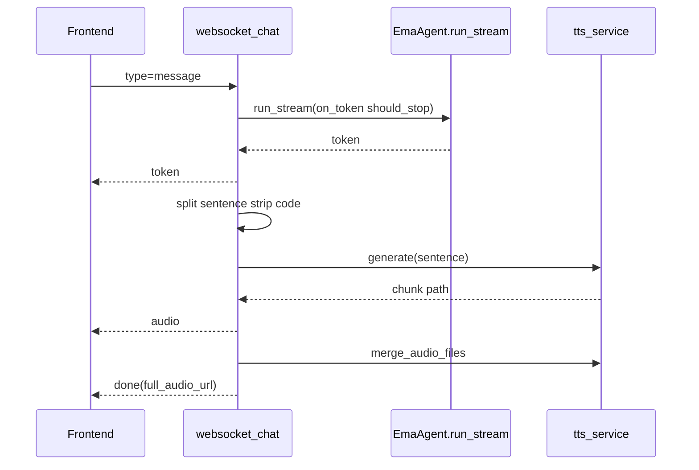

# api/routes 模块

`api/routes/` 负责 HTTP/WS 协议适配，请求参数解析与响应模型组织

---

## 路由清单

| 文件 | 主要路径 | 说明 |
|---|---|---|
| `chat.py` | `/api/chat` `/api/ws/chat` | 聊天主入口 附件上传 流式输出 |
| `sessions.py` | `/api/sessions*` | 会话列表 创建 删除 重命名 |
| `settings.py` | `/api/settings*` | 模型设置 路径设置 主题字体设置 |
| `audio.py` | `/api/audio*` | cache/output 音频访问与清理 |
| `news.py` | `/api/news*` | 新闻聚合检索 |
| `music.py` | `/api/music*` | 播放列表 上传 搜索 转换 |
| `live2d.py` | `/api/live2d*` | 表情状态控制 + WS |
| `game.py` | `/api/game/*` | 拼图资源接口 |

---

## `chat.py` WS 链路

---

## 设计约束

- 路由层尽量薄：业务逻辑下沉到 `api/services`
- 统一使用 `config.paths` 获取路径，不硬编码目录
- 对外返回结构稳定，减少前端耦合

