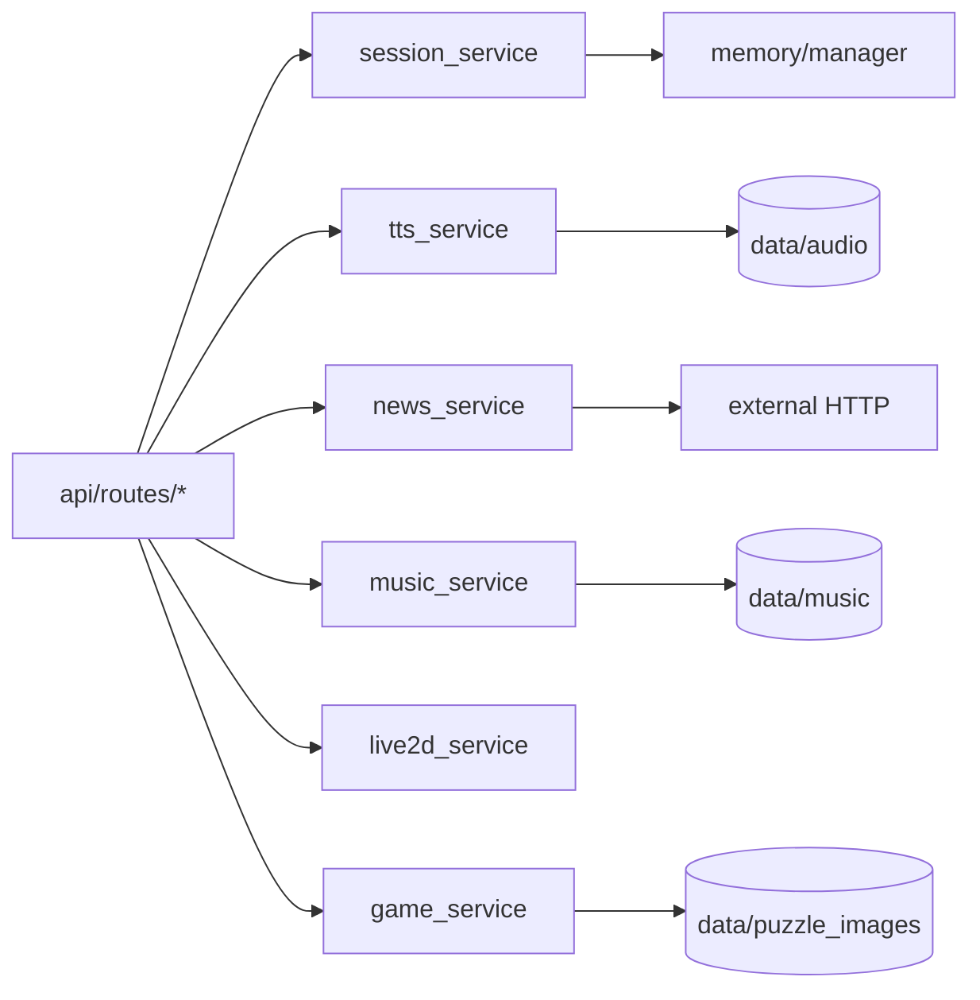

# api/services 模块

`api/services/` 是业务实现层，负责状态、文件、外部 API 和数据处理逻辑

---

## 服务清单

| 文件 | 类/函数 | 职责 |
|---|---|---|
| `session_service.py` | `SessionService` | 会话单例服务 创建 删除 重命名 列表 |
| `tts_service.py` | `APITTSService` | 语音生成 分段合并 缓存清理 |
| `news_service.py` | `NewsService` | 多来源抓取 偏好加权 去重排序 |
| `music_service.py` | `MusicService` | 本地音乐索引 播放统计 搜索 转换 |
| `live2d_service.py` | `Live2DService` | 表情情绪状态 口型同步 |
| `game_service.py` | `GameService` | 拼图资源目录管理与上传 |

---

## 服务调用关系

---

## 与其它目录关系

- 强依赖 `config/paths.py` 统一路径
- `session_service` 依赖 `memory/`
- `tts_service` 被 `chat` 路由流式调用
- `live2d_service` 被 `EmaAgent` 与 `live2d` 路由共同调用

