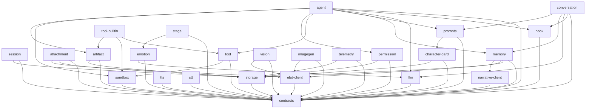
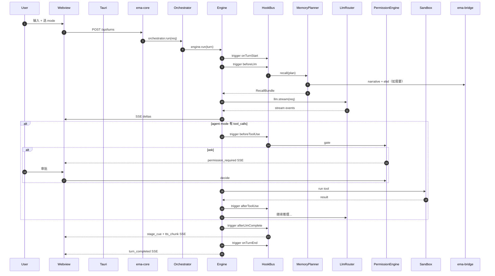

# EmaAgent V1 架构文档

> 版本：V1 target architecture
> 最后更新：2026-05-08
> 形态：Tauri 2 + React + TypeScript Hono sidecar + Python FastAPI bridge
> 模式：`chat` / `narrative` / `agent` (plan/debug/full)
> 参考：AIRI（前端形态）+ Claude Code（agent harness）+ EmaAgent v0.4（产品灵魂）

---

## 目录

1. [产品边界与定位](#1-产品边界与定位)
2. [进程模型与端口分配](#2-进程模型与端口分配)
3. [Monorepo 完整结构](#3-monorepo-完整结构)
4. [Hook 总线](#4-hook-总线)
5. [Conversation Engine](#5-conversation-engine)
6. [Agent Engine 与 AgentPolicy](#6-agent-engine-与-agentpolicy)
7. [Memory 与召回](#7-memory-与召回)
8. [Tool / Permission / Sandbox 安全管线](#8-tool--permission--sandbox-安全管线)
9. [LLM Provider 体系](#9-llm-provider-体系)
10. [Multimodal](#10-multimodal)
11. [Stage 与 Live2D](#11-stage-与-live2d)
12. [Artifact 系统](#12-artifact-系统)
13. [角色卡与 Emotion](#13-角色卡character-card与-emotion)
14. [Narrative](#14-narrative)
15. [SQLite Schema](#15-sqlite-schema)
16. [SSE 事件协议](#16-sse-事件协议)
17. [Tauri IPC 契约](#17-tauri-ipc-契约)
18. [前端架构](#18-前端架构)
19. [Python Bridge](#19-python-bridge)
20. [配置与密钥](#20-配置与密钥)
21. [错误处理与降级](#21-错误处理与降级)
22. [启动与生命周期](#22-启动与生命周期)
23. [可观测性](#23-可观测性)
24. [测试策略](#24-测试策略)
25. [构建与打包](#25-构建与打包)
26. [文件级接口索引](#26-文件级接口索引)

---

## 1. 产品边界与定位

### 1.1 是什么

本地优先的**单角色二次元桌宠 + 桌面 Agent 单人应用**。固定 Ema 角色舞台，三模式覆盖陪伴 / 剧情 / 生产三类场景。

### 1.2 不是什么

- **不是多用户 SaaS**：单机运行，无账号体系，无云同步
- **不是通用聊天客户端**：角色卡是核心，不是可选
- **不是 IDE**：agent 模式有工作区编辑能力，但不替代 VS Code
- **不是 VTuber 直播工具**：v0.4 的 game / music / news / 直播抓取全部砍掉

### 1.3 三模式职责

| 维度 | chat | narrative | agent |
|---|---|---|---|
| **主循环** | 单步流式 | 单步流式 + RAG 召回 | think→act 多轮（按 policy） |
| **Engine** | ConversationEngine | ConversationEngine | AgentEngine |
| **核心目标** | 高质量陪伴对话 | 剧情检索 + 情绪互动 | 工具调用 + 工作区编辑 |
| **角色卡强度** | 强 | 强 | 中（叠加任务规则） |
| **TTS** | 句级触发 | 句级触发 | 句级触发（debug 子模式可关） |
| **Stage Cue** | 跟随 emotion | 跟随 emotion | 跟随 emotion + 工具反馈 |
| **召回 Source** | userFact + sessionHistory + attachment | userFact + sessionHistory + narrative | userFact + sessionHistory + attachment |
| **Tool 调用** | 无 | 无 | 有 |
| **Artifact 产出** | 无 | 无 | 有 |
| **Compaction** | rolling-summary | rolling-summary | rolling-summary + tool-result-snip |

mode 是 **turn 级别字段**，同一个 session 可交错三模式。

### 1.4 Agent 子模式（AgentPolicy）

| 子模式 | 工具池 | 权限 | 循环 | 输出形态 | 子 agent |
|---|---|---|---|---|---|
| **plan** | 只读工具 | auto | 1 轮 think | 结构化计划 artifact | 否 |
| **debug** | 全部 | ask 全部 + 单步暂停 | 默认 | 详细 trace | 否 |
| **full** | 全部 + subagent | 沿用全局 | 默认 | 正常对话 + artifact | 是 |

子模式不是 sub-engine，是**同一 AgentEngine 的 policy 常量**。新增子模式只加常量，主循环零改动。

### 1.5 V1 范围 / V1.5 推迟 / V2 推迟

| V1 必做 | V1.5 推迟 | V2 推迟 |
|---|---|---|
| 单 Ema 角色卡 + emotion + ACT 标签 | 多角色卡切换 + 上传/导入 | 多用户 |
| chat / narrative / agent(plan/debug/full) | imagegen | 云同步 |
| TTS / STT / Live2D | vision（图片附件理解） | 多 agent 角色协作（魔女审判） |
| 内置 fs / shell / web 工具 | MCP client | Skill loader |
| 单工作区 sandbox | 多工作区 | Stronghold 密钥 |
| API key 明文 SQLite | crash report 上报 | 自动更新 |
| 召回三源（含 narrative） | 跨 session 长期记忆 | 团队共享角色卡 |
| 7 项设置 IA（角色卡/机体模块/角色模型/记忆体/服务来源/Data/系统） | 场景（角色所处环境） | 手机伴侣端配对（连接页） |
| Provider Health Check（定时 + Ping API） | — | — |
| 记忆体设置页（条目浏览 + 策略可调） | — | — |

---

## 2. 进程模型与端口分配

```
┌─────────────────────────────────────────────────────────────────┐
│                       Tauri Host (Rust)                         │
│  ┌────────────────────────┐                                     │
│  │  Webview               │  1) 启动时 spawn ema-core           │
│  │  React + Vite          │  2) ema-core 启动后 spawn ema-bridge│
│  │  - Live2D Stage        │  3) sidecar 异常自动重启 ≤ 3 次     │
│  │  - Chat / Agent UI     │  4) 全局热键 / 托盘 / 文件 dialog   │
│  │  - Settings (AIRI 风)  │                                     │
│  └──────┬─────────────────┘                                     │
│         │ Tauri IPC (类型化 invoke)                              │
│         │ + HTTP fetch → http://127.0.0.1:3421                  │
│         ▼                                                        │
│  ┌─────────────────────────────────────────────────────────┐    │
│  │  ema-core (TS sidecar, Node 20)        port 3421        │    │
│  │  Hono + better-sqlite3                                  │    │
│  │  - REST: turns / sessions / providers / models / ...    │    │
│  │  - SSE:  /api/turns/:id/events                          │    │
│  │  - WS:   /api/turns/ws  (可选)                          │    │
│  └──────┬──────────────────────────────────────────────────┘    │
│         │ HTTP + X-Ema-Secret                                   │
│         ▼                                                        │
│  ┌─────────────────────────────────────────────────────────┐    │
│  │  ema-bridge (Python FastAPI)           port 7421        │    │
│  │  uv-managed venv                                        │    │
│  │  - /embed     batch embedding                           │    │
│  │  - /rerank    cross-encoder rerank                      │    │
│  │  - /narrative/query  LightRAG 三周目                    │    │
│  │  - /narrative/index  剧本入库                           │    │
│  │  - /vision    图片理解（V1.5）                          │    │
│  │  - /imagegen  图片生成（V1.5）                          │    │
│  └─────────────────────────────────────────────────────────┘    │
└─────────────────────────────────────────────────────────────────┘
```

### 2.1 端口约定

- Tauri webview：随机本地端口（dev 用 5173）
- ema-core：固定 `3421`，被占用则 `3422` `3423` 递增到 `3430` 为止，超过失败
- ema-bridge：固定 `7421`，同上递增至 `7430`
- 实际端口写入用户数据目录 `runtime.json`，前端启动时读取

### 2.2 进程间认证

- 启动时 Tauri 生成一次性 `EMA_SHARED_SECRET`（256-bit URL-safe base64），写入：
  - 环境变量传给 ema-core
  - ema-core 启动 ema-bridge 时再传给 Python
- 所有 sidecar 间请求带 `X-Ema-Secret` header；不匹配返回 401
- 前端 → ema-core 走 Tauri IPC（已经是受信任域），无需 secret

### 2.3 进程异常策略

| 进程 | 异常 | 处理 |
|---|---|---|
| ema-bridge crash | narrative / RAG / vision / imagegen 全部降级返回空 | 主链路继续，发 `system_warning` SSE |
| ema-bridge 启动失败 | 上述能力直接禁用 | UI 标注 "Python 桥接未启动" |
| ema-core crash | 前端显示重启 banner | Tauri 自动 spawn ≤ 3 次，超限提示用户 |
| 前端 webview crash | Tauri 重新加载 | 当前 turn 中断，状态从 SQLite 恢复 |
| 当前 turn 中断 | 已落盘 messages 完整 | 重启后 turn 状态回滚至最后一个 `turn_completed` 之前 |

---

## 3. Monorepo 完整结构

```
ema-agent/
├── apps/
│   ├── desktop/                  # Tauri 2 应用
│   │   ├── src-tauri/            # Rust 主进程
│   │   │   ├── src/
│   │   │   │   ├── main.rs       # 入口
│   │   │   │   ├── sidecar.rs    # ema-core / ema-bridge 生命周期
│   │   │   │   ├── secret.rs     # EMA_SHARED_SECRET 生成
│   │   │   │   ├── ipc.rs        # Tauri command 注册
│   │   │   │   └── tray.rs       # 托盘 + 全局热键
│   │   │   └── tauri.conf.json
│   │   └── src/                  # React webview
│   │       ├── main.tsx
│   │       ├── App.tsx
│   │       ├── routes/           # 路由
│   │       ├── pages/            # 页面（chat / agent / narrative / settings）
│   │       ├── components/       # UI 组件
│   │       │   ├── stage/        # Live2D 舞台
│   │       │   ├── chat/         # 聊天面板
│   │       │   ├── workspace/    # Agent WorkspacePane（artifact + diff）
│   │       │   ├── settings/     # AIRI 风设置（服务来源/机体模块/Data）
│   │       │   └── shared/       # 通用 UI（按钮/输入/弹窗）
│   │       ├── stores/           # Zustand store（按域分）
│   │       │   ├── turn.ts       # 当前 turn 流状态
│   │       │   ├── session.ts    # session 列表
│   │       │   ├── stage.ts      # Live2D 状态
│   │       │   ├── settings.ts   # 设置
│   │       │   └── permission.ts # 权限审批队列
│   │       ├── hooks/            # React 业务 hook
│   │       │   ├── useSse.ts
│   │       │   ├── useTurn.ts
│   │       │   ├── usePermissionDialog.ts
│   │       │   └── useStageCue.ts
│   │       ├── ipc/              # Tauri IPC 类型化封装
│   │       └── styles/           # UnoCSS 配置
│
│   ├── core/                     # TS sidecar
│   │   └── src/
│   │       ├── index.ts          # 启动入口
│   │       ├── server.ts         # Hono 装配
│   │       ├── auth.ts           # X-Ema-Secret 中间件
│   │       ├── wiring.ts         # 依赖装配（DI 手写）
│   │       ├── orchestrator/
│   │       │   ├── orchestrator.ts        # 选 engine + 注入依赖
│   │       │   ├── conversation-flow.ts   # chat/narrative 流程编排
│   │       │   └── agent-flow.ts          # agent 流程编排
│   │       ├── routes/
│   │       │   ├── turns.ts
│   │       │   ├── sessions.ts
│   │       │   ├── providers.ts
│   │       │   ├── models.ts
│   │       │   ├── memory.ts
│   │       │   ├── attachments.ts
│   │       │   ├── artifacts.ts
│   │       │   ├── permissions.ts
│   │       │   ├── character-cards.ts     # 角色卡 CRUD + activate + import/export
│   │       │   ├── live2d-models.ts       # Live2D/VRM 资产 CRUD
│   │       │   ├── memory.ts              # facts CRUD + 策略读写
│   │       │   ├── provider-health.ts     # 健康状态查询 + Ping API
│   │       │   ├── multimodal.ts          # /tts /stt /imagegen 同步端点
│   │       │   ├── narrative.ts           # /narrative/index 触发
│   │       │   ├── settings.ts            # 设置读写
│   │       │   └── health.ts
│   │       ├── sse/
│   │       │   ├── writer.ts              # SSE 编码 + 心跳
│   │       │   └── event-store.ts         # in-memory turn 事件存储 + 重放
│   │       └── shutdown.ts                # 优雅关闭
│
│   └── bridge/                   # Python FastAPI compute bridge
│       ├── pyproject.toml
│       ├── ema_bridge/
│       │   ├── main.py
│       │   ├── auth.py
│       │   ├── routes/
│       │   │   ├── embed.py
│       │   │   ├── rerank.py
│       │   │   ├── narrative.py
│       │   │   ├── vision.py
│       │   │   └── imagegen.py
│       │   ├── services/
│       │   │   ├── lightrag_service.py    # 三周目 LightRAG 实例
│       │   │   ├── embedding_service.py
│       │   │   ├── rerank_service.py
│       │   │   ├── vision_service.py
│       │   │   └── imagegen_service.py
│       │   └── config.py
│       └── data/                          # narrative LightRAG 持久化
│           ├── 1st_loop/
│           ├── 2nd_loop/
│           └── 3rd_loop/
│
├── packages/
│   ├── contracts/
│   ├── storage/
│   ├── session/
│   ├── prompts/
│   ├── llm/
│   ├── ebd-client/
│   ├── narrative-client/
│   ├── memory/
│   ├── attachment/
│   ├── character-card/
│   ├── emotion/
│   ├── hook/
│   ├── conversation/
│   ├── agent/
│   ├── tool/
│   ├── tool-builtin/
│   ├── permission/
│   ├── sandbox/
│   ├── artifact/
│   ├── tts/
│   ├── stt/
│   ├── vision/
│   ├── imagegen/
│   ├── stage/
│   └── telemetry/
├── pnpm-workspace.yaml
├── turbo.json
├── tsconfig.base.json
├── package.json
└── docs/
    └── README.md (本文档)
```

### 3.1 包依赖矩阵



`apps/core` 装配所有包。`apps/desktop` 只依赖 `contracts`（共享类型）。`apps/bridge` 是 Python，独立。

---

## 4. Hook 总线

横切关注点的核心机制。所有非主循环逻辑（角色卡注入 / emotion / stage / tts / OOC / memory 沉淀 / 审计）都注册为 hook，engine 只触发不感知。

### 4.1 包结构

```
packages/hook/
├── src/
│   ├── index.ts          # export HookBus, HookEvent, HookHandler
│   ├── bus.ts            # HookBus 实现
│   ├── events.ts         # 事件类型定义
│   └── priority.ts       # 优先级常量
└── package.json
```

### 4.2 事件清单

```ts
// packages/hook/src/events.ts
export type HookEvent =
  | 'beforeLlm'           // engine 调 LLM 之前 — 角色卡注入、召回拼接
  | 'afterLlmDelta'       // 每个 token chunk — TTS 句级累积
  | 'afterLlmComplete'    // LLM 一轮完成 — emotion 抽取、stage cue
  | 'afterMessage'        // assistant message 落盘后 — memory 沉淀候选
  | 'beforeToolUse'       // tool 调用前 — permission gate
  | 'afterToolUse'        // tool 调用后 — artifact upsert
  | 'onToolFailure'       // tool 失败 — 熔断计数
  | 'beforeCompact'       // 压缩前
  | 'afterCompact'        // 压缩后
  | 'onTurnStart'         // turn 开始
  | 'onTurnEnd'           // turn 正常结束
  | 'onTurnAbort'         // turn 中断（用户 stop / 异常）
  | 'onCharacterCardSwitch' // 角色卡切换（V1 不触发，V1.5 用）
  | 'onEmotionChange';    // emotion 状态变化
```

### 4.3 Façade

```ts
// packages/hook/src/bus.ts
export interface HookContext<E extends HookEvent> {
  event: E;
  turnId: TurnId;
  sessionId: SessionId;
  payload: HookPayload[E];
  emit: (event: EmaStreamEvent) => void;        // 推 SSE
  abort: (reason: string) => void;              // 终止 turn
  meta: Record<string, unknown>;                 // hook 间传递（不持久化）
}

export type HookHandler<E extends HookEvent> = (
  ctx: HookContext<E>
) => Promise<HookResult> | HookResult;

export type HookResult =
  | { kind: 'continue' }
  | { kind: 'replace'; payload: unknown }       // 替换 payload，仅特定事件支持
  | { kind: 'abort'; reason: string };          // 中止 turn

export class HookBus {
  register<E extends HookEvent>(
    event: E,
    handler: HookHandler<E>,
    opts?: { priority?: number; name?: string }
  ): () => void;                                // 返回 unregister
  
  trigger<E extends HookEvent>(
    event: E,
    ctx: Omit<HookContext<E>, 'event'>
  ): Promise<HookResult>;                       // 串行触发，按 priority 升序
  
  // 调试用
  list(event?: HookEvent): RegisteredHook[];
}
```

### 4.4 注册时机与位置

`apps/core/src/wiring.ts` 中装配阶段，所有包按需注册自身 hook：

```ts
// wiring.ts 节选
const hookBus = new HookBus();

// character-card 包注册
new CharacterCardStore(db).registerHooks(hookBus);
// emotion 包
new EmotionEngine({ llm, card }).registerHooks(hookBus);
// stage 包
new StageController(emotion).registerHooks(hookBus);
// tts 包
new TtsClient(providers).registerHooks(hookBus);
// memory 包
new MemoryPlanner(db, ebd, nar).registerHooks(hookBus);
// telemetry
new TelemetryRecorder(db).registerHooks(hookBus);
```

### 4.5 优先级与串行

- 按 `priority` 升序串行执行（默认 100）
- 任一 handler 返回 `abort` 立即中止后续 handler，触发 `onTurnAbort`
- handler 内 `throw` 视同 `abort`，原因为 error.message
- handler **必须 idempotent + side-effect 可见**：不允许偷偷修改 payload 而不返回 replace

### 4.6 横切落地示例

| Hook | 注册者 | 行为 |
|---|---|---|
| `beforeLlm` p=10 | character-card | 把激活卡的 systemPrompt + ACT 标签语法说明拼到 prompt |
| `beforeLlm` p=20 | memory | 调 MemoryPlanner.recall()，把 RecallBundle 拼成独立 user context message |
| `afterLlmDelta` p=10 | emotion | 流式解析 ACT 标签，命中即更新 state + emit emotion_changed |
| `afterLlmDelta` p=50 | tts | 累积句末标点（剥离 ACT 标签），触发 TtsClient.synthesize 流式投 SSE |
| `afterLlmComplete` p=10 | emotion | 兜底：若整轮未命中任何 ACT 标签，调便宜 LLM 后置抽取 |
| `afterLlmComplete` p=20 | stage | emotion → motion 映射，emit `stage_cue` SSE |
| `afterMessage` p=10 | memory | 评估是否落 memory_item（user fact 候选） |
| `beforeToolUse` p=10 | permission | 阻塞至用户授权，否则 abort |
| `afterToolUse` p=10 | artifact | 工具结果含 artifact 标签 → ArtifactStore.upsert + emit SSE |
| `onTurnEnd` p=10 | telemetry | 记 usage + tokens + latency |

### 4.7 与 Claude Code 27 hook 的差异

V1 14 个事件，砍掉 `SessionStart/End`、`Notification`、`SubagentStart/Stop`、`Setup` 等。理由：

- session 生命周期不是高价值扩展点（V1 单用户）
- subagent V1.5 才做
- 通知走 SSE event 而非 hook

V1.5 加 subagent 时补 `beforeSubagentRun` / `afterSubagentRun`。

---

## 5. Conversation Engine

处理 `chat` 和 `narrative` 模式。单步流式生成，无循环，所有副作用走 hook。

### 5.1 包结构

```
packages/conversation/
├── src/
│   ├── index.ts                    # export ConversationEngine
│   ├── engine.ts                   # ConversationEngine 主体
│   ├── prompt-assembly.ts          # buildPrompt（持 hook 注入点）
│   ├── stream-pump.ts              # LLM stream → 事件转换
│   └── types.ts                    # 内部类型
└── package.json
```

### 5.2 核心接口

```ts
// packages/conversation/src/engine.ts
export interface ConversationEngineDeps {
  llm: LlmRouter;
  hooks: HookBus;
  prompts: PromptsBuilder;
  session: SessionStore;
}

export class ConversationEngine {
  constructor(deps: ConversationEngineDeps);
  
  run(turn: TurnRequest): AsyncIterable<EmaStreamEvent>;
}
```

### 5.3 单步流程

```
1. hooks.trigger('onTurnStart', { turn })
2. emit { type: 'turn_started', turnId }

3. msgs = session.loadHistoryFor(turn)
4. card = await characterCardStore.current()
   systemPrompt = prompts.buildSystem({ mode, card })
   → hooks.trigger('beforeLlm', { systemPrompt, msgs })
     character-card 包注入 systemPrompt + ACT 语法说明
     memory 包注入 RecallBundle 为独立 user context message
     narrative 模式下 memory 包额外召回 narrative source
   后 systemPrompt + msgs 已经被 hook 增强

5. stream = llm.stream({ model, systemPrompt, messages: msgs })

6. for delta in stream:
     emit { type: 'output_text_delta', delta }
     hooks.trigger('afterLlmDelta', { delta, accumulated })
       tts 包累积句末，触发合成，emit { type: 'tts_chunk' }

7. final = stream.final()
   hooks.trigger('afterLlmComplete', { final })
     emotion 包抽取情绪 → 更新 state
     stage 包 emotion → motion，emit { type: 'stage_cue' }

8. msg = session.appendAssistantMessage(turn, final)
   hooks.trigger('afterMessage', { msg })
     memory 包评估 user fact 候选

9. hooks.trigger('onTurnEnd', { turn })
10. emit { type: 'turn_completed' }
```

### 5.4 中断处理

- 用户在前端点 stop → DELETE `/api/turns/:id` → orchestrator abortController.abort()
- 流被取消时：
  1. 已生成部分作为 partial assistant message 落盘（带 `interrupted: true`）
  2. emit `{ type: 'turn_aborted', reason: 'user_stop' }`
  3. hooks.trigger('onTurnAbort')
- 异常（LLM 网络错 / hook abort）：同上，reason 字段不同

### 5.5 错误恢复

| 场景 | 处理 |
|---|---|
| LLM 网络超时 | LlmRouter 内部重试 1 次，失败 emit `turn_failed` |
| LLM 401（key 失效） | emit `turn_failed`，前端提示去设置 |
| Provider 限流 429 | LlmRouter fallback model（如配置），否则 fail |
| Context too long 413 | MemoryPlanner.compact() 触发 micro-compaction，重试一次 |
| Hook handler 抛 | 视同 abort，turn_aborted |

---

## 6. Agent Engine 与 AgentPolicy

处理 `agent` 模式。think→act 多轮循环。

### 6.1 包结构

```
packages/agent/
├── src/
│   ├── index.ts
│   ├── engine.ts                 # AgentEngine 主循环
│   ├── policy.ts                 # AgentPolicy 类型 + plan/debug/full 常量
│   ├── tool-dispatch.ts          # tool_calls 风险分桶 + 并行/串行执行
│   ├── circuit-breaker.ts        # 同错熔断
│   ├── plan-output.ts            # plan 子模式的结构化输出 parser
│   ├── trace.ts                  # debug 子模式的 trace 收集
│   └── types.ts
```

### 6.2 AgentPolicy

```ts
// packages/agent/src/policy.ts
export interface AgentPolicy {
  name: 'plan' | 'debug' | 'full';
  toolFilter: (descriptor: ToolDescriptor) => boolean;
  permissionPreset: 'auto' | 'ask' | 'strict';
  loopGuards: {
    maxIterations: number;
    requirePerStepConfirm: boolean;
    enableSubagents: boolean;
    repeatedErrorLimit: number;          // 同错熔断阈值，默认 3
  };
  outputContract: 'plain' | 'plan-spec' | 'trace';
  ttsEnabled: boolean;
}

export const PLAN_POLICY: AgentPolicy = {
  name: 'plan',
  toolFilter: (d) => d.risk === 'low' && d.readOnly,
  permissionPreset: 'auto',
  loopGuards: {
    maxIterations: 1,
    requirePerStepConfirm: false,
    enableSubagents: false,
    repeatedErrorLimit: 3,
  },
  outputContract: 'plan-spec',
  ttsEnabled: true,
};

export const DEBUG_POLICY: AgentPolicy = {
  name: 'debug',
  toolFilter: () => true,
  permissionPreset: 'ask',
  loopGuards: {
    maxIterations: 10,
    requirePerStepConfirm: true,
    enableSubagents: false,
    repeatedErrorLimit: 3,
  },
  outputContract: 'trace',
  ttsEnabled: false,
};

export const FULL_POLICY: AgentPolicy = {
  name: 'full',
  toolFilter: () => true,
  permissionPreset: 'auto',                  // 受全局 permission mode 制约
  loopGuards: {
    maxIterations: 25,
    requirePerStepConfirm: false,
    enableSubagents: true,
    repeatedErrorLimit: 3,
  },
  outputContract: 'plain',
  ttsEnabled: true,
};
```

### 6.3 主循环

```ts
// packages/agent/src/engine.ts
export class AgentEngine {
  async *run(turn: TurnRequest, policy: AgentPolicy): AsyncIterable<EmaStreamEvent> {
    yield this.emitTurnStart();
    await this.hooks.trigger('onTurnStart', { turn, policy });
    
    let iteration = 0;
    const breaker = new CircuitBreaker(policy.loopGuards.repeatedErrorLimit);
    
    while (iteration < policy.loopGuards.maxIterations) {
      iteration++;
      yield { type: 'agent_iteration', n: iteration };
      
      // think
      const tools = this.toolRegistry
        .listDescriptors()
        .filter(policy.toolFilter);
      
      const stream = this.llm.stream({
        messages: await this.buildMessages(turn),
        tools,
      });
      
      const { content, toolCalls } = await this.collectStream(stream);
      yield* this.streamPump(stream);             // 推 token delta
      
      // 写 assistant message（含 tool_calls）
      await this.session.appendAssistantMessage(turn, { content, toolCalls });
      
      if (toolCalls.length === 0) {
        // 终止条件
        await this.hooks.trigger('afterLlmComplete', { content });
        break;
      }
      
      // act
      const results = await this.dispatchTools(toolCalls, policy, turn);
      
      for (const r of results) {
        breaker.record(r);
        if (breaker.tripped()) {
          yield { type: 'agent_breaker_tripped', reason: breaker.reason };
          await this.hooks.trigger('onTurnAbort', { reason: 'breaker' });
          yield this.emitTurnFailed('repeated_error');
          return;
        }
      }
      
      // 写 tool messages
      for (const r of results) {
        await this.session.appendToolMessage(turn, r);
      }
    }
    
    if (iteration >= policy.loopGuards.maxIterations) {
      yield this.emitTurnFailed('max_iterations');
      return;
    }
    
    await this.hooks.trigger('onTurnEnd', { turn });
    yield this.emitTurnCompleted();
  }
}
```

### 6.4 风险分桶（v0.4 思路升级）

```ts
// packages/agent/src/tool-dispatch.ts
async function dispatchTools(
  calls: ToolCall[],
  policy: AgentPolicy,
  turn: TurnRequest
): Promise<ToolResult[]> {
  const descriptors = calls.map(c => toolRegistry.find(c.name));
  const buckets = partition(descriptors, d => d.readOnly && d.risk === 'low');
  const readonly = buckets.matched;          // 并发
  const serial = buckets.unmatched;          // 串行 + 权限闸
  
  // 1. 并发执行只读
  const readonlyResults = await pLimit(3, readonly.map(d => 
    runOne(d, calls, policy, turn)
  ));
  
  // 2. 串行执行高风险
  const serialResults: ToolResult[] = [];
  for (const d of serial) {
    if (policy.loopGuards.requirePerStepConfirm) {
      // debug 模式逐步确认
      const ok = await waitUserConfirm(d, turn);
      if (!ok) {
        serialResults.push({ name: d.name, error: 'user_skip' });
        continue;
      }
    }
    const r = await runOne(d, calls, policy, turn);
    serialResults.push(r);
  }
  
  return [...readonlyResults, ...serialResults];
}

async function runOne(
  descriptor: ToolDescriptor,
  call: ToolCall,
  policy: AgentPolicy,
  turn: TurnRequest
): Promise<ToolResult> {
  // beforeToolUse hook → permission gate
  const hookResult = await hooks.trigger('beforeToolUse', { call, descriptor, policy });
  if (hookResult.kind === 'abort') {
    return { name: call.name, error: hookResult.reason };
  }
  
  try {
    const out = await tool.run(call.args, { sandbox, turn });
    await hooks.trigger('afterToolUse', { call, result: out });
    return { name: call.name, output: out };
  } catch (e) {
    await hooks.trigger('onToolFailure', { call, error: e });
    return { name: call.name, error: serialize(e) };
  }
}
```

### 6.5 熔断

`CircuitBreaker` 跟踪连续相同 error 串。规则：

- 同 toolName + 同 errorCode 连续 ≥ `repeatedErrorLimit` 次 → 熔断
- 计数随**不同 tool 调用**或**成功**重置
- 熔断后注入 system message："工具 X 连续失败，已停止调用，请改换思路"

### 6.6 plan 子模式输出

`outputContract: 'plan-spec'` 时，AgentEngine 在 LLM prompt 后置追加：

```
Output a JSON plan strictly matching this schema:
{ "goal": string, "steps": [{ "n": int, "action": string, "tool": string|null, "expects": string }], "risks": string[] }
Do NOT call any tool. Output only JSON.
```

`plan-output.ts` 用 Zod 解析 LLM 最终文本 → 落 artifact `type: 'plan-spec'`，不进入 act 阶段。

### 6.7 debug 子模式 trace

每步收集：think 文本 / 待执行 tool list / 用户审批结果 / tool 输出 / 耗时 / token。turn 结束后落 artifact `type: 'agent-trace'`。

### 6.8 Subagent（V1.5 接口预留 / V2 实装）

`tool-builtin/subagent` 注册一个内置工具：

```ts
// packages/tool-builtin/src/subagent.ts
const subagentTool: Tool = {
  name: 'invoke_subagent',
  descriptor: { /* readOnly: false, risk: 'medium' */ },
  schema: z.object({
    name: z.enum(['explorer', 'searcher', 'reviewer']),
    prompt: z.string(),
    isolation: z.enum(['shared-session', 'isolated']).default('isolated'),
  }),
  run: async (args, ctx) => {
    if (!ctx.policy.loopGuards.enableSubagents) {
      throw new Error('Subagents disabled by current policy');
    }
    // V1：抛 not_implemented
    // V2：spawn 新 AgentEngine 实例 + 独立 turn-context + 共享 SessionStore
  }
};
```

---

## 7. Memory 与召回

### 7.1 设计原则

- **物理隔离**：narrative 在 Python LightRAG，memory_items 在 SQLite，attachment chunks 在 SQLite
- **逻辑统一**：MemoryPlanner.plan() 返回多 source 组合，由 orchestrator 统一注入
- **注入位置**：独立 `role: 'user'` 的 context message，metadata.kind='context'，**不入 system 保 prompt cache**

### 7.2 包结构

```
packages/memory/
├── src/
│   ├── index.ts                  # MemoryPlanner Façade
│   ├── planner.ts                # plan() + recall()
│   ├── facts.ts                  # MemoryItem CRUD（user/feedback/project/reference）
│   ├── compaction.ts             # rolling-summary + tool-result-snip
│   ├── budget.ts                 # token 预算计算
│   └── types.ts
```

### 7.3 Façade

```ts
// packages/memory/src/planner.ts
export interface RecallSource {
  kind: 'userFact' | 'sessionHistory' | 'attachment' | 'narrative';
  enabled: boolean;
  topK: number;
  weight: number;
}

export interface RecallPlan {
  turnId: TurnId;
  sources: RecallSource[];
  budget: { maxChars: number; maxItems: number };
}

export interface RecallEvidence {
  source: RecallSource['kind'];
  text: string;
  score: number;
  meta: Record<string, unknown>;
}

export interface RecallBundle {
  evidences: RecallEvidence[];
  budgetUsed: number;
  truncated: boolean;
}

export class MemoryPlanner {
  constructor(deps: { db: Database; ebd: EbdClient; narrative: NarrativeClient });
  
  plan(turn: TurnRequest): RecallPlan;
  recall(plan: RecallPlan): Promise<RecallBundle>;
  
  // 压缩
  shouldCompact(messages: Message[]): boolean;
  compact(messages: Message[]): Promise<CompactionResult>;
  
  // facts CRUD
  facts: MemoryFactsRepository;
  
  registerHooks(bus: HookBus): void;
}
```

### 7.4 默认 plan 策略

```ts
function planDefault(turn: TurnRequest): RecallPlan {
  const base: RecallSource[] = [
    { kind: 'userFact',       enabled: true,  topK: 8,  weight: 1.0 },
    { kind: 'sessionHistory', enabled: true,  topK: 5,  weight: 0.8 },
    { kind: 'attachment',     enabled: true,  topK: 5,  weight: 0.7 },
    { kind: 'narrative',      enabled: false, topK: 5,  weight: 1.0 },
  ];
  
  if (turn.mode === 'narrative') {
    base.find(s => s.kind === 'narrative')!.enabled = true;
    base.find(s => s.kind === 'attachment')!.enabled = false;
  }
  if (turn.mode === 'agent') {
    // agent 模式下工作区文件由 sandbox 直读，不进 attachment 召回
    base.find(s => s.kind === 'attachment')!.enabled = !turn.workspaceActive;
  }
  
  return {
    turnId: turn.id,
    sources: base,
    budget: { maxChars: 8000, maxItems: 20 },
  };
}
```

### 7.5 召回执行

```ts
async function recall(plan: RecallPlan): Promise<RecallBundle> {
  const tasks = plan.sources
    .filter(s => s.enabled)
    .map(s => recallOne(s, plan));
  
  const results = await Promise.allSettled(tasks);
  
  const evidences: RecallEvidence[] = [];
  let budgetUsed = 0;
  let truncated = false;
  
  for (const r of results) {
    if (r.status === 'rejected') {
      // 降级：narrative 不可用 → 跳过，不阻塞
      logger.warn({ source: r.reason });
      continue;
    }
    for (const e of r.value) {
      if (budgetUsed + e.text.length > plan.budget.maxChars) {
        truncated = true;
        break;
      }
      evidences.push(e);
      budgetUsed += e.text.length;
    }
  }
  
  // 按 score 降序
  evidences.sort((a, b) => b.score - a.score);
  
  return { evidences, budgetUsed, truncated };
}
```

### 7.6 Compaction（参考 Claude Code 三层）

| 策略 | 触发 | 实现 |
|---|---|---|
| `tool-result-snip` | 单 tool message > 4KB | 替换为 `[Old tool result content cleared]`，只 agent 模式 |
| `rolling-summary` | history 总 token > 60% 模型上限 | LLM 摘要前 N 条，注入 `summary` system note |
| `reactive` | LLM 返回 413 / context_too_long | 触发 rolling-summary 后重试一次 |

注入 `compact_boundary` system message 标记切割点，`afterCompact` hook 通知前端 emit `{ type: 'context_compacted' }`。

### 7.7 注入到 LLM 的格式

orchestrator 在调 engine 前组装：

```ts
const messages = [
  ...history,
  // RecallBundle 拼成独立 user context message
  {
    role: 'user',
    content: formatRecall(bundle),     // ## 用户偏好\n...\n## 历史相关\n...\n## 剧情参考\n...
    metadata: { kind: 'context', sources: bundle.evidences.map(e => e.source) },
  },
  // 真用户消息
  { role: 'user', content: turn.userInput, metadata: { kind: 'user' } },
];
```

前端按 `metadata.kind === 'context'` 过滤不渲染。

---

## 8. Tool / Permission / Sandbox 安全管线

### 8.1 三包职责

| 包 | 职责 | 不做 |
|---|---|---|
| `tool` | 注册中心 + descriptor + 调度入口 | 工具实现 / 权限决策 / shell 执行 |
| `tool-builtin` | 内置工具实现（fs/shell/web/...） | 注册中心（注册到 tool 包的 ToolRegistry） |
| `permission` | 风险分级 + 规则匹配 + grant 持久化 | 工具执行 |
| `sandbox` | 工作区边界 + 命令执行 + patch apply | 工具选择 / 权限决策 |

### 8.2 包结构

```
packages/tool/
├── src/
│   ├── index.ts                # ToolRegistry Façade
│   ├── registry.ts
│   ├── descriptor.ts
│   └── types.ts                # Tool / ToolCall / ToolResult / ToolDescriptor

packages/tool-builtin/
├── src/
│   ├── index.ts                # registerBuiltinTools(registry)
│   ├── fs/
│   │   ├── read-file.ts
│   │   ├── write-file.ts
│   │   ├── list-dir.ts
│   │   └── apply-patch.ts
│   ├── shell/
│   │   └── run-shell.ts
│   ├── web/
│   │   ├── fetch.ts
│   │   └── search.ts
│   ├── analysis/
│   │   ├── analyze-csv.ts      # 输出 csv-table artifact
│   │   ├── render-chart.ts     # 输出 chart artifact (recharts spec)
│   │   └── render-mermaid.ts   # 输出 mermaid artifact
│   └── subagent.ts             # invoke_subagent（V1 抛 not_implemented）

packages/permission/
├── src/
│   ├── index.ts                # PermissionEngine Façade
│   ├── engine.ts
│   ├── risk-classifier.ts
│   ├── rule-engine.ts          # forbidden > prompt > allow
│   ├── grant-store.ts          # SQLite permission_grants 表读写
│   └── types.ts

packages/sandbox/
├── src/
│   ├── index.ts                # WorkspaceScope + CommandRunner
│   ├── workspace-scope.ts      # 路径白名单 + canonicalize
│   ├── command-runner.ts       # spawn + 超时 + 输出截断
│   ├── patch-builder.ts        # diff 生成
│   ├── patch-apply.ts          # SHA-256 冲突检测 + 应用
│   └── types.ts
```

### 8.3 Tool 接口

```ts
// packages/tool/src/types.ts
export interface Tool<I = unknown, O = unknown> {
  name: string;
  descriptor: ToolDescriptor;
  schema: ZodSchema<I>;
  run: (args: I, ctx: ToolContext) => Promise<O>;
}

export interface ToolDescriptor {
  name: string;
  description: string;
  category: 'fs' | 'shell' | 'web' | 'analysis' | 'meta';
  risk: 'low' | 'medium' | 'high' | 'critical';
  readOnly: boolean;
  destructive: boolean;
  openWorld: boolean;
  llmSchema: JSONSchema7;          // 给 LLM 看的 function signature
  needsConfirmHint: string;        // 弹权限框时显示
  maxOutputChars: number;
}

export interface ToolContext {
  turnId: TurnId;
  sessionId: SessionId;
  workspace: WorkspaceScope;
  signal: AbortSignal;
  emit: (e: EmaStreamEvent) => void;
}

export interface ToolCall {
  id: string;
  name: string;
  args: unknown;
}

export interface ToolResult {
  callId: string;
  name: string;
  output?: unknown;
  error?: { code: string; message: string };
  artifactIds?: ArtifactId[];
  durationMs: number;
}
```

### 8.4 ToolRegistry

```ts
// packages/tool/src/registry.ts
export class ToolRegistry {
  register(tool: Tool): void;
  unregister(name: string): void;
  find(name: string): Tool | undefined;
  listDescriptors(filter?: (d: ToolDescriptor) => boolean): ToolDescriptor[];
  
  // 给 LLM 的 function schema
  toLlmFunctions(filter?: (d: ToolDescriptor) => boolean): LlmFunction[];
}
```

### 8.5 PermissionEngine

```ts
// packages/permission/src/engine.ts
export type PermissionMode = 'auto' | 'ask' | 'strict';

export interface PermissionRule {
  id: string;
  toolPattern: string;             // 'Bash' / 'Bash:*' / 'Edit:src/**'
  argMatcher?: RegExp;
  effect: 'allow' | 'ask' | 'forbidden' | 'prompt';
  scope: 'session' | 'persistent';
  source: 'user' | 'project' | 'default';
}

export class PermissionEngine {
  constructor(deps: { db: Database });
  
  setMode(mode: PermissionMode): void;
  getMode(): PermissionMode;
  
  gate(call: ToolCall, descriptor: ToolDescriptor): Promise<GateResult>;
  
  addRule(rule: PermissionRule): void;
  removeRule(id: string): void;
  listRules(): PermissionRule[];
  
  // grant：用户在弹窗选 "always allow"
  grant(toolPattern: string, scope: 'session' | 'persistent'): void;
  
  registerHooks(bus: HookBus): void;   // 注册到 beforeToolUse
}

export type GateResult =
  | { decision: 'allow' }
  | { decision: 'deny'; reason: string }
  | { decision: 'ask'; promptId: string };  // orchestrator 推 SSE 等待用户
```

`gate` 决策逻辑（参考 Claude Code 但简化）：

```
1. 匹配 forbidden 规则 → deny
2. risk == 'critical' && mode != 'auto' → deny
3. session/persistent grant 命中 → allow
4. 匹配 allow 规则 → allow
5. mode == 'auto' && risk in [low, medium] → allow
6. mode == 'strict' && risk in [high, critical] → deny
7. 其余 → ask
```

### 8.6 ask 流程（前端审批）

```
1. PermissionEngine.gate → { decision: 'ask', promptId }
2. orchestrator emit { type: 'permission_required', promptId, tool, args, hint }
3. 前端弹窗 → 用户点 allow once / always / deny
4. 前端 POST /api/permissions/:promptId/decide { decision, scope }
5. orchestrator 收到决策 → AbortController.signal 解锁
6. PermissionEngine 持久化 grant（如选 always）
```

orchestrator 内部用 in-memory `Map<promptId, Deferred<Decision>>` 等待。超时 60s → 自动 deny + emit `permission_timeout`。

### 8.7 Sandbox

```ts
// packages/sandbox/src/workspace-scope.ts
export class WorkspaceScope {
  constructor(opts: {
    root: string;                   // 工作区根
    allowList: string[];            // glob
    denyList: string[];             // glob
    readOnly?: boolean;
  });
  
  resolve(relPath: string): string;       // 校验 + canonicalize，越界抛
  canRead(absPath: string): boolean;
  canWrite(absPath: string): boolean;
  
  static forSession(sessionId: SessionId, db: Database): WorkspaceScope;
}

// packages/sandbox/src/command-runner.ts
export interface RunOptions {
  cwd: string;
  env?: Record<string, string>;
  timeoutMs: number;                // 默认 60_000，最大 600_000
  maxOutputBytes: number;           // 默认 256KB
  signal?: AbortSignal;
}

export class CommandRunner {
  run(cmd: string, args: string[], opts: RunOptions): Promise<RunResult>;
}

export interface RunResult {
  exitCode: number;
  stdout: string;
  stderr: string;
  durationMs: number;
  truncated: boolean;
  timedOut: boolean;
}
```

### 8.8 Patch apply（diff 应用）

```ts
// packages/sandbox/src/patch-apply.ts
export interface PatchSpec {
  path: string;
  baseHash: string;                 // SHA-256 of current content
  patch: UnifiedDiff;               // structured
}

export class PatchApplier {
  preview(spec: PatchSpec): Promise<PreviewResult>;
  apply(spec: PatchSpec): Promise<ApplyResult>;        // 校验 baseHash 防冲突
  reject(specId: string): void;
}
```

冲突场景：用户在 IDE 里手改了文件 → baseHash 不匹配 → emit `patch_conflict`，前端提示用户重新生成。

### 8.9 Windows 与跨平台

V1 在 Windows 上：

- 无原生 sandbox（Linux bubblewrap / macOS sandbox-exec 在 Windows 上不可用）
- Sandbox 只做应用层路径校验 + 命令 allowlist
- `dangerouslyDisableSandbox` 标志默认禁用，UI 不暴露

V2 探索 Windows AppContainer 或 WSL bubblewrap。

### 8.10 内置工具清单（V1）

| 工具 | 风险 | 只读 | 默认权限 |
|---|---|---|---|
| `read_file` | low | yes | allow |
| `list_dir` | low | yes | allow |
| `write_file` | high | no | ask |
| `apply_patch` | high | no | ask |
| `run_shell` | critical | no | ask（strict 拒） |
| `fetch_url` | medium | yes | allow（domain allowlist） |
| `web_search` | medium | yes | allow |
| `analyze_csv` | low | yes | allow |
| `render_chart` | low | yes | allow |
| `render_mermaid` | low | yes | allow |
| `invoke_subagent` | medium | no | ask（V1 抛 not_implemented） |

---

## 9. LLM Provider 体系

### 9.1 包结构

```
packages/llm/
├── src/
│   ├── index.ts          # 统一导出
│   ├── router.ts         # LlmRouter Façade
│   ├── catalog.ts        # ModelCatalog + 静态预置列表
│   ├── retry.ts          # 指数退避，LlmAuthError / LlmContextTooLongError
│   ├── validate.ts       # validateContentParts() 前置检查
│   ├── types.ts          # 所有类型（LlmProvider 从 contracts 导入）
│   └── adapters/
│       ├── base.ts       # LlmAdapter 接口
│       ├── openai.ts     # openai + openai-compat 共用（baseURL 切换）
│       ├── anthropic.ts  # Messages API（含 baseURL 支持，DeepSeek compat）
│       └── gemini.ts     # Gemini API
```

### 9.2 LlmRouter

```ts
// LlmProvider 定义在 contracts/ids.ts，此处 re-export
export type LlmProvider = 'openai' | 'anthropic' | 'gemini' | 'openai-compat';

export interface LlmRequest {
  provider:     LlmProvider;
  model:        string;        // 直接传给 adapter，如 'gpt-4o'
  messages:     LlmMessage[];
  tools?:       LlmToolDef[];
  toolChoice?:  'auto' | 'none' | { name: string };
  maxTokens?:   number;
  temperature?: number;
  signal?:      AbortSignal;
}

export type LlmStreamChunk =
  | { type: 'text_delta';        delta: string }
  | { type: 'tool_use_delta';    callId: string; name: string; argsDelta: string }
  | { type: 'tool_use_complete'; callId: string; name: string; args: unknown }
  | { type: 'usage';             inputTokens: number; outputTokens: number }
  | { type: 'done';              stopReason: StopReason };

export interface LlmCompletion {
  text:       string | null;
  toolCalls:  LlmToolCall[];
  stopReason: StopReason;
  usage:      { inputTokens: number; outputTokens: number };
}

export interface ProbeResult {
  ok:         boolean;
  latencyMs?: number;
  error?:     string;
}

export class LlmRouter {
  constructor(configs: ProviderConfig[], adapterOverrides?: ReadonlyMap<LlmProvider, LlmAdapter>);

  // 流式 — 引擎主循环，不重试（出错由引擎决定是否重发 turn）
  stream(req: LlmRequest): AsyncIterable<LlmStreamChunk>;

  // 非流式 — 内部调用（compaction / emotion 抽取 / plan 解析），带重试
  complete(req: LlmRequest): Promise<LlmCompletion>;

  // 设置页验证 key / endpoint 可用性
  probe(provider: LlmProvider, model: string): Promise<ProbeResult>;

  upsertConfig(config: ProviderConfig): void;
  removeConfig(provider: LlmProvider): void;
}
```

### 9.3 ModelCatalog

```ts
export interface ModelEntry {
  provider:      LlmProvider;   // 对应 LlmRequest.provider
  model:         string;        // 对应 LlmRequest.model，如 'gpt-4o'
  displayName:   string;
  capabilities:  ModelCapabilities;
  contextWindow: number;
  pricing?: { inputUsdPerMillion: number; outputUsdPerMillion: number };
  isStatic:      boolean;       // true = 静态预置；false = 远程拉取
}

export class ModelCatalog {
  list(): ModelEntry[];
  get(provider: LlmProvider, model: string): ModelEntry | undefined;
  upsert(entries: ModelEntry[]): void;
  refresh(provider: LlmProvider): Promise<void>;  // OpenRouter / Ollama 动态列表
}
```

### 9.4 Provider 列表（V1）

| Provider | adapter 文件 | 主要场景 |
|---|---|---|
| OpenAI | openai.ts | chat / tools / vision |
| Anthropic | anthropic.ts | chat / tools，支持 baseURL（DeepSeek compat） |
| Google Gemini | gemini.ts | chat / vision |
| DeepSeek | openai.ts（openai-compat） | chat，便宜，用于 narrative |
| OpenRouter | openai.ts（openai-compat） | 模型聚合 |
| Ollama | openai.ts（openai-compat） | 本地推理 |
| LM Studio | openai.ts（openai-compat） | 本地推理 |
| AIHubMix / 302.AI / Cerebras | openai.ts（openai-compat） | 国内代理 / 高速推理 |

### 9.5 使用场景路由

不同 module 可以绑不同 provider/model：

| Module | 推荐 model |
|---|---|
| Chat（角色卡主驱动） | Anthropic Claude / GPT-4o / DeepSeek |
| Narrative（情绪价值，量大） | DeepSeek / 国产代理 |
| Agent | Claude / GPT-4o（tool 能力强） |
| Compaction | 便宜模型（DeepSeek / Haiku） |
| Emotion 抽取 | 小模型（Haiku / DeepSeek） |
| Plan parsing | 同 Compaction |

`model_bindings` 表（见 § 15）配置每 module 的绑定。

### 9.6 重试策略

| 错误 | 处理 |
|---|---|
| 429 rate limit | 指数退避（1s/2s/4s），最多 3 次 |
| 5xx | 同上 |
| 408 / network timeout | 同上 |
| 401 / 403 | 不重试，throw LlmAuthError |
| 413 context_too_long | 不在 router 重试，throw LlmContextTooLongError，由 engine 触发 compaction |

重试只包裹 `complete()`；`stream()` 不重试（前端已看到 UI，重发整个 turn 由 engine 决定）。

### 9.7 Usage 与成本

- 每个 LlmStreamChunk.usage 落 `turn_usage` 表
- 累计到 session.usage 字段
- 设置页显示当月成本（基于 catalog.pricing 估算，实际以 provider 账单为准）
---

## 10. Multimodal

四个独立包，**不抽 `multimodal` 杂物间**。

### 10.1 TTS

```
packages/tts/
├── src/
│   ├── index.ts                    # TtsClient Façade
│   ├── client.ts
│   ├── adapters/
│   │   ├── siliconflow.ts          # CosyVoice
│   │   ├── openai.ts
│   │   ├── elevenlabs.ts
│   │   └── azure.ts
│   ├── sentence-splitter.ts        # 句末标点累积
│   ├── lipsync.ts                  # 音频 → 口型时间轴
│   └── hooks.ts                    # 注册 afterLlmDelta + onTurnAbort
```

接口：

```ts
export interface TtsRequest {
  text: string;
  voice: string;
  format: 'mp3' | 'wav' | 'ogg';
  speed?: number;
  signal?: AbortSignal;
}

export interface TtsClient {
  synthesize(req: TtsRequest): AsyncIterable<TtsChunk>;     // 流式
  listVoices(providerId: string): Promise<Voice[]>;
}

export interface TtsChunk {
  audio: Uint8Array;
  sampleRate: number;
  durationMs: number;
  lipsync?: LipSyncFrame[];
}
```

`hooks.ts` 注册 `afterLlmDelta`：累积到句末标点（。！？.!?）→ 触发合成 → emit `{ type: 'tts_chunk', audio, lipsync }`。中断时取消未完成的 fetch。

### 10.2 STT

```
packages/stt/
├── src/
│   ├── index.ts                    # SttClient Façade
│   ├── client.ts
│   ├── adapters/
│   │   ├── whisper-openai.ts
│   │   ├── deepgram.ts
│   │   └── siliconflow.ts          # SenseVoice
│   └── types.ts
```

接口：

```ts
export interface SttRequest {
  audio: Uint8Array;
  format: 'webm' | 'wav' | 'mp3';
  language?: string;
}

export interface SttClient {
  transcribe(req: SttRequest): Promise<SttResult>;
  // streaming（V1.5）
  // transcribeStream(stream: AsyncIterable<Uint8Array>): AsyncIterable<SttPartial>;
}

export interface SttResult {
  text: string;
  language: string;
  durationMs: number;
}
```

### 10.3 Vision（V1.5）

```
packages/vision/
├── src/
│   ├── index.ts                    # VisionClient Façade
│   ├── client.ts
│   ├── adapters/
│   │   ├── openai-vision.ts
│   │   ├── gemini-vision.ts
│   │   └── bridge-clip.ts          # 走 Python bridge 的 CLIP（可选）
│   └── types.ts
```

接口：

```ts
export interface VisionRequest {
  image: Uint8Array | string;        // bytes 或 file path
  prompt: string;
  model: ModelId;
}

export interface VisionClient {
  analyze(req: VisionRequest): Promise<VisionResult>;
}
```

附件 pipeline 集成：图片附件上传后 → AttachmentService 调 vision.analyze 提取描述 → 描述存为 chunk 进向量库。

### 10.4 ImageGen（V1.5）

```
packages/imagegen/
├── src/
│   ├── index.ts                    # ImagegenClient Façade
│   ├── client.ts
│   ├── adapters/
│   │   ├── openai-dalle.ts
│   │   ├── siliconflow.ts          # SD/Flux
│   │   ├── bridge-sd.ts            # 本地 SD 走 Python bridge
│   │   └── gemini.ts
│   └── types.ts
```

注册一个 agent 工具 `generate_image`（在 `tool-builtin/web/generate-image.ts`）：调 ImagegenClient → 产物落 ArtifactStore（type='image'）→ emit `artifact_upserted`。

---

## 11. Stage 与 Live2D

### 11.1 后端职责

stage 包不直接渲染 Live2D（那是前端的事），只负责：

- 维护当前 emotion → motion 映射表
- 接受 EmotionEngine 状态变化 → emit `stage_cue` SSE 给前端
- 提供 `/api/stage/state` 让前端冷启动同步

### 11.2 包结构

```
packages/stage/
├── src/
│   ├── index.ts                    # StageController Façade
│   ├── controller.ts
│   ├── emotion-mapping.ts          # emotion → motion/expression 映射表
│   ├── lipsync-relay.ts            # tts lipsync 帧转 SSE
│   └── hooks.ts
```

### 11.3 Façade

```ts
export interface StageCue {
  motion?: string;                   // Live2D motion group
  expression?: string;               // Live2D expression
  lipsync?: LipSyncFrame[];
  durationMs?: number;
  priority: number;
}

export class StageController {
  constructor(deps: { emotion: EmotionEngine });
  
  current(): StageCue;
  
  registerHooks(bus: HookBus): void;
  // 监听 onEmotionChange + tts_chunk → 合成 stage_cue
}
```

### 11.4 前端 Live2D（在 apps/desktop）

- 库：`pixi-live2d-display`（lipsync patch 版）+ `pixi.js`
- 模型：`apps/desktop/public/live2d/ema/` 直接打包进 Tauri resource
- 切换：监听 SSE stage_cue → controller.setMotion / setExpression / lipsync

### 11.5 Idle 策略

- 默认 idle motion 循环
- 用户 5 分钟无交互 → 切 idle-bored 表情
- TTS 播放期间 lipsync 帧驱动嘴型

---

## 12. Artifact 系统

### 12.1 设计

参考 Claude.ai artifact：每个产物有 ID、type、content、preview、可在前端 WorkspacePane 侧栏全文打开。

### 12.2 Artifact 类型

```ts
export type ArtifactType =
  | 'code'                  // 代码片段（含 language 字段）
  | 'markdown'
  | 'csv-table'             // 表格预览（pandas 风）
  | 'chart'                 // recharts spec
  | 'mermaid'               // mermaid 源码
  | 'plan-spec'             // agent plan 子模式输出
  | 'agent-trace'           // agent debug 子模式输出
  | 'diff'                  // 代码 diff，前端 Monaco DiffEditor
  | 'image'                 // imagegen 产出
  | 'json';
```

### 12.3 包结构

```
packages/artifact/
├── src/
│   ├── index.ts                # ArtifactStore Façade
│   ├── store.ts
│   ├── repository.ts           # SQLite artifacts 表读写
│   ├── content-store.ts        # 大内容存文件系统 + path 索引
│   ├── render-spec.ts          # 各 type 的渲染契约（zod schema）
│   └── types.ts
```

### 12.4 Façade

```ts
export interface Artifact {
  id: ArtifactId;
  sessionId: SessionId;
  turnId: TurnId;
  type: ArtifactType;
  title: string;
  content: string;             // 或文件路径（大文件）
  contentLocation: 'inline' | 'file';
  meta: Record<string, unknown>;
  createdAt: number;
  updatedAt: number;
  appliedAt?: number;          // diff/code 类被用户 apply 的时间
  rejectedAt?: number;
}

export class ArtifactStore {
  upsert(input: ArtifactInput): Promise<Artifact>;
  get(id: ArtifactId): Promise<Artifact | undefined>;
  list(sessionId: SessionId): Promise<Artifact[]>;
  apply(id: ArtifactId, ctx: ApplyContext): Promise<ApplyResult>;
  reject(id: ArtifactId): Promise<void>;
  delete(id: ArtifactId): Promise<void>;
  
  registerHooks(bus: HookBus): void;
  // 注册 afterToolUse：tool 输出标记 artifact:* → upsert + emit
}
```

### 12.5 大小阈值

- inline content ≤ 64KB
- 超过转 `contentLocation: 'file'`，存 `<userData>/artifacts/<id>.<ext>`，content 字段存路径

### 12.6 前端 WorkspacePane

- 当前 turn 产物以卡片列表显示在工作区面板
- 点击展开为侧栏全文（modal 或独立栏）
- diff 类型用 Monaco DiffEditor 显示，含 apply / reject 按钮
- chart 用 Recharts 渲染 spec
- mermaid 用 Mermaid 渲染
- csv-table 用 grid 展示，前 100 行 + 列统计

---

## 13. 角色卡（Character Card）与 Emotion

### 13.1 拆分理由

- `character-card` = 角色数据容器（人设 + 口癖 + 关系网 + per-card 模块绑定 + 版本 + 激活态）
- `emotion` = 动态状态机（ACT 标签流式解析 + 兜底后置抽取 + 状态演化）

角色卡是**用户可见可管理可上传的一等数据资产**（参考 AIRI），多卡列表 + 当前激活，上层 UI 提供描述 / 模块 两 tab。

V1 内置一张 Ema 卡，**多卡切换 / 上传 / 创建 V1.5 开放**，但 V1 接口已经按多卡设计，单纯锁了 UI 入口。

### 13.2 character-card 包

```
packages/character-card/
├── src/
│   ├── index.ts                # CharacterCardStore Façade
│   ├── store.ts
│   ├── repository.ts           # SQLite character_cards 表读写
│   ├── system-block.ts         # 拼 systemPrompt + ACT 语法说明
│   ├── module-binding.ts       # per-card 模块绑定覆盖逻辑
│   ├── ooc-detector.ts         # 兜底 OOC 检测（V1.5 用，V1 留接口）
│   └── types.ts
```

### 13.3 角色卡数据结构

```ts
export interface CharacterCard {
  id: CharacterCardId;
  name: string;                          // "ReLU" / "Ema"
  version: string;                       // "v1.0.0"
  description: string;                   // 卡片首页摘要文本
  systemPrompt: string;                  // 完整人设 prompt（含 ACT 标签语法说明由 character-card 拼接）
  speechPatterns: string[];              // 口癖
  forbiddenTopics: string[];             // OOC 红线
  
  // per-card 模块绑定覆盖（缺省时回落全局 model_bindings）
  moduleBindings: {
    chat?: ModelId;
    narrative?: ModelId;
    agent?: ModelId;
    emotion?: ModelId;
    compaction?: ModelId;
    tts?: { providerId: string; voiceId: string };
    stt?: { providerId: string };
    vision?: ModelId;
    imagegen?: ModelId;
  };
  
  // 视觉资产（角色模型页配置）
  live2dModelId?: string;                // 引用 live2d_models 表
  
  // ACT 标签字典（决定该角色支持哪些 emotion / motion 标签）
  emotionVocabulary: string[];           // ['happy','sad','surprised','curious','shy', ...]
  motionVocabulary: string[];            // ['nod','shrug','wave', ...]
  
  isActive: boolean;
  isBuiltin: boolean;
  createdAt: number;
  updatedAt: number;
}

export class CharacterCardStore {
  constructor(deps: { db: Database });
  
  current(): Promise<CharacterCard>;
  list(): Promise<CharacterCard[]>;
  get(id: CharacterCardId): Promise<CharacterCard | undefined>;
  activate(id: CharacterCardId): Promise<void>;          // 触发 onCharacterCardSwitch
  create(input: CharacterCardInput): Promise<CharacterCard>;
  update(id: CharacterCardId, patch: Partial<CharacterCardInput>): Promise<CharacterCard>;
  duplicate(id: CharacterCardId): Promise<CharacterCard>;
  delete(id: CharacterCardId): Promise<void>;
  importFromFile(buf: Uint8Array): Promise<CharacterCard>;
  exportToFile(id: CharacterCardId): Promise<Uint8Array>;
  
  // 模块绑定解析：先看卡级覆盖，缺则回落 model_bindings 全局
  resolveBinding(module: ModuleKey): Promise<ResolvedBinding>;
  
  buildSystemBlock(turn?: TurnRequest): string;
  
  registerHooks(bus: HookBus): void;
  // beforeLlm: 注入 systemPrompt + ACT 语法
  // afterMessage (V1.5): 调 ooc-detector
}
```

### 13.4 ACT 内联标签协议

LLM 输出格式（在 systemPrompt 中要求）：

```
<|ACT:emotion:surprised|><|DELAY:1|>哇……你为我准备了礼物吗？
<|ACT:emotion:curious|>我可以打开看看吗？
```

支持标签：

| 标签 | 形式 | 含义 |
|---|---|---|
| `<\|ACT:emotion:NAME\|>` | 命名情绪 | 切换 EmotionEngine 状态 |
| `<\|ACT:emotion:{ "name":"NAME","intensity":0.8 }\|>` | JSON 形式 | 含强度 |
| `<\|ACT:motion:NAME\|>` | Live2D motion | stage cue motion |
| `<\|DELAY:N\|>` | 延迟（秒） | TTS 句间停顿 |
| `<\|ACT:cognitive:thinking\|>` | 思考态（可选） | 前端可视化思考点 |

`prompts` 包按当前激活卡的 `emotionVocabulary` / `motionVocabulary` 动态生成 ACT 语法说明片段。

### 13.5 emotion 包

```
packages/emotion/
├── src/
│   ├── index.ts                # EmotionEngine Façade
│   ├── engine.ts
│   ├── act-parser.ts           # 流式解析 <|ACT:...|> 标签
│   ├── tag-stripper.ts         # 从渲染文本中剥离标签（前端 / TTS 用）
│   ├── extractor-fallback.ts   # 兜底：调便宜 LLM 抽取
│   ├── state-machine.ts        # 情绪过渡 + 时间衰减
│   └── types.ts
```

接口：

```ts
export interface EmotionState {
  primary: EmotionLabel;
  intensity: number;                  // 0-1
  valence: number;                    // -1..1
  arousal: number;                    // 0-1
  triggeredBy?: string;
  source: 'act-tag' | 'fallback-extractor' | 'decay' | 'manual';
  changedAt: number;
}

export class EmotionEngine {
  constructor(deps: { llm: LlmRouter; card: CharacterCardStore });
  
  current(): EmotionState;
  
  // 流式：每个 token chunk 调一次，命中 ACT 即返回新状态
  consumeDelta(delta: string): { newState?: EmotionState; cleanedDelta: string };
  
  // 兜底：整轮结束时若 act-parser 一次都没命中，调用 extractor
  fallbackExtract(fullText: string): Promise<EmotionState | null>;
  
  // 解析独立 API（前端预览用）
  static stripActTags(text: string): string;
  
  registerHooks(bus: HookBus): void;
  // afterLlmDelta: consumeDelta → emit emotion_changed (如有)
  // afterLlmComplete: 若全程未命中 → fallbackExtract
}
```

### 13.6 emotion 注入 prompt 与否

**V1 不主动注入** mood 回灌 system prompt（避免角色被强行带情绪）。emotion 只驱动 stage cue + TTS voice 微调。

V1.5 实验：把 mood 作为 prompt 一部分让回复跟情绪一致。

### 13.7 TTS 与 ACT 标签的协同

TTS 包在 `afterLlmDelta` 累积文本时**先剥 ACT 标签**再做句末检测：

```ts
// packages/tts/src/hooks.ts
const cleaned = EmotionEngine.stripActTags(delta);
buffer += cleaned;
if (sentenceEndsAt(buffer)) flushSynthesize();
```

`<|DELAY:N|>` 标签由 TTS 包消费 → 在合成队列里插入 N 秒静音帧。

---

## 14. Narrative

### 14.1 三周目设计

保留 v0.4 实测有效的三独立 LightRAG。

```
ema-bridge/data/
├── 1st_loop/
├── 2nd_loop/
└── 3rd_loop/
```

### 14.2 narrative-client（TS 端）

```
packages/narrative-client/
├── src/
│   ├── index.ts                # NarrativeClient Façade
│   ├── client.ts
│   ├── router.ts               # 用 LLM 拆问 + 路由到周目
│   └── types.ts
```

接口：

```ts
export interface NarrativeQuery {
  text: string;
  topK: number;
  loops: ('1st' | '2nd' | '3rd')[];
}

export interface NarrativeResult {
  loop: '1st' | '2nd' | '3rd';
  chunks: NarrativeChunk[];
  routedReason: string;
}

export class NarrativeClient {
  constructor(opts: { baseUrl: string; secret: string });
  
  query(q: NarrativeQuery): Promise<NarrativeResult[]>;
  index(corpus: { loop: string; documents: NarrativeDoc[] }): Promise<void>;
  status(): Promise<NarrativeStatus>;
}
```

### 14.3 Python bridge 端

```
ema_bridge/services/lightrag_service.py
  - LightRAGService 单例，启动时加载三个实例
  - query(loop, text, topK) → chunks
  - index(loop, docs) → ok
```

启动时：

- 三个 LightRAG 实例并行加载
- 加载失败的实例标记 disabled，narrative-client.status() 暴露给前端
- 前端在 narrative 模式下显示哪些 loop 可用

### 14.4 索引流程

不在 V1 自动跑。用户在 settings 触发：

```
前端 → POST /api/narrative/index { loop, sourcePath }
     → ema-core 校验路径在 userData 之下
     → 透传到 ema-bridge → LightRAG.insert
```

### 14.5 路由

`router.ts` 用便宜 LLM（DeepSeek/Haiku）：

```
输入：用户问题 + 三周目剧情简介
输出：JSON { 1st_loop?: subQuery, 2nd_loop?: subQuery, 3rd_loop?: subQuery }
```

routing 失败 → fallback 三个 loop 并发查 + 取 top-N。

---

## 15. SQLite Schema

数据库位置：`<userData>/ema.db`，WAL 模式，better-sqlite3。

### 15.1 完整表清单

```sql
-- 版本
PRAGMA user_version = 1;

-- ============ 会话与消息 ============

CREATE TABLE sessions (
  id              TEXT PRIMARY KEY,
  title           TEXT NOT NULL,
  character_card_id TEXT NOT NULL DEFAULT 'ema',  -- 引用 character_cards.id
  workspace_root  TEXT,                          -- agent 模式工作区
  created_at      INTEGER NOT NULL,
  updated_at      INTEGER NOT NULL,
  archived_at     INTEGER,
  meta_json       TEXT NOT NULL DEFAULT '{}'
);
CREATE INDEX idx_sessions_updated ON sessions(updated_at DESC);

CREATE TABLE turns (
  id              TEXT PRIMARY KEY,
  session_id      TEXT NOT NULL REFERENCES sessions(id) ON DELETE CASCADE,
  mode            TEXT NOT NULL CHECK(mode IN ('chat','narrative','agent')),
  agent_sub_mode  TEXT CHECK(agent_sub_mode IN ('plan','debug','full')),
  status          TEXT NOT NULL CHECK(status IN ('pending','running','completed','failed','aborted')),
  user_input      TEXT NOT NULL,
  started_at      INTEGER NOT NULL,
  completed_at    INTEGER,
  error_code      TEXT,
  error_message   TEXT,
  iterations      INTEGER NOT NULL DEFAULT 0,
  usage_input_tokens   INTEGER NOT NULL DEFAULT 0,
  usage_output_tokens  INTEGER NOT NULL DEFAULT 0,
  cost_usd        REAL NOT NULL DEFAULT 0,
  meta_json       TEXT NOT NULL DEFAULT '{}'
);
CREATE INDEX idx_turns_session ON turns(session_id, started_at);
CREATE INDEX idx_turns_status ON turns(status);

CREATE TABLE messages (
  id              TEXT PRIMARY KEY,
  session_id      TEXT NOT NULL REFERENCES sessions(id) ON DELETE CASCADE,
  turn_id         TEXT REFERENCES turns(id) ON DELETE SET NULL,
  role            TEXT NOT NULL CHECK(role IN ('system','user','assistant','tool')),
  kind            TEXT NOT NULL DEFAULT 'normal'        -- normal/context/compact_boundary
                  CHECK(kind IN ('normal','context','compact_boundary','summary')),
  content         TEXT NOT NULL,
  tool_calls_json TEXT,                                  -- 含 tool_call_id, name, args
  tool_call_id    TEXT,                                  -- role=tool 时关联
  interrupted     INTEGER NOT NULL DEFAULT 0,
  created_at      INTEGER NOT NULL,
  meta_json       TEXT NOT NULL DEFAULT '{}'
);
CREATE INDEX idx_messages_session ON messages(session_id, created_at);
CREATE INDEX idx_messages_turn ON messages(turn_id);

-- ============ Provider / Model ============

CREATE TABLE provider_configs (
  id              TEXT PRIMARY KEY,                      -- 'openai' / 'anthropic' / 'deepseek' / 'openrouter' / ...
  display_name    TEXT NOT NULL,
  api_key_plain   TEXT,                                  -- V1 明文，V2 改 secret_handle
  base_url        TEXT,
  enabled         INTEGER NOT NULL DEFAULT 0,
  config_json     TEXT NOT NULL DEFAULT '{}',           -- 额外参数（API version 等）
  created_at      INTEGER NOT NULL,
  updated_at      INTEGER NOT NULL
);

CREATE TABLE model_catalog (
  id              TEXT PRIMARY KEY,                      -- 'openai:gpt-4o'
  provider_id     TEXT NOT NULL REFERENCES provider_configs(id) ON DELETE CASCADE,
  display_name    TEXT NOT NULL,
  capabilities_json TEXT NOT NULL,                      -- chat/tools/vision/jsonMode/streaming/promptCache
  context_window  INTEGER NOT NULL,
  pricing_json    TEXT,
  is_static       INTEGER NOT NULL DEFAULT 0,
  enabled         INTEGER NOT NULL DEFAULT 1,
  fetched_at      INTEGER
);

-- module → model 绑定
CREATE TABLE model_bindings (
  module          TEXT PRIMARY KEY                       -- 'chat' / 'narrative' / 'agent' / 'compaction' / 'emotion' / 'tts' / 'stt' / 'vision' / 'imagegen'
                  CHECK(module IN ('chat','narrative','agent','compaction','emotion','tts','stt','vision','imagegen','router','plan-parse')),
  model_id        TEXT NOT NULL REFERENCES model_catalog(id),
  voice_id        TEXT,                                  -- TTS 用
  config_json     TEXT NOT NULL DEFAULT '{}'
);

-- ============ 记忆 ============

CREATE TABLE memory_items (
  id              TEXT PRIMARY KEY,
  kind            TEXT NOT NULL CHECK(kind IN ('user','feedback','project','reference')),
  title           TEXT NOT NULL,
  body            TEXT NOT NULL,
  embedding       BLOB,                                  -- f32 array
  source_session_id TEXT REFERENCES sessions(id) ON DELETE SET NULL,
  source_turn_id    TEXT REFERENCES turns(id) ON DELETE SET NULL,
  created_at      INTEGER NOT NULL,
  updated_at      INTEGER NOT NULL,
  expires_at      INTEGER,
  importance      INTEGER NOT NULL DEFAULT 50,           -- 0-100
  meta_json       TEXT NOT NULL DEFAULT '{}'
);
CREATE INDEX idx_memory_kind ON memory_items(kind);
CREATE INDEX idx_memory_updated ON memory_items(updated_at DESC);

-- 简单 vec 召回靠手写 cosine（V1 性能够），V2 接 sqlite-vec
CREATE INDEX idx_memory_importance ON memory_items(importance DESC);

-- ============ 附件 ============

CREATE TABLE attachments (
  id              TEXT PRIMARY KEY,
  session_id      TEXT NOT NULL REFERENCES sessions(id) ON DELETE CASCADE,
  filename        TEXT NOT NULL,
  mime            TEXT NOT NULL,
  size            INTEGER NOT NULL,
  storage_path    TEXT NOT NULL,                         -- 文件系统相对路径
  content_hash    TEXT NOT NULL,
  status          TEXT NOT NULL CHECK(status IN ('pending','indexed','failed')),
  created_at      INTEGER NOT NULL,
  meta_json       TEXT NOT NULL DEFAULT '{}'
);

CREATE TABLE attachment_chunks (
  id              TEXT PRIMARY KEY,
  attachment_id   TEXT NOT NULL REFERENCES attachments(id) ON DELETE CASCADE,
  chunk_index     INTEGER NOT NULL,
  text            TEXT NOT NULL,
  embedding       BLOB,
  meta_json       TEXT NOT NULL DEFAULT '{}'
);
CREATE INDEX idx_chunks_attachment ON attachment_chunks(attachment_id, chunk_index);

-- ============ Artifact ============

CREATE TABLE artifacts (
  id              TEXT PRIMARY KEY,
  session_id      TEXT NOT NULL REFERENCES sessions(id) ON DELETE CASCADE,
  turn_id         TEXT REFERENCES turns(id) ON DELETE SET NULL,
  type            TEXT NOT NULL,
  title           TEXT NOT NULL,
  content         TEXT,                                  -- inline 或 NULL
  content_location TEXT NOT NULL CHECK(content_location IN ('inline','file')),
  content_path    TEXT,                                  -- 文件位置
  meta_json       TEXT NOT NULL DEFAULT '{}',
  created_at      INTEGER NOT NULL,
  updated_at      INTEGER NOT NULL,
  applied_at      INTEGER,
  rejected_at     INTEGER
);
CREATE INDEX idx_artifacts_session ON artifacts(session_id, created_at DESC);
CREATE INDEX idx_artifacts_turn ON artifacts(turn_id);

-- ============ 权限 ============

CREATE TABLE permission_grants (
  id              TEXT PRIMARY KEY,
  tool_pattern    TEXT NOT NULL,                         -- 'Bash:git *' / 'Edit:src/**'
  arg_matcher     TEXT,
  effect          TEXT NOT NULL CHECK(effect IN ('allow','ask','forbidden')),
  scope           TEXT NOT NULL CHECK(scope IN ('session','persistent')),
  session_id      TEXT REFERENCES sessions(id) ON DELETE CASCADE,
  source          TEXT NOT NULL CHECK(source IN ('user','project','default')),
  created_at      INTEGER NOT NULL
);
CREATE INDEX idx_grants_tool ON permission_grants(tool_pattern);

-- ============ 角色卡 ============

CREATE TABLE character_cards (
  id              TEXT PRIMARY KEY,                      -- 'ema'
  name            TEXT NOT NULL,
  version         TEXT NOT NULL DEFAULT 'v1.0.0',
  description     TEXT,
  system_prompt   TEXT NOT NULL,
  speech_patterns_json TEXT NOT NULL DEFAULT '[]',
  forbidden_topics_json TEXT NOT NULL DEFAULT '[]',
  emotion_vocab_json TEXT NOT NULL DEFAULT '[]',          -- 该角色支持的 emotion 标签集
  motion_vocab_json TEXT NOT NULL DEFAULT '[]',           -- 该角色支持的 motion 标签集
  module_bindings_json TEXT NOT NULL DEFAULT '{}',        -- per-card 绑定覆盖（可空键，缺则回落 model_bindings）
  live2d_model_id TEXT REFERENCES live2d_models(id) ON DELETE SET NULL,
  is_active       INTEGER NOT NULL DEFAULT 0,             -- 全表只允许一行 is_active=1
  is_builtin      INTEGER NOT NULL DEFAULT 0,
  created_at      INTEGER NOT NULL,
  updated_at      INTEGER NOT NULL
);
CREATE UNIQUE INDEX idx_character_cards_active ON character_cards(is_active) WHERE is_active = 1;

-- Live2D / VRM 资产
CREATE TABLE live2d_models (
  id              TEXT PRIMARY KEY,
  name            TEXT NOT NULL,
  format          TEXT NOT NULL CHECK(format IN ('live2d','vrm')),
  storage_path    TEXT NOT NULL,                          -- userData 相对路径
  -- 运行时参数（缩放/位置/帧率/blink/shadow 等，对应 § 18 角色模型页）
  params_json     TEXT NOT NULL DEFAULT '{}',
  is_builtin      INTEGER NOT NULL DEFAULT 0,
  created_at      INTEGER NOT NULL,
  updated_at      INTEGER NOT NULL
);

-- ============ Provider Health Check ============

CREATE TABLE provider_health (
  provider_id     TEXT PRIMARY KEY REFERENCES provider_configs(id) ON DELETE CASCADE,
  status          TEXT NOT NULL CHECK(status IN ('ok','failed','probing','unknown')),
  last_probed_at  INTEGER,
  latency_ms      INTEGER,
  last_error      TEXT,
  consecutive_fails INTEGER NOT NULL DEFAULT 0
);

-- ============ 设置 ============

CREATE TABLE settings (
  key             TEXT PRIMARY KEY,
  value_json      TEXT NOT NULL,
  updated_at      INTEGER NOT NULL
);

-- ============ Telemetry ============

CREATE TABLE telemetry_events (
  id              TEXT PRIMARY KEY,
  session_id      TEXT,
  turn_id         TEXT,
  kind            TEXT NOT NULL,
  payload_json    TEXT NOT NULL,
  created_at      INTEGER NOT NULL
);
CREATE INDEX idx_telemetry_kind ON telemetry_events(kind, created_at);

CREATE TABLE turn_usage (
  turn_id         TEXT PRIMARY KEY REFERENCES turns(id) ON DELETE CASCADE,
  provider_id     TEXT NOT NULL,
  model_id        TEXT NOT NULL,
  input_tokens    INTEGER NOT NULL,
  output_tokens   INTEGER NOT NULL,
  cost_usd        REAL NOT NULL,
  duration_ms     INTEGER NOT NULL,
  created_at      INTEGER NOT NULL
);

-- ============ Runtime（端口、共享密钥不进库，进 runtime.json 文件）============
```

### 15.2 迁移机制

```
packages/storage/src/migrations/
├── 001_initial.sql
├── 002_add_xxx.sql
└── ...
```

应用启动时：

```ts
const current = db.pragma('user_version', { simple: true });
for (let v = current + 1; v <= LATEST; v++) {
  const sql = readMigration(v);
  db.transaction(() => {
    db.exec(sql);
    db.pragma(`user_version = ${v}`);
  })();
}
```

### 15.3 备份

启动时检查上次启动时间 > 24h → 拷贝 `ema.db` 到 `<userData>/backups/ema-<ts>.db`。保留最近 7 份。

---

## 16. SSE 事件协议

### 16.1 端点

```
POST /api/turns
  body: { sessionId?, mode, subMode?, userInput, attachments?, model? }
  resp: { turnId }

GET /api/turns/:turnId/events
  Content-Type: text/event-stream
  
  data: { ... EmaStreamEvent JSON ... }\n\n
  
  ping: heartbeat 每 15s
  
DELETE /api/turns/:turnId
  body: {}
  resp: { aborted: true }
```

### 16.2 EmaStreamEvent 联合类型

```ts
// packages/contracts/src/events.ts
export type EmaStreamEvent =
  // 生命周期
  | { type: 'turn_started'; turnId: TurnId; mode: TurnMode; subMode?: AgentSubMode }
  | { type: 'turn_completed'; turnId: TurnId; usage: UsageSummary }
  | { type: 'turn_failed'; turnId: TurnId; code: string; message: string }
  | { type: 'turn_aborted'; turnId: TurnId; reason: string }
  
  // 文本流
  | { type: 'output_text_delta'; delta: string }
  | { type: 'output_text_complete'; text: string }
  
  // 思考链（agent debug 子模式）
  | { type: 'reasoning_delta'; delta: string }
  | { type: 'reasoning_complete' }
  
  // 工具
  | { type: 'tool_call_partial'; callId: string; name: string; argsDelta: string }
  | { type: 'tool_call_complete'; callId: string; name: string; args: unknown }
  | { type: 'tool_result'; callId: string; output?: unknown; error?: ToolError }
  
  // 权限审批
  | { type: 'permission_required'; promptId: string; tool: string; args: unknown; hint: string }
  | { type: 'permission_resolved'; promptId: string; decision: 'allow' | 'deny' }
  
  // Artifact
  | { type: 'artifact_upserted'; artifact: Artifact }
  | { type: 'artifact_applied'; id: ArtifactId }
  
  // Stage
  | { type: 'stage_cue'; cue: StageCue }
  | { type: 'emotion_changed'; state: EmotionState }
  
  // TTS
  | { type: 'tts_chunk'; audio: Uint8Array; lipsync?: LipSyncFrame[]; sentenceId: string }
  | { type: 'tts_sentence_complete'; sentenceId: string }
  
  // Memory
  | { type: 'context_compacted'; before: number; after: number; method: string }
  | { type: 'recall_evidence'; sources: string[]; itemCount: number }
  
  // Agent specific
  | { type: 'agent_iteration'; n: number }
  | { type: 'agent_breaker_tripped'; reason: string }
  
  // Provider health
  | { type: 'provider_health_changed'; providerId: string; status: 'ok' | 'failed' | 'probing' | 'unknown'; latencyMs?: number; error?: string }
  
  // 角色卡
  | { type: 'character_card_switched'; cardId: CharacterCardId; name: string }
  
  // 系统
  | { type: 'system_warning'; level: 'info' | 'warn' | 'error'; message: string }
  | { type: 'heartbeat'; ts: number };
```

### 16.3 二进制处理

`tts_chunk.audio` 是 Uint8Array，SSE 文本协议下编码为 base64：

```ts
function encodeEvent(e: EmaStreamEvent): string {
  if (e.type === 'tts_chunk') {
    return JSON.stringify({ ...e, audio: base64(e.audio) });
  }
  return JSON.stringify(e);
}
```

前端解码后写入 AudioContext。

### 16.4 心跳 + 重连

- 服务端每 15s 发 `event: heartbeat` 保活
- 前端用 EventSource，断线自动重连，重连后通过 `?lastEventId=<n>` 让 `TurnEventStore` 重放遗漏事件
- 终端事件（completed/failed/aborted）触发后再来的请求返回 410 Gone

---

## 17. Tauri IPC 契约

### 17.1 Tauri 与前端的边界

不所有事都走 HTTP。系统级操作走 Tauri IPC：

| 操作 | 走 |
|---|---|
| Turn 流 | HTTP/SSE → ema-core |
| 文件 dialog | Tauri invoke |
| 全局热键 | Tauri event |
| 窗口控制 | Tauri invoke |
| 系统通知 | Tauri invoke |
| 文件读取（如导入会话） | Tauri invoke |
| sidecar 状态 | Tauri event |

### 17.2 Tauri command 清单

```rust
// apps/desktop/src-tauri/src/ipc.rs
#[tauri::command] async fn pick_file(filters: Vec<FileFilter>) -> Result<Option<String>>;
#[tauri::command] async fn pick_folder() -> Result<Option<String>>;
#[tauri::command] async fn show_in_explorer(path: String) -> Result<()>;
#[tauri::command] async fn read_user_data_file(rel_path: String) -> Result<Vec<u8>>;
#[tauri::command] async fn write_user_data_file(rel_path: String, bytes: Vec<u8>) -> Result<()>;
#[tauri::command] async fn get_runtime_info() -> Result<RuntimeInfo>;
#[tauri::command] async fn get_sidecar_status() -> Result<SidecarStatus>;
#[tauri::command] async fn restart_sidecar(name: SidecarName) -> Result<()>;
#[tauri::command] async fn quit_app() -> Result<()>;
#[tauri::command] async fn toggle_window_pinned(pinned: bool) -> Result<()>;
```

### 17.3 Tauri event（主→前）

```ts
// 事件名 + 类型，前端注册 listen
'sidecar://status_changed' → SidecarStatus
'tray://toggle_window'     → void
'global-hotkey://activate' → { hotkey: string }
'app://before_quit'        → void
```

### 17.4 类型化封装

```ts
// apps/desktop/src/ipc/index.ts
import { invoke as rawInvoke, listen as rawListen } from '@tauri-apps/api';

export const ipc = {
  pickFile: (filters: FileFilter[]) =>
    rawInvoke<string | null>('pick_file', { filters }),
  pickFolder: () =>
    rawInvoke<string | null>('pick_folder'),
  // ...
  
  onSidecarStatus: (cb: (s: SidecarStatus) => void) =>
    rawListen<SidecarStatus>('sidecar://status_changed', e => cb(e.payload)),
};
```

---

## 18. 前端架构

效仿 AIRI 的 7 项设置 IA：**角色卡 / 机体模块 / 角色模型 / 记忆体 / 服务来源 / Data / 系统**。

### 18.1 路由

```
/                                → ChatStage (默认主界面：Live2D + Chat 面板)
/sessions                        → 会话列表
/sessions/:id                    → 历史会话回放
/agent                           → Agent 工作区（Chat + WorkspacePane）
/narrative                       → Narrative 模式（高亮剧情召回）

/settings                        → 设置首页（7 项卡片）
/settings/cards                  → 角色卡列表
/settings/cards/:id              → 角色卡详情（描述 / 模块 两 tab）
/settings/modules                → 机体模块（module → provider → model 三级）
/settings/modules/:moduleKey     → 单模块 provider 选择 + 模型选择
/settings/character-model        → 角色模型（Live2D/VRM 资产 + 运行时参数）
/settings/memory                 → 记忆体（策略 + 条目浏览 + 备份）
/settings/sources                → 服务来源（provider 卡列表 + 健康状态）
/settings/sources/:providerId    → 单 provider 详情（API key + Base URL + Ping API + 模型）
/settings/data                   → Data（导入导出 + 危险区）
/settings/system                 → 系统首页
/settings/system/general         → 通用（主题 / 语言 / 控制岛 / 数据收集）
/settings/system/theme           → 配色方案（HSL 强调色 + 预设）
/settings/system/hotkeys         → 窗口快捷方式
/settings/system/developer       → 开发者
/settings/permissions            → 权限规则与 grant（隐藏到系统/开发者下，普通用户不暴露）

/devtools                        → 开发者面板（仅 dev build）
```

### 18.2 组件分层

```
apps/desktop/src/
├── pages/
│   ├── ChatStage.tsx
│   ├── AgentWorkspace.tsx
│   ├── NarrativeView.tsx
│   ├── settings/
│   │   ├── SettingsHomePage.tsx       # 7 卡片入口
│   │   ├── CardsPage.tsx              # 角色卡列表（上传/创建/搜索/排序）
│   │   ├── CardDetailPage.tsx         # 角色卡详情（描述 + 模块 tab）
│   │   ├── ModulesPage.tsx            # 机体模块列表
│   │   ├── ModuleDetailPage.tsx       # 单模块 provider/model 选择
│   │   ├── CharacterModelPage.tsx     # Live2D/VRM 资产 + 运行时参数
│   │   ├── MemoryPage.tsx             # 记忆体（策略 + 条目浏览）
│   │   ├── SourcesPage.tsx            # provider 卡片网格（含健康状态）
│   │   ├── ProviderDetailPage.tsx     # API key + Base URL + Ping API
│   │   ├── DataPage.tsx               # 导入导出 + 危险区
│   │   ├── SystemHomePage.tsx
│   │   ├── GeneralPage.tsx            # 主题 / 语言 / 控制岛 / 数据收集
│   │   ├── ThemePage.tsx              # HSL 强调色 + 预设调色板
│   │   ├── HotkeysPage.tsx
│   │   ├── DeveloperPage.tsx
│   │   └── PermissionsPage.tsx
│   └── SessionListPage.tsx
│
├── components/
│   ├── stage/
│   │   ├── Live2DCanvas.tsx          # pixi-live2d-display 封装
│   │   ├── EmotionDebugOverlay.tsx   # dev only
│   │   └── LipSyncDriver.tsx
│   ├── chat/
│   │   ├── MessageList.tsx
│   │   ├── MessageItem.tsx
│   │   ├── MessageInput.tsx
│   │   ├── AttachmentTray.tsx
│   │   ├── ModeToggle.tsx            # chat / narrative / agent 三按钮
│   │   ├── AgentSubModeToggle.tsx    # plan / debug / full
│   │   ├── PermissionDialog.tsx
│   │   └── StopButton.tsx
│   ├── workspace/
│   │   ├── WorkspacePane.tsx
│   │   ├── ArtifactCard.tsx
│   │   ├── ArtifactDrawer.tsx        # 侧栏全文打开
│   │   ├── DiffViewer.tsx            # Monaco DiffEditor
│   │   ├── ChartViewer.tsx           # recharts
│   │   ├── MermaidViewer.tsx
│   │   └── CsvTableViewer.tsx
│   ├── settings/
│   │   ├── ProviderCard.tsx          # 含健康状态红绿点
│   │   ├── HealthBadge.tsx           # 健康状态徽章（ok/failed/probing）
│   │   ├── ApiKeyInput.tsx           # 明文显示按钮
│   │   ├── PingApiButton.tsx         # 主动测连
│   │   ├── ModuleBindingRow.tsx
│   │   ├── CharacterCardCard.tsx     # 角色卡列表项
│   │   ├── CardDescriptionTab.tsx
│   │   ├── CardModulesTab.tsx        # per-card 绑定覆盖
│   │   ├── ColorSchemePicker.tsx     # HSL 滑块 + 11 档色阶 + 预设
│   │   ├── Live2DParamsPanel.tsx     # 缩放/精度/帧率/blink/shadow
│   │   ├── MemoryItemList.tsx
│   │   ├── MemoryStrategyPanel.tsx
│   │   └── DangerZone.tsx
│   └── shared/
│       ├── Button.tsx
│       ├── Dialog.tsx
│       ├── Input.tsx
│       └── Toast.tsx
│
├── stores/
│   ├── turn.ts                    # 当前 turn 流
│   ├── session.ts                 # 会话列表 + 当前 session
│   ├── stage.ts                   # Live2D + emotion
│   ├── settings.ts                # 设置缓存
│   ├── permission.ts              # 待审批队列
│   ├── artifact.ts                # 当前 session artifact 列表
│   └── tts.ts                     # 音频播放队列
│
├── hooks/
│   ├── useSse.ts
│   ├── useTurn.ts
│   ├── usePermissionDialog.ts
│   ├── useStageCue.ts
│   ├── useTtsPlayer.ts
│   ├── useArtifactDrawer.ts
│   └── useSttRecorder.ts
│
├── ipc/                           # Tauri 类型化封装
├── api/                           # ema-core HTTP 客户端
└── styles/                        # UnoCSS
```

### 18.3 状态管理（Zustand 按域）

```ts
// stores/turn.ts
interface TurnStore {
  current: TurnState | null;
  events: EmaStreamEvent[];
  start: (req: TurnRequest) => Promise<void>;
  abort: () => Promise<void>;
  appendEvent: (e: EmaStreamEvent) => void;
}
```

不建单一 god store。store 间通过订阅互相联动（如 stage.ts 订阅 turn.events 中的 stage_cue）。

### 18.4 设置 — 角色卡

```
列表页：
- 上传卡片（zip 含 card.json + assets）
- 创建新卡片
- 搜索 + 排序（A-Z / 最近）
- 卡片网格：name / version / 当前激活徽章 / 缩略描述
- 点击卡片 → 详情抽屉（描述 / 模块 两 tab）

详情 - 描述 tab：
- name / version / 当前使用中徽章
- system_prompt 文本编辑器（含 ACT 标签语法预览）
- speech_patterns 列表
- forbidden_topics 列表
- emotion_vocab / motion_vocab 编辑（影响 ACT 标签可用集）
- 激活按钮 / 复制 / 导出 / 删除

详情 - 模块 tab：
- 5 卡片：聊天 provider / 意识 model / 语音 provider / 声音 model / 声线
- 每卡显示"使用默认 (xxx)" 或 卡级覆盖值
- 点击 → 选择 provider/model 弹窗（继承全局 model_bindings 列表）
```

### 18.5 设置 — 机体模块（双入口同源）

```
- 模块卡片：意识 / 发声 / 听觉 / 视觉 / 短期记忆 / 长期记忆 / MCP（V1.5）
- 每张卡片：当前绑定 provider:model + 健康状态点
- 点击 → 模块详情：
  - 服务来源 grid（仅显示提供该 module 能力的 provider）
  - 选中 provider → 模型列表（含搜索）
  - 模块特定参数（TTS 选 voice，stt 选语言等）
- 这里改的是全局 model_bindings；角色卡里改的是 per-card 覆盖
```

### 18.6 设置 — 角色模型（Live2D/VRM）

```
- Select Model 按钮（导入 .zip / .vrm）
- 已导入模型列表
- 缩放与位置：scale / x / y 滑块
- Parameters 折叠区：
  - 禁用 Live2D 鼠标追踪 toggle
  - 渲染精度滑块（0-3）
  - Idle Animation dropdown
  - 帧率档（∞ / 60 / 30）
  - Auto Blink toggle
  - Force Auto Blink (fallback timer) toggle
  - Shadow toggle
  - Reset To Default Parameters
  - Clear Model Cache
- Expressions 折叠区：模型自带表情列表
- 这些参数存 live2d_models.params_json，由 stage 包读取
```

### 18.7 设置 — 记忆体

```
短期记忆策略：
- 滚动摘要触发阈值（百分比，默认 60%）
- 单条工具结果裁剪上限（KB，默认 4）
- compaction 模型绑定（dropdown，回落 model_bindings.compaction）

长期记忆策略：
- 召回 source 开关（userFact / sessionHistory / attachment / narrative）
- 各 source 默认 topK 滑块
- 各 source 权重滑块
- embedding 模型绑定
- rerank 模型绑定（可选）

记忆条目浏览：
- 4 类型 tab（user / feedback / project / reference）
- 列表（title / body 摘要 / importance / 创建源）
- 单条编辑 / 删除 / 调整 importance
- 搜索 + 按 importance 排序

存储信息：
- 总条数 / 占用空间
- 打开存储文件夹（Tauri command）
- 重新建索引按钮（embedding 模型变更后用）

备份恢复：
- 导出记忆 JSON
- 导入合并（去重策略：跳过 / 覆盖 / 保留两份）
```

### 18.8 设置 — 服务来源

```
- 顶部：搜索 + 分类 tab（Chat / Speech / Hearing / Vision / ImageGen）
- 卡片网格：每个 provider 一卡
  - display name + 一行描述
  - 健康状态点（绿/红/灰/loading）
  - 启用 toggle
- 点击卡片 → 详情页：
  - 基础配置：API Key（明文输入 + 显示/隐藏）
  - 高级配置：Base URL（可选）
  - 配置部分验证：Ping API 按钮（同步调 /probe）
  - 选择模型 → 跳到模型列表（含 refresh 远程拉取）
```

### 18.9 设置 — Data

```
- 打开应用数据文件夹（Tauri command）
- 聊天会话：
  - 导出聊天记录（zip：.json + 附件）
  - 导入聊天记录
  - 删除所有聊天会话（危险）
- 模型：
  - 删除所有 Live2D / VRM 模型
- 模块：
  - 重置模块设置和凭据
- 重置桌面设置和状态
- 危险区域（红色块，需二次确认）：
  - 重置所有 provider 配置和凭据
  - 删除所有数据（不可逆）
```

### 18.10 设置 — 系统

```
通用：
- 主题（深色/浅色/自动）
- 语言（简中/英 V1；日 V1.5）
- 控制岛图标大小（自动/小/中/大）
- 允许收集使用数据及崩溃分析（V2 上线前置 false）+ 隐私政策链接

配色方案：
- 强调色：HSL 滑块 + RGB ON 模式
- 11 档色阶预览（50/100/.../950）
- 10 档透明度预览（500/5 ... 500/90）
- 6 套预设：默认绿 / Morandi / 莫奈 / 日本 / 北欧 / 中国传统
- 实时切换（CSS 变量 + UnoCSS theme token）

窗口快捷方式：
- 全局热键：召唤窗口 / 静音 / 中断当前 turn
- 应用内热键：新会话 / 切模式 / 打开设置

开发者：
- 显示 devtools 入口
- 启用 verbose 日志
- 开放权限规则编辑（普通用户不暴露）
- Hook 总线观察器
- 数据库浏览器
```

### 18.11 Provider Health Check（显性化）

```
- 应用启动后 5s 异步触发首轮 health check（所有 enabled provider）
- 之后每 5min 后台轮询一次
- 用户在设置/服务来源点 Ping API → 立即触发 + UI 状态从 'probing' 切到结果
- 状态写 provider_health 表
- 前端 stores/health.ts 订阅状态变化
- provider 卡片实时显示徽章：
  - ok：绿点 + 延迟 ms
  - failed：红点 + 错误原因 tooltip
  - probing：黄点 + spinner
  - unknown：灰点
- 连续失败 ≥ 3 次 → 顶部 banner 提示用户检查
```

### 18.12 多窗口（V1.5）

V1 单窗口。V1.5 增桌宠迷你窗：

- 主窗口（默认）：Stage + Chat
- 迷你窗（用户选）：仅 Live2D，可拖动，鼠标穿透切换，气泡显示最新 assistant message
- 共享同一个 ema-core 进程（通过 HTTP）

### 18.13 样式

UnoCSS + AIRI 类似的暗色 + 温暖色调。组件用 `:class` 数组语法。

```tsx
<div :class={[
  'flex items-center gap-2 px-4 py-2',
  'bg-gray-900/50 backdrop-blur',
  isActive && 'border-l-2 border-amber-400',
]}>
```

---

## 19. Python Bridge

### 19.1 启动

由 ema-core spawn：

```ts
// apps/core/src/wiring.ts 启动阶段
const bridge = await spawnBridge({
  pythonPath: detectPython(),
  scriptPath: '<resourceDir>/bridge/main.py',
  port: 7421,
  secret: process.env.EMA_SHARED_SECRET,
});
await bridge.waitReady(15_000);
```

### 19.2 API

```python
# ema_bridge/main.py
@app.middleware('http')
async def auth(request, call_next):
    if request.headers.get('x-ema-secret') != EMA_SHARED_SECRET:
        return JSONResponse({'error': 'unauthorized'}, status_code=401)
    return await call_next(request)

# routes/embed.py
POST /embed
  body: { texts: string[], model: string }
  resp: { embeddings: number[][] }

# routes/rerank.py
POST /rerank
  body: { query: string, documents: string[], model: string, topK: number }
  resp: { scored: Array<{ index: number, score: number }> }

# routes/narrative.py
POST /narrative/query
  body: { loop: '1st'|'2nd'|'3rd', text: string, topK: number }
  resp: { chunks: NarrativeChunk[] }

POST /narrative/index
  body: { loop: string, documents: NarrativeDoc[] }
  resp: { ok: true, indexed: number }

GET /narrative/status
  resp: { loops: { '1st': 'ready'|'loading'|'failed', ... } }

GET /health
  resp: { status: 'ok' }
```

### 19.3 LightRAG 三周目加载

```python
# services/lightrag_service.py
class LightRAGService:
    def __init__(self):
        self.instances: dict[str, LightRAG | None] = {}
        for loop in ['1st', '2nd', '3rd']:
            try:
                self.instances[loop] = self._load(loop)
            except Exception as e:
                logger.error(f'Failed to load {loop}: {e}')
                self.instances[loop] = None
    
    def query(self, loop, text, topK):
        inst = self.instances.get(loop)
        if not inst:
            raise NarrativeUnavailable(loop)
        return inst.query(text, top_k=topK)
```

### 19.4 模型加载

- embedding 默认 `BGE-M3`（小，本地够）
- rerank 默认 `bge-reranker-v2-m3`
- 可在 settings 切换为 SiliconFlow 远程 API（不再需要本地下载）

---

## 20. 配置与密钥

### 20.1 设计原则

V1 单用户单机，**所有配置存 SQLite**：

- API key → `provider_configs.api_key_plain`（明文）
- 模型绑定 → `model_bindings`
- 用户偏好 → `settings` 表
- 不读 .env，不写 yaml

V2 替换 `api_key_plain` 为 `secret_handle`，读写转 Stronghold，**业务代码零改动**。

### 20.2 用户数据目录

```
<userData>/
├── ema.db                     # 主库
├── runtime.json               # 端口、PID、shared secret 句柄（不含明文 secret）
├── backups/
├── attachments/
│   └── <session>/<file>
├── artifacts/
│   └── <id>.<ext>
├── live2d/                    # 用户导入的模型
├── character-cards/           # 用户导入的角色卡（zip 解压目录）
└── logs/
    └── ema-<date>.log
```

`<userData>` 由 Tauri 决定：

- Windows: `%APPDATA%\EmaAgent`
- macOS: `~/Library/Application Support/EmaAgent`
- Linux: `~/.local/share/EmaAgent`

### 20.3 Settings 键

```
# 系统/通用
- ui.theme: 'dark' | 'light' | 'auto'
- ui.locale: 'zh-CN' | 'en-US' | 'ja-JP'
- ui.controlIslandSize: 'auto' | 'small' | 'medium' | 'large'
- telemetry.enabled: boolean
# 系统/配色
- ui.themeColor.hue: number (0-360)
- ui.themeColor.preset: 'default' | 'morandi' | 'monet' | 'japanese' | 'nordic' | 'chinese' | 'custom'
- ui.themeColor.rgbMode: boolean
# 系统/快捷键
- hotkeys.toggleWindow: string
- hotkeys.muteTts: string
- hotkeys.stopTurn: string
# Agent
- agent.permissionMode: 'auto' | 'ask' | 'strict'
- agent.workspace.allowList: string[]
- agent.workspace.denyList: string[]
# 记忆体
- memory.compaction.thresholdPercent: number (default 60)
- memory.compaction.toolResultMaxKB: number (default 4)
- memory.recall.sources.userFact: { enabled: boolean; topK: number; weight: number }
- memory.recall.sources.sessionHistory: { ... }
- memory.recall.sources.attachment: { ... }
- memory.recall.sources.narrative: { ... }
# Multimodal
- multimodal.tts.enabled: boolean
- multimodal.stt.enabled: boolean
# Provider health
- providerHealth.probeIntervalMs: number (default 300_000)
- providerHealth.consecutiveFailThreshold: number (default 3)
# Bridge / Core
- bridge.autoStart: boolean
- bridge.port: number
- core.port: number
```

热重载：UPDATE settings → emit `settings_changed` → wiring.ts 触发对应模块 `onSettingsChange()`。

---

## 21. 错误处理与降级

### 21.1 错误分类

```ts
// packages/contracts/src/errors.ts
export type ErrorCode =
  | 'auth/api_key_missing'
  | 'auth/api_key_invalid'
  | 'auth/sidecar_secret_mismatch'
  | 'provider/rate_limit'
  | 'provider/server_error'
  | 'provider/timeout'
  | 'provider/context_too_long'
  | 'provider/model_unavailable'
  | 'tool/permission_denied'
  | 'tool/sandbox_violation'
  | 'tool/timeout'
  | 'tool/output_too_large'
  | 'tool/breaker_tripped'
  | 'memory/embedding_failed'
  | 'narrative/bridge_unavailable'
  | 'narrative/loop_disabled'
  | 'storage/disk_full'
  | 'storage/locked'
  | 'storage/migration_failed'
  | 'tts/synthesize_failed'
  | 'stt/transcribe_failed'
  | 'turn/aborted_by_user'
  | 'turn/max_iterations'
  | 'turn/hook_aborted'
  | 'system/bridge_crashed'
  | 'system/sidecar_crashed';

export interface EmaError {
  code: ErrorCode;
  message: string;            // 用户可读
  technical?: string;         // 给开发者的细节
  retryable: boolean;
  context?: Record<string, unknown>;
}
```

### 21.2 错误检查矩阵（生产级关键）

| 阶段 | 检查 | 错误 | 用户可见 | 恢复 |
|---|---|---|---|---|
| 启动 | ema.db 可写 | storage/disk_full | 启动失败 banner | 让用户清理磁盘 |
| 启动 | migrations 应用成功 | storage/migration_failed | 启动失败 + log 路径 | 提示恢复备份 |
| 启动 | core sidecar 端口可绑定 | system/port_conflict | 自动尝试递增端口 | 最多 +10 |
| 启动 | bridge 启动 | system/bridge_crashed | 顶部 banner "Python 桥接未启动" | 设置页提供重启按钮 |
| 用户输入 | 无 enabled provider | auth/api_key_missing | 弹引导 + 跳设置页 | 用户配置后回来 |
| Turn 创建 | model 绑定不存在 | provider/model_unavailable | turn_failed | 设置页绑定 |
| Turn 创建 | session 不存在 | 404 | 创建新 session | 自动 |
| LLM 调用 | API key 失效 | auth/api_key_invalid | turn_failed + 设置页提醒 | 用户更新 key |
| LLM 调用 | 网络超时 | provider/timeout | 自动重试 1 次 | 失败则 turn_failed |
| LLM 调用 | 限流 429 | provider/rate_limit | 退避 1/2/4s | 失败则 fallback model（如配） |
| LLM 调用 | 413 context | provider/context_too_long | 触发 reactive compact | 重试 1 次 |
| Tool 调用 | permission deny | tool/permission_denied | UI 显示拒绝 | 写 tool_result error，agent 继续推理 |
| Tool 调用 | sandbox 越界 | tool/sandbox_violation | UI 显示越界路径 | 同上 |
| Tool 调用 | 60s 超时 | tool/timeout | UI 显示 | 同上 |
| Tool 调用 | 输出过大 | tool/output_too_large | 截断标记 | 同上 |
| Tool 调用 | 同错 ≥ 3 次 | tool/breaker_tripped | turn_failed | 用户重启 turn |
| Memory | embedding 失败 | memory/embedding_failed | 降级仅文本召回 | 不阻塞 |
| Narrative | bridge 不可用 | narrative/bridge_unavailable | 跳过 narrative source | 主链路继续 |
| Narrative | 某 loop disabled | narrative/loop_disabled | 跳过该 loop | 其他 loop 继续 |
| TTS | provider 错 | tts/synthesize_failed | UI 静默 + log | 文本仍展示 |
| Stage cue | 模型未加载 | （前端） | 静默 | 文本继续 |
| 持久化 | SQLite locked | storage/locked | 重试 200ms × 5 | 失败 turn_failed |
| Hook | handler 抛 | turn/hook_aborted | turn_aborted | log + 用户重发 |

### 21.3 用户可见错误展示原则

- 顶部 banner：系统级问题（bridge 挂、端口占用）
- 消息内 inline error：单 turn 失败
- 弹窗：需要用户操作的（API key 缺失、权限审批）
- toast：临时性（保存成功、连接测试通过）

### 21.4 日志

`packages/telemetry/src/logger.ts` 输出结构化 JSON：

```json
{ "ts": 1730000000, "level": "error", "scope": "llm.openai", "code": "provider/timeout", "msg": "...", "turnId": "...", "context": {...} }
```

写入 `<userData>/logs/ema-<date>.log`，按天滚动，保留 30 天。

### 21.5 崩溃报告

- ema-core 未捕获异常 → 写 `<userData>/crash/<ts>.log` + `process.exit(1)`
- Tauri 重启 ema-core ≤ 3 次，超限提示用户
- V1 不上传 crash report，V2 加入 opt-in 上报

---

## 22. 启动与生命周期

### 22.1 冷启动序列

```
1. Tauri main.rs
   - 解析 args
   - 计算 userData 路径
   - 生成 EMA_SHARED_SECRET
   - spawn ema-core，传 EMA_SHARED_SECRET / userData / port-range env
   - 等 GET http://127.0.0.1:3421/health 返回 ok（≤ 10s 否则报错退出）

2. ema-core/index.ts
   - 加载 config
   - 打开 SQLite + 应用迁移
   - 装配所有包（wiring.ts）
   - HookBus 注册所有 hook
   - spawn ema-bridge（如设置自动启动）
   - 启动 Hono server
   - 写 runtime.json（端口、pid）
   - emit `health: ok`

3. ema-bridge/main.py
   - 加载 LightRAG 三实例（并行，失败标记）
   - 加载 embedding/rerank 模型
   - 启动 FastAPI

4. Tauri 创建主窗口 → load webview index.html
   - 前端读 runtime.json 拿 ema-core 端口
   - GET /api/health → 检查整体状态
   - GET /api/sessions → 加载列表
   - GET /api/character-cards/active → 加载当前激活的角色卡
   - 进入主界面
```

### 22.2 首次启动（无 API key）

- 检测 `provider_configs` 全为 disabled 或 api_key 为空
- 显示 onboarding 引导：
  - step1：欢迎 + 隐私说明（数据存哪里 + telemetry 选择）
  - step2：选 provider + 输入 API key + Ping API 验证
  - step3：选意识模型（必选）+ 其他模块（可跳过用默认）
  - step4：选定 Ema 角色卡（V1 内置一张，自动激活）
  - step5：完成进入主界面

### 22.3 关闭序列

```
用户关闭窗口 → Tauri before_quit event
  → 通知前端：保存任何 pending 状态
  → 等待 2s
  → 发 SIGTERM 到 ema-core
ema-core 接 SIGTERM:
  - 拒绝新连接
  - 等待进行中的 turn 完成（或 5s 超时强终止）
  - 写未持久化数据
  - 关 SQLite（WAL checkpoint）
  - 发 SIGTERM 到 ema-bridge
  - exit 0
ema-bridge 接 SIGTERM:
  - 等当前 query 完成（或 3s 超时）
  - 关 LightRAG 实例
  - exit 0
Tauri:
  - 清理 runtime.json
  - exit
```

### 22.4 turn 中断恢复

应用崩溃重启后：

- `turns` 表中 status='running' 的记录 → 标记为 'aborted'，error_code='system/sidecar_crashed'
- 前端加载 session 时显示 aborted turn 的 partial assistant message（带"已中断"标记）

---

## 23. 可观测性

### 23.1 数据点

| 来源 | 落点 |
|---|---|
| 每 turn usage | `turn_usage` 表 |
| 每 hook 触发耗时 | `telemetry_events` (kind='hook_timing') |
| LLM 调用 | `telemetry_events` (kind='llm_call') |
| Tool 调用 | `telemetry_events` (kind='tool_call') |
| Permission 决策 | `telemetry_events` (kind='permission_decision') |
| 错误 | `telemetry_events` (kind='error') |
| Stage cue | `telemetry_events` (kind='stage_cue') |

### 23.2 Devtools 页（dev build）

- 当前 turn 事件流时间轴
- HookBus 注册情况（每 event 的 handler 列表 + 优先级）
- 实时 token 速率
- LLM cost 累计
- Memory 召回明细
- Permission grant 列表

### 23.3 用户可见统计

设置页 "用量统计"：

- 当月 token / cost（按 provider 分组）
- 各 module 调用次数
- 各 mode 时长占比

V1 不做隐私上报。

---

## 24. 测试策略

### 24.1 各包

- 每个 Façade 必须有 contract test（用 Façade interface mock 验证依赖方）
- Vitest，co-located `*.test.ts`
- 不 mock 不可控的（fs / SQLite memory / HTTP server in-process）

### 24.2 集成

- ema-core 启动后端到端测：用 mock LLM adapter（返回固定 stream）跑完整 chat / agent / narrative turn
- 测 SSE 协议完整性（事件顺序、编码、心跳、重连）
- 测错误恢复（mock LLM 抛 413/429/timeout）

### 24.3 前端

- 组件用 React Testing Library + Vitest
- 关键交互（permission dialog、turn stop、artifact apply）用 Playwright（V1.5）

### 24.4 Python bridge

- pytest
- LightRAG mock（或用一个小 fixture corpus）

### 24.5 CI

- pnpm typecheck（全包）
- pnpm test（全包）
- pnpm lint
- 不跑 LLM 真调用（cost）

---

## 25. 构建与打包

### 25.1 dev

```bash
pnpm dev
# 内部 turbo 触发：
# - apps/core: tsx watch src/index.ts
# - apps/bridge: uv run uvicorn ema_bridge.main:app --reload
# - apps/desktop: vite + tauri dev
```

### 25.2 prod build

```bash
pnpm build           # 各 ts 包 build
pnpm --filter @ema/core build   # esbuild bundle 成单 cjs，含 better-sqlite3
pnpm --filter @ema/bridge build # uv build wheel + PyInstaller 打包
pnpm --filter @ema/desktop tauri:build
```

### 25.3 sidecar 嵌入 Tauri

`tauri.conf.json`:

```json
"bundle": {
  "externalBin": [
    "binaries/ema-core",
    "binaries/ema-bridge"
  ],
  "resources": [
    "resources/migrations/**",
    "resources/live2d/**",
    "resources/character-cards/**"
  ]
}
```

build 流程：

1. `pnpm --filter @ema/core build` → `apps/core/dist/ema-core` (Node SEA 或 esbuild bundle)
2. `pnpm --filter @ema/bridge build` → PyInstaller 打成单 exe
3. 拷贝到 `apps/desktop/binaries/`
4. `pnpm --filter @ema/desktop tauri:build`

### 25.4 平台

- V1：Windows（主测） + macOS
- V1.5：Linux（AppImage）
- 每次 release 在 GitHub Actions 跨平台构建

### 25.5 签名

V1：手动 sign（开发者证书）。V2：自动化 + notarize（macOS）。

### 25.6 自动更新

V2：Tauri updater + manifest server。

---

## 26. 文件级接口索引

为节省篇幅，每包列出 **公开导出**（`src/index.ts` 实际导出）。内部实现不在此列。

### 26.1 contracts

```ts
// packages/contracts/src/index.ts
export type { TurnId, SessionId, MessageId, ArtifactId, ToolCallId, CharacterCardId, ModelId, ProviderId };
export type { TurnRequest, TurnMode, AgentSubMode, TurnState };
export type { Message, MessageKind, MessageRole };
export type { ToolCall, ToolResult, ToolDescriptor };
export type { EmaStreamEvent };
export type { Artifact, ArtifactType, ArtifactInput };
export type { StageCue, EmotionState, EmotionLabel };
export type { LipSyncFrame };
export type { RecallSource, RecallPlan, RecallEvidence, RecallBundle };
export type { LlmRequest, LlmStreamEvent, LlmCompletion, LlmFunction, LlmMessage };
export type { ModelEntry, ProviderConfig, ModelBinding };
export type { PermissionMode, PermissionRule, GateResult };
export type { ErrorCode, EmaError };
export type { HookEvent, HookContext, HookHandler, HookResult };
export type { UsageSummary };
export const PROTOCOL_VERSION: string;
```

零运行时依赖。

### 26.2 storage

```ts
export class Database;                      // open(path) / transaction / pragma / close
export class MigrationsRunner;              // apply(latestVersion)
export class SessionsRepo;
export class TurnsRepo;
export class MessagesRepo;
export class ProvidersRepo;
export class ModelsRepo;
export class ModelBindingsRepo;
export class MemoryItemsRepo;
export class AttachmentsRepo;
export class AttachmentChunksRepo;
export class ArtifactsRepo;
export class PermissionGrantsRepo;
export class CharacterCardsRepo;
export class Live2DModelsRepo;
export class ProviderHealthRepo;
export class SettingsRepo;
export class TelemetryRepo;
```

### 26.3 session

```ts
export class SessionStore {
  create(input): Promise<Session>;
  get(id): Promise<Session | undefined>;
  list(opts?): Promise<Session[]>;
  rename(id, title): Promise<void>;
  archive(id): Promise<void>;
  delete(id): Promise<void>;
  
  startTurn(req): Promise<Turn>;
  completeTurn(id, usage): Promise<void>;
  failTurn(id, err): Promise<void>;
  abortTurn(id, reason): Promise<void>;
  
  appendUserMessage(turnId, content): Promise<Message>;
  appendAssistantMessage(turnId, partial): Promise<Message>;
  appendToolMessage(turnId, result): Promise<Message>;
  
  loadHistoryFor(turn): Promise<Message[]>;
  
  acquireTurnLock(sessionId): Promise<Release>;     // 防并发 turn
}
```

### 26.4 prompts

```ts
export class PromptsBuilder {
  buildSystem(args: { mode, card: CharacterCard, agentPolicy? }): string;
  // 内部组装顺序：card.systemPrompt → ACT 标签语法（基于 emotionVocab/motionVocab） → mode prompt → agent policy 规则
  buildCompactionPrompt(messages): string;
  buildPlanOutputPrompt(): string;
  buildEmotionFallbackPrompt(text, vocab): string;     // 兜底抽取
  buildActSyntaxBlock(card: CharacterCard): string;    // 单独导出，便于 emotion 包参考词表
}
```

### 26.5 llm

```ts
export class LlmRouter {
  stream(req): AsyncIterable<LlmStreamEvent>;
  complete(req): Promise<LlmCompletion>;
  probe(providerId): Promise<ProbeResult>;        // 单次 health check
}
export class ModelCatalog;
export class ProviderConfigStore;     // CRUD provider_configs 表
export class HealthCheckScheduler {              // 定时轮询所有 enabled provider
  start(): void;
  stop(): void;
  probeNow(providerId): Promise<ProbeResult>;
  subscribe(cb: (snapshot: HealthSnapshot) => void): () => void;
}
```

### 26.6 ebd-client

```ts
export class EbdClient {
  embed(texts, model): Promise<number[][]>;
  rerank(query, docs, model, topK): Promise<RerankResult[]>;
  isAvailable(): Promise<boolean>;
}
```

### 26.7 narrative-client

```ts
export class NarrativeClient {
  query(q): Promise<NarrativeResult[]>;
  index(corpus): Promise<{ ok: true; indexed: number }>;
  status(): Promise<NarrativeStatus>;
  isAvailable(): Promise<boolean>;
}
```

### 26.8 memory

```ts
export class MemoryPlanner {
  plan(turn): RecallPlan;
  recall(plan): Promise<RecallBundle>;
  shouldCompact(messages): boolean;
  compact(messages): Promise<CompactionResult>;
  facts: MemoryFactsRepository;
  registerHooks(bus): void;
}

export class MemoryFactsRepository {
  add(item): Promise<MemoryItem>;
  update(id, patch): Promise<MemoryItem>;
  delete(id): Promise<void>;
  list(filter?): Promise<MemoryItem[]>;
  search(query, topK): Promise<MemoryItem[]>;
}
```

### 26.9 attachment

```ts
export class AttachmentService {
  ingest(sessionId, file): Promise<Attachment>;
  list(sessionId): Promise<Attachment[]>;
  delete(id): Promise<void>;
  recall(sessionId, query, topK): Promise<RecallEvidence[]>;
}
```

### 26.10 character-card

```ts
export class CharacterCardStore {
  current(): Promise<CharacterCard>;
  list(): Promise<CharacterCard[]>;
  get(id): Promise<CharacterCard | undefined>;
  activate(id): Promise<void>;
  create(input): Promise<CharacterCard>;
  update(id, patch): Promise<CharacterCard>;
  duplicate(id): Promise<CharacterCard>;
  delete(id): Promise<void>;
  importFromFile(buf): Promise<CharacterCard>;
  exportToFile(id): Promise<Uint8Array>;
  resolveBinding(module): Promise<ResolvedBinding>;
  buildSystemBlock(turn?): string;
  registerHooks(bus): void;
}
```

### 26.11 emotion

```ts
export class EmotionEngine {
  current(): EmotionState;
  consumeDelta(delta): { newState?: EmotionState; cleanedDelta: string };
  fallbackExtract(fullText): Promise<EmotionState | null>;
  static stripActTags(text): string;
  registerHooks(bus): void;
}
```

### 26.12 hook

```ts
export class HookBus {
  register(event, handler, opts?): () => void;
  trigger(event, ctx): Promise<HookResult>;
  list(event?): RegisteredHook[];
}
```

### 26.13 conversation

```ts
export class ConversationEngine {
  run(turn): AsyncIterable<EmaStreamEvent>;
}
```

### 26.14 agent

```ts
export class AgentEngine {
  run(turn, policy): AsyncIterable<EmaStreamEvent>;
}
export const PLAN_POLICY: AgentPolicy;
export const DEBUG_POLICY: AgentPolicy;
export const FULL_POLICY: AgentPolicy;
```

### 26.15 tool

```ts
export class ToolRegistry {
  register(tool): void;
  unregister(name): void;
  find(name): Tool | undefined;
  listDescriptors(filter?): ToolDescriptor[];
  toLlmFunctions(filter?): LlmFunction[];
}
```

### 26.16 tool-builtin

```ts
export function registerBuiltinTools(registry, deps): void;
// 内部注册 read_file/write_file/list_dir/apply_patch/run_shell/fetch_url/web_search/analyze_csv/render_chart/render_mermaid/invoke_subagent
```

### 26.17 permission

```ts
export class PermissionEngine {
  setMode(mode): void;
  getMode(): PermissionMode;
  gate(call, descriptor): Promise<GateResult>;
  addRule(rule): void;
  removeRule(id): void;
  listRules(): PermissionRule[];
  grant(pattern, scope): void;
  resolveAsk(promptId, decision): void;
  registerHooks(bus): void;
}
```

### 26.18 sandbox

```ts
export class WorkspaceScope { /* resolve, canRead, canWrite */ }
export class CommandRunner { /* run */ }
export class PatchApplier { /* preview, apply, reject */ }
```

### 26.19 artifact

```ts
export class ArtifactStore {
  upsert(input): Promise<Artifact>;
  get(id): Promise<Artifact | undefined>;
  list(sessionId): Promise<Artifact[]>;
  apply(id, ctx): Promise<ApplyResult>;
  reject(id): Promise<void>;
  delete(id): Promise<void>;
  registerHooks(bus): void;
}
```

### 26.20 tts / stt / vision / imagegen

```ts
// 各包 export 一个 *Client Façade，参考 § 10
```

### 26.21 stage

```ts
export class StageController {
  current(): StageCue;
  registerHooks(bus): void;
}
```

### 26.22 telemetry

```ts
export class TelemetryRecorder {
  record(event): void;
  query(filter): Promise<TelemetryEvent[]>;
  registerHooks(bus): void;
}
```

---

## 数据流总览（一张图收尾）



---

## 附录 A：迁移现 V1 残留代码

旧 `apps/api` `apps/web` `packages/core-types` 等保留分支，但 main 上**全部删除**。本文档作为**目标态**，不照顾兼容。

迁移步骤：

1. checkout 新分支 `v1-rewrite`
2. 删除 `apps/api` `apps/web` `packages/core-types` 等所有现有
3. 按 § 3 创建新结构
4. 按 P0 顺序实现（contracts → storage → hook → session → llm → conversation → ... ）
5. 每完成一个包，跑通一个 contract test 才能切下个

## 附录 B：命名禁忌

- `runtime` / `core` / `common` / `utils`：信息量为零
- `core-types`：用 `contracts`
- `multimodal`：拆 tts/stt/vision/imagegen
- `service`：每包都有 service，不构成包名
- `manager` / `helper` / `controller`：动词化函数名而非包名

## 附录 C：未决问题

V1 实施期间可能调整的：

1. Hono vs Fastify：默认 Hono，遇到 Hono 生态短板再切回
2. Zustand vs Jotai：默认 Zustand，遇到状态颗粒度问题再考虑 Jotai
3. UnoCSS vs Tailwind v4：默认 UnoCSS（参考 AIRI），如团队不熟悉再切
4. Live2D：默认 `pixi-live2d-display-lipsyncpatch`，如果发现性能/兼容问题考虑 oasis-engine
5. Subagent V1 是否实装：取决于 P1 完成后的资源
6. 是否真的需要 emotion 单独成包：如果 V1.5 emotion 一直只是 stage 的输入，未来可合并到 character-card

每个未决都有 fallback 方案，**不阻塞 V1 推进**。
