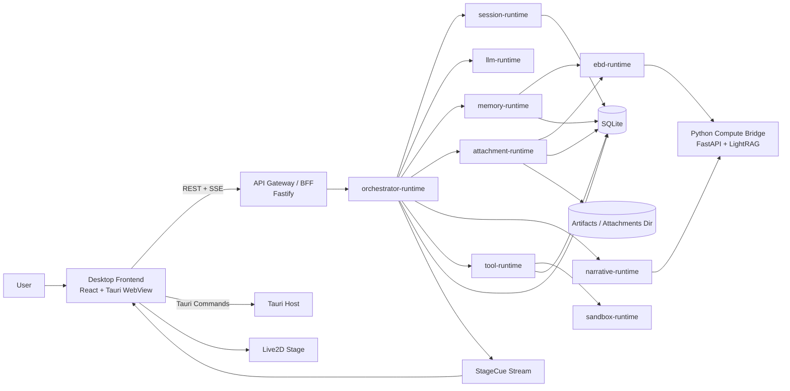
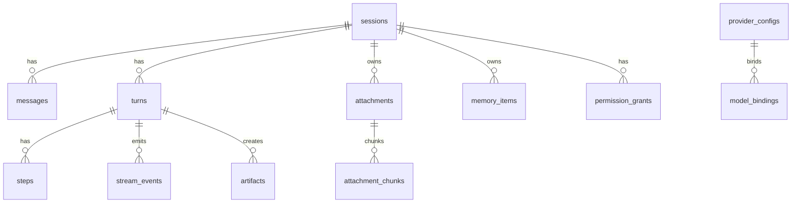
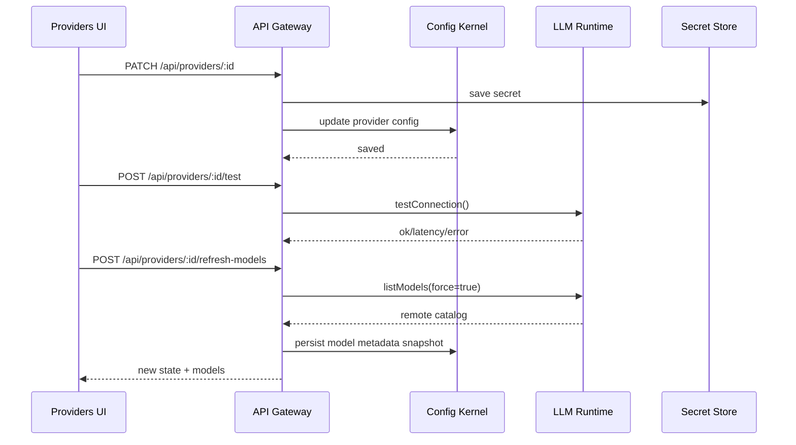

# EmaAgent V1 全栈 TypeScript 生产级架构蓝图

## 执行摘要

EmaAgent V1 不应该继续沿着“把 Python v0.4 逐块翻译成 TypeScript”的思路推进，而应该明确地重建成一个**本地优先、桌面优先、三模式清晰分层、可持续扩展**的产品化系统。你的现有长文档里，大方向已经是对的：三模式、SQLite 持久化、Agent 工具链、Narrative 差异化、AIRI 式设置界面、Live2D 固定舞台、Python 侧承接 LightRAG。这份蓝图做的事情，是把这些原则推进到**真正可落地的包级别、文件级别、接口级别、事件级别、数据库级别**。同时，我会明确指出哪些地方建议“保留”，哪些地方建议“推翻重写”。

最终推荐的 V1 形态是：

1. **桌面形态**：Tauri 壳 + React 前端 + TypeScript 本地 sidecar（Fastify BFF）+ Python compute sidecar。
2. **统一交互主线**：所有模式不再走“chat 专属路由”，而是收敛为**Turn/Execution 模型**：`POST /api/turns` 发起一次回合，SSE 流输出统一事件，工具确认、Diff 应用、停止、重试都围绕 turn 做。
3. **运行时分层**：把能力拆为 `session-runtime`、`llm-runtime`、`ebd-runtime`、`memory-runtime`、`tool-runtime`、`sandbox-runtime`、`narrative-runtime`、`attachment-runtime`、`config-kernel`、`storage-sql` 和 `orchestrator-runtime`。每个 runtime 只暴露单一 façade，内部使用少量必要类，其余保持函数式模块，避免过度封装。
4. **记忆策略**：V1 **不做通用 GraphRAG**。通用记忆走“近期上下文 + 会话摘要 + 向量召回 + SQLite FTS5 词法回退 + 轻量 rerank”，Narrative 单独继续用 LightRAG，互不污染。
5. **Agent 工具主线**：参考 Claude Code / Codex 的思路，但不复制其产品表面；你的 Agent 模式必须具备**工具确认、沙箱约束、结构化步骤流、Artifact 工作区、Monaco Diff、Apply/Reject**，且**禁止把 patch 只当聊天文本展示**。Claude Code 明确把“权限”和“沙箱”视为互补安全层，Codex 则把 approval policy 与 sandbox 分开，并提供结构化 patch/diff 工作流，这正是 EmaAgent 应借鉴的生产级基线。citeturn0search3turn19search0turn19search1turn19search2turn19search13
6. **Provider 体系**：不能只做“一个 OpenAI-compatible fetch 封装”。必须建立**Provider Registry + Model Catalog + Capability Probe + Health + Model Role Binding**。OpenAI、Anthropic、Gemini 三家应该优先走原生适配器；DeepSeek、OpenRouter、Ollama 走 OpenAI-compatible / Anthropic-compatible 适配层，且能力标记必须是“探测出来或文档确认过的”，不能想当然。OpenAI、Anthropic、Gemini、DeepSeek 都提供官方模型/流式/工具接口文档；OpenRouter 和 Ollama 也明确提供兼容层与模型元数据能力。citeturn13search0turn1search0turn1search0turn17search0turn4search0turn0search2turn4search1turn15search2turn2search0turn16search5turn14search0turn16search0turn26search5turn26search3turn26search6turn23view0turn23view1turn23view2turn6search0turn6search5turn6search7
7. **桌面与前端体验基线**：AIRI 的价值在于它证明了“角色化 UI + 设置中枢 + 浏览器/桌面共栈 + 丰富 provider/模块配置”的产品路线是成立的，但你不需要把 AIRI 那套游戏/多平台/全能力都背过来。AIRI 官方 README 也明确它是 Web 技术驱动、浏览器与桌面双目标、模块繁多且记忆仍在推进中的项目；EmaAgent V1 必须做的是**收缩到 Ema 固定角色 + chat/agent/narrative 三条主线**。citeturn24view0

我建议把你现有文档中的以下要点**保留**：三模式、SQLite 持久化、Narrative 独立、前端 Artifact 工作区、Live2D ACT/StageCue、Windows 打包目标、Tool 权限引擎、去 JSON 文件化持久层。  
我建议把以下要点**推翻或重写**：

- 用 `/api/chat` 和 `/api/chat/stream` 作为“一切主入口”的设计，改成统一的 **turn API**。
- 把 provider 与 model 简单一一绑定的思路，改成 **provider registry + model catalog + role binding**。
- 把 ebd/rerank 混在 llm-runtime 里的倾向，改成独立 `ebd-runtime`。
- 把 memory 未来默认走图的倾向，改成 V1 **vector-first**。
- 把“日志字符串给前端解析”的残余习惯，改成**结构化事件协议**。
- 把 Python 逻辑直接耦合到前端/路由的方式，改成**TS sidecar 管控 + Python bridge 隔离**。

这份蓝图的设计目标不是“看起来很工程”，而是保证到 5 月底时，你得到的不是玩具骨架，而是一版**可以一键启动、能流式聊天、能做安全工具调用、能看 diff、能打包桌面端、能跑 narrative、后续还扩得动**的 EmaAgent。

## 产品范围与总体架构

### 产品定义与 V1 边界

EmaAgent 的核心不是“大而全 AI VTuber”，而是一个带有固定 Ema 角色舞台的**个人智能桌面伙伴**。V1 只做三件事：

| 模块 | V1 必做 | V1 不做 |
|---|---|---|
| chat | 日常聊天、长期偏好记忆、附件理解、结构化消息渲染 | 语音通话、多人会话、角色切换 |
| agent | 工具调用、步骤时间线、权限确认、Diff/Apply、数据分析与绘图、MCP/Skill | 云端后台任务池、并行多 agent 协作、自动 PR 流水线 |
| narrative | 基于 LightRAG 的剧情文本检索与情绪价值对话 | 世界状态模拟、全局 GraphRAG、角色关系治理平台 |
| 舞台 | 固定 Ema Live2D、ACT/StageCue 驱动表情/动作 | 多角色、VRM 切换、游戏控制 |
| 存储 | SQLite + 本地 artifact/attachment | 分布式数据库、远程同步 |
| Providers | OpenAI / Anthropic / Gemini / DeepSeek / OpenRouter / Ollama | 所有 provider 首发全覆盖 |

你的 README 已经说明 EmaAgent v0.4 目前具备 chat、agent、narrative、WebSocket 流式、会话持久化、ChunkRAG 和记忆/附件预处理，以及 Live2D 联动；而 AIRI 的经验表明桌面/浏览器共栈、角色化 UI、provider 模块化是可行路线，但 AIRI 同时也是一个非常宽的项目，包含游戏、语音、浏览器内数据库等庞大边界。EmaAgent V1 应主动收缩，而不是跟 AIRI 比能力宽度。citeturn24view0

### 三模式职责划分

| 模式 | 核心目标 | Prompt 形态 | 读哪些上下文 | 写哪些持久化 |
|---|---|---|---|---|
| chat | 日常高质量陪伴对话 | 角色指令 + user input + 轻量 recall | 近期消息、用户画像、偏好、相关附件 | 会话消息、摘要、稳定偏好记忆 |
| agent | 生产力任务完成 | **Ema 角色指令** + 任务说明 + 工具清单 + workspace/权限规则 | 近期消息、任务摘要、工具结果、相关文件/附件 | turns、steps、artifacts、可选 workflow 记忆 |
| narrative | 剧情检索与情绪互动 | 角色指令 + user input + narrative context | 用户消息 + LightRAG 命中剧情块 | 会话消息、narrative analytics；**不写世界事实到通用 memory** |

这里的三模式不是三个彼此隔离的会话类型，而是同一个 session 下每一轮 turn 的执行策略。用户可以在同一个对话里上一轮用 chat，下一轮切到 agent，再下一轮切到 narrative；session 只负责承载连续上下文、消息、附件、权限授予和产物，`turn.mode` 才记录本轮到底按哪个模式执行。

Agent 模式不能因为进入“生产力任务”就丢掉 Ema 人设。它的 system prompt 应该先注入 Ema 的身份、语气、边界和陪伴风格，再叠加 agent 的工具使用、沙箱、权限确认、workspace、diff/apply 等执行规则。也就是说，agent 是“用 Ema 的语气完成任务”，不是切换成一个无人格的通用 coding bot。

### 总体组件图



### 进程边界与部署形态

推荐最终落地到三进程：

```text
Tauri Host (Rust)
  ├─ React Frontend (WebView)
  └─ ema-api-sidecar.exe (TypeScript/Fastify sidecar)
        └─ py-compute-bridge.exe (Python/FastAPI)
```

采用这个布局的原因很简单：

- **Tauri** 负责桌面壳、窗口、插件权限、侧车进程与打包；官方支持 sidecar 外部二进制，并允许使用 shell plugin 启动与限制执行参数。citeturn7search0turn7search2turn25search6
- Tauri 官方示例明确指出 sidecar 可以携带 Node/JS 应用，也可以通过 localhost、stdin/stdout、本地 socket 做 IPC；这非常适合你把 TS BFF 与 Python bridge 独立出来。citeturn7search1
- **Fastify** 适合作为本地 BFF，因为它天然用插件组织路由和服务，作用域封装清晰，适合单机 sidecar，不会像大型 Nest 风格一样过重。citeturn8search0turn8search9
- **Python** 只保留 LightRAG / embedding / rerank / 既有 narrative 代码，不进入前端，不进入主路由，不参与桌面 UI 生命周期，只通过桥接服务提供能力。

### V1 的关键架构原则

第一，**一切围绕 turn，而不是围绕 chat**。  
第二，**前端永远只消费结构化事件，不消费日志字符串**。  
第三，**provider 能力必须可探测、可绑定、可测试、可回退**。  
第四，**工具执行与模型推理必须分离，权限与沙箱必须分离**。Claude Code 和 Codex 都把这件事讲得很清楚：权限是“何时停下来问”，沙箱是“技术边界本身”，二者不能混成一个开关。citeturn0search3turn19search0turn19search2  
第五，**Narrative 是独立检索体系，不是通用 memory 的一种 mode**。  
第六，**V1 不追求通用插件平台，而追求清晰的扩展面**：Provider Adapter、ToolAdapter、MCP Server、Skill Manifest。

## 前端架构

### 页面与信息架构

前端不建议做成“设置页 + 一个聊天页”的普通聊天壳，而应该做成**命令中心 + 工具工作区 + 固定舞台**。

```text
AppShell
  ├─ Sidebar
  │   ├─ Sessions
  │   └─ Settings
  ├─ CommandCenter
  │   ├─ SessionHeader
  │   │   └─ ModePicker (chat / agent / narrative, per-turn)
  │   ├─ TranscriptPane
  │   ├─ StepTimelinePane
  │   ├─ ContextRadarPane
  │   └─ WorkspacePane
  └─ EmaStage
      └─ Live2D + Status + Quick Actions
```

AppShell 里不要把 `Sessions` 和 `Modes` 做成并列导航。模式选择属于当前 session 的输入上下文，是“下一轮按什么模式执行”的选择器，而不是全局页面入口。UI 可以记住每个 session 的上一次模式作为默认值，但这只是便利状态，不能把 session 固化成 chat session / agent session / narrative session。

推荐的页面路由：

| 路由 | 作用 |
|---|---|
| `/` | 重定向到最近会话 |
| `/s/:sessionId` | 主会话页；每次发送前在这里选择本轮 mode |
| `/settings` | 设置首页 |
| `/settings/providers` | Provider 网格 |
| `/settings/providers/:providerId` | Provider 配置详情、健康、模型列表 |
| `/settings/modules` | 模块总开关 |
| `/settings/memory` | memory / attachment / narrative 策略 |
| `/settings/security` | 权限规则、全权限、沙箱 |
| `/settings/data` | DB、导入导出、重置、索引状态 |
| `/settings/character` | Ema 角色页，只含 Live2D/ACT/Prompt 绑定 |
| `/settings/developer` | trace、event inspector、contract debug |

### 命令中心布局

你给的截图和 AIRI 的视觉方向都说明一点：你想要的是“带角色舞台的控制中心”，而不是“一个 Markdown 聊天框”。AIRI 的公开材料也强调其是 Web 技术驱动、支持桌面/浏览器多入口、并把 UI 模块拆得很细。EmaAgent V1 可以借这个方向，但必须把模式切换收进会话主页面的输入区，转而强化主页面中的四块区域。citeturn24view0

推荐桌面页面为四区：

| 区域 | 默认显示 | 什么时候出现 |
|---|---|---|
| TranscriptPane | 聊天消息与富文本输出 | 永远显示 |
| StepTimelinePane | agent 步骤、工具调用、权限节点 | agent 时主开，chat/narrative 可折叠 |
| ContextRadarPane | 近期消息、召回块、附件、summary、token 预算 | 三模式都可见 |
| WorkspacePane | Artifact、Editor、Diff、预览、图表 | agent 主开；chat 中按需弹出 |

### 前端状态模型

前端不要把所有状态都丢给 React Query，也不要把所有状态都丢给 Zustand。建议分两类：

| 状态类型 | 技术 |
|---|---|
| 服务端真实状态（sessions、messages、providers、artifacts） | TanStack Query |
| 流式临时状态（当前 turn 的 deltas、step 进度、permission dialog、stage cue） | Zustand / slice store |
| 路由状态 | TanStack Router |
| 表单状态 | react-hook-form + zod |
| 长列表虚拟化 | react-virtuoso |

### 事件协议

V1 统一使用 **SSE** 作为文本模式的前端流协议，不再把 WebSocket 当默认。原因是 OpenAI Responses、Anthropic Streaming、Gemini `streamGenerateContent` 都公开提供流式事件能力，OpenAI 还明确把 Responses 流定义成**typed semantic events**；统一成 server-internal `AsyncIterable<EmaStreamEvent>` 再由 BFF 转 SSE，抽象最稳。DeepSeek 的官方 FAQ 还明确提醒其流式等待过程中可能发 keep-alive 注释，说明客户端必须按 SSE/流式语义稳健处理。citeturn0search0turn0search2turn16search5turn26search8

推荐事件联合类型：

```ts
export type EmaStreamEvent =
  | { type: "turn_started"; requestId: string; sessionId: string; mode: "chat" | "agent" | "narrative"; at: number }
  | { type: "context_snapshot"; budget: ContextBudgetView; sources: ContextSourceView[] }
  | { type: "output_text_delta"; blockId: string; delta: string; index: number }
  | { type: "render_block"; block: RenderBlock }
  | { type: "step_started"; step: StepView }
  | { type: "step_updated"; stepId: string; patch: Partial<StepView> }
  | { type: "tool_call_requested"; call: ToolCallView; permission?: PermissionRequestView }
  | { type: "tool_call_output"; callId: string; output: ToolOutputView }
  | { type: "artifact_upserted"; artifact: ArtifactSummary }
  | { type: "diff_ready"; artifactId: string; diff: DiffSummary }
  | { type: "permission_required"; request: PermissionRequestView }
  | { type: "permission_resolved"; requestId: string; decision: PermissionDecision }
  | { type: "stage_cue"; cue: StageCue }
  | { type: "usage_report"; usage: UsageView }
  | { type: "warning"; code: string; message: string }
  | { type: "turn_completed"; requestId: string; assistantMessageId: string; at: number }
  | { type: "turn_failed"; requestId: string; error: UiErrorView; retryable: boolean };
```

前端消费方式：

```ts
export interface StreamController {
  consume(stream: AsyncIterable<EmaStreamEvent>, hooks: {
    onEvent(event: EmaStreamEvent): void
    onError(error: Error): void
    onDone(): void
  }): Promise<void>
  abort(reason?: string): void
}
```

### Editor、Artifact 与 Diff UI

这块是你当前文档里最对、也最应该继续强化的地方。Agent 产物必须进入 Workspace，而不是停留在聊天正文里。

关键原则：

| 原则 | 说明 |
|---|---|
| 代码生成默认产物化 | 模型生成“文件、报表、图表、脚本、patch”时，转为 artifact |
| 编辑与聊天分离 | Monaco 编辑区不嵌在消息气泡里 |
| Diff 独立视图 | file diff 一律进 `CodeDiffWorkspace` |
| Apply 需要 hash 检查 | 防止用户手改文件后盲目覆盖 |
| 图表与数据分析也是 artifact | CSV、PNG、HTML 报告、notebook 输出都进入 workspace |

Codex 官方文档明确把 diff pane 作为核心界面的一部分，并把 apply patch 设计为结构化工具而不是普通文本建议。这正是 EmaAgent agent mode 该学习的地方。citeturn19search1turn19search13

### Provider 管理 UI

Provider 页不能只提供“API Key 输入框 + Ping API”。建议拆成四层：

| 层 | UI 元素 | 作用 |
|---|---|---|
| Provider 卡片层 | Grid 卡片 | 全局健康、配置状态、默认角色绑定总览 |
| Provider 详情层 | Drawer / Detail Page | base URL、认证、模型、测试、错误详情 |
| Model Binding 层 | Role Binding 面板 | `chat/agent/narrative/title/embedding/rerank` 分别绑定 |
| Capability 层 | Capabilities 表 | streaming/tools/vision/structured-output/cache/list-models |

Provider 卡片状态建议：

```ts
export interface ProviderConfigState {
  providerId: string
  label: string
  status: "unconfigured" | "testing" | "ready" | "degraded" | "rate_limited" | "auth_error" | "offline"
  baseUrl?: string
  supportsRemoteModels: boolean
  enabled: boolean
  configuredAt?: number
  lastTestAt?: number
  lastError?: string
  health: { ok: boolean; latencyMs?: number; detail?: string }
}
```

### Live2D 与舞台通道

因为你已经明确 **Live2D 和 Ema 人设不换**，所以 Character 模块要**从“角色切换系统”降级成“Ema 舞台配置系统”**。这其实是好事，会显著减少架构复杂度。

前端只消费 `StageCue`：

```ts
export interface StageCue {
  source: "act" | "step" | "tool" | "artifact" | "system"
  expression?: "neutral" | "curious" | "happy" | "thinking" | "sad" | "surprised"
  motion?: "idle" | "lean_forward" | "nod" | "look_left" | "look_right"
  mouth?: "idle" | "speaking"
  priority?: number
  durationMs?: number
}
```

规则：

- chat / narrative：优先使用模型 ACT 或后端 fallback 生成 cue。
- agent：主要由 step 生命周期驱动 cue，比如 `thinking`、`running_tool`、`error`。
- Live2D 绝不读取复杂 Agent state，只读取 cue；这是防耦合关键。

## 后端与运行时架构

### 推荐 Monorepo 结构

```text
apps/
  desktop-shell/                       # React + Tauri 前端
  api-gateway/                         # Fastify BFF，作为 TS sidecar 入口

services/
  py-compute-bridge/                   # FastAPI bridge，承接 narrative / embedding / rerank

packages/
  core-types/                          # 全局类型、事件、错误码、接口约束
  config-kernel/                       # 配置分层、默认值、解析器、密钥引用
  storage-sql/                         # Drizzle schema、repo、migrations、FTS5
  session-runtime/                     # sessions/messages/turns/title/context window
  llm-runtime/                         # provider registry, adapters, stream controller, usage, fallback
  ebd-runtime/                         # embedding / rerank 抽象与 bridge
  memory-runtime/                      # summary / durable memory / recall planner
  attachment-runtime/                  # 上传、解析、分块、索引、召回
  tool-runtime/                        # builtin tools / MCP / skills / permission preview
  sandbox-runtime/                     # workspace scope / command runner / diff apply
  narrative-runtime/                   # Python bridge client + narrative context builder
  orchestrator-runtime/                # chat/agent/narrative 三模式编排入口
```

这个结构刻意避免继续把包拆得更细。你需要的是**少而稳的 runtime 包**，不是几十个“感觉很先进”的 micro-package。

### 每个 runtime 的 façade 与职责

| runtime | façade | 只做什么 | 不做什么 |
|---|---|---|---|
| session-runtime | `SessionFacade` | 会话、消息、turn、标题、上下文窗口 | provider、工具、附件解析 |
| llm-runtime | `ExecutionFacade` | 模型调用、流归一化、usage/cost、fallback | 记忆规划、工具权限 |
| ebd-runtime | `EmbeddingFacade` | embed/rerank 路由、缓存、bridge | 会话逻辑 |
| memory-runtime | `MemoryFacade` | durable memory 读写、summary、recall planning | narrative corpus |
| attachment-runtime | `AttachmentFacade` | ingest、chunk、索引、召回 | 通用用户画像记忆 |
| tool-runtime | `ToolFacade` | tool registry、MCP/Skill 加载、permission preview | shell 隔离 |
| sandbox-runtime | `SandboxFacade` | 文件与命令边界、patch apply | tool 选择 |
| narrative-runtime | `NarrativeFacade` | narrative query、timeline route、context build | 通用 memory |
| config-kernel | `ConfigFacade` | 配置分层与解析 | 执行模型调用 |
| orchestrator-runtime | `OrchestratorFacade` | 三模式回合编排 | DB 细节 |

### 关键接口示例

#### Provider / Model / LLM Adapter

```ts
export interface ModelCapabilities {
  streaming: boolean
  toolCalling: boolean
  visionInput: boolean
  structuredOutput: boolean
  promptCache: boolean
  remoteMcp: boolean
  nativeWebSearch: boolean
}

export interface ModelDescriptor {
  id: string
  providerId: string
  apiFamily: "openai-responses" | "anthropic-messages" | "gemini-native" | "openai-compatible" | "anthropic-compatible"
  displayName: string
  contextWindow?: number
  maxOutputTokens?: number
  capabilities: ModelCapabilities
  pricing?: {
    inputPer1M?: number
    outputPer1M?: number
    cacheReadPer1M?: number
    cacheWritePer1M?: number
  }
  deprecation?: { at?: string; note?: string }
}

export interface ProviderDescriptor {
  id: string
  displayName: string
  kind: "llm" | "embedding" | "reranker"
  baseUrl?: string
  website?: string
  icon?: string
  supportsModelListing: boolean
  authScheme: "api_key" | "bearer" | "none" | "custom"
}

export interface LlmProvider {
  readonly provider: ProviderDescriptor
  listModels(input?: { force?: boolean }): Promise<ModelDescriptor[]>
  getModel(modelId: string): Promise<ModelDescriptor | undefined>
  testConnection(): Promise<{ ok: boolean; latencyMs?: number; detail?: string }>
  stream(request: LlmExecutionRequest): AsyncIterable<LlmDelta>
  complete(request: LlmExecutionRequest): Promise<LlmCompleteResult>
}
```

#### Stream Controller / Execution Facade

```ts
export interface ExecutionFacade {
  streamTurn(req: LlmExecutionRequest): AsyncIterable<EmaStreamEvent>
  completeOnce(req: LlmExecutionRequest): Promise<LlmCompleteResult>
  stop(requestId: string): Promise<void>
  estimateCost(input: {
    modelId: string
    usage: NormalizedUsage
  }): Promise<{ usd?: number; unknown: boolean }>
}

export class StreamAggregator {
  private text = ""
  private toolBuffers = new Map<string, string>()

  accept(delta: LlmDelta): EmaStreamEvent[] {
    // vendor delta -> normalized UI/domain events
    return []
  }

  finalize(): {
    outputText: string
    toolCalls: FinalToolCall[]
    usage?: NormalizedUsage
  } {
    return { outputText: this.text, toolCalls: [] }
  }
}
```

#### MemoryStore / ToolAdapter

```ts
export interface MemoryStore {
  write(input: MemoryWriteInput): Promise<MemoryWriteResult>
  search(input: MemorySearchInput): Promise<MemoryHit[]>
  summarizeWindow(input: ContextSummarizeInput): Promise<ConversationSummary>
  pin(input: { sessionId: string; memoryId: string }): Promise<void>
}

export interface ToolAdapter {
  readonly id: string
  readonly source: "builtin" | "mcp" | "skill"
  describe(): ToolDescriptor
  preview(args: unknown, ctx: ToolPreviewContext): Promise<ToolEffectPreview>
  execute(args: unknown, ctx: ToolExecutionContext): Promise<ToolExecutionResult>
}
```

### `llm-runtime` 的真正缺口与最终文件设计

你现在的 `provider.ts`、`router.ts`、`model.ts` 方向是对的，但还缺完整的**四块关键能力**：配置状态、能力探测、错误归一化、流控制。

推荐文件树：

```text
packages/llm-runtime/src/
  index.ts                             # 对外只暴露 facade
  types.ts                             # LLM 请求/响应/usage/cost/error 类型
  provider.ts                          # ProviderDescriptor / LlmProvider / config state
  model.ts                             # ModelDescriptor / capability types
  registry.ts                          # registerProvider/listProviders/resolveProvider
  catalog.ts                           # static catalog + remote model listing + cache
  config-service.ts                    # provider config CRUD / secret handle / health test
  execution-facade.ts                  # streamTurn / completeOnce / stop
  stream-aggregator.ts                 # vendor delta -> normalized events
  usage.ts                             # normalize usage + estimate cost
  errors.ts                            # classify vendor errors
  fallback.ts                          # fallback chain decision
  adapters/
    openai-native.ts                   # OpenAI Responses 原生适配
    anthropic-native.ts                # Claude Messages 原生适配
    gemini-native.ts                   # Gemini 原生适配
    openai-compatible.ts               # DeepSeek/OpenRouter/Ollama/自定义兼容层
```

关键导出函数与类：

| 文件 | 导出 | 作用 |
|---|---|---|
| `registry.ts` | `registerProvider` `listProviders` `resolveProviderByModelId` | provider/model 路由 |
| `catalog.ts` | `loadMergedCatalog` `refreshRemoteModels` | 组合静态目录与远端列模 |
| `config-service.ts` | `saveProviderConfig` `testProviderConfig` `listProviderHealth` | 设置页与健康检测 |
| `execution-facade.ts` | `streamTurn` `completeOnce` `stop` | 单一 façade |
| `stream-aggregator.ts` | `StreamAggregator` | 拼接文本、tool args、usage |
| `errors.ts` | `classifyProviderError` | 统一错误码 |
| `fallback.ts` | `chooseFallbackModel` | 自动或显式回退 |

### `orchestrator-runtime` 的文件设计

`orchestrator-runtime` 是唯一“知道三模式差异”的地方：

```text
packages/orchestrator-runtime/src/
  index.ts                             # runTurn facade
  types.ts                             # TurnInput / TurnHandle / mode contracts
  run-turn.ts                          # mode dispatch + AbortController
  chat-flow.ts                         # chat 主链
  agent-flow.ts                        # agent 主链
  narrative-flow.ts                    # narrative 主链
  context-plan.ts                      # 构建上下文计划
  output-render-plan.ts                # assistant 输出转 render blocks / artifacts
  stage-cue-plan.ts                    # turn -> StageCue
```

关键函数：

| 函数 | 功能 |
|---|---|
| `runTurn(req)` | 统一回合入口，返回 `AsyncIterable<EmaStreamEvent>` |
| `runChatFlow(ctx)` | chat 模式：加载 history、memory、attachments、LLM |
| `runAgentFlow(ctx)` | agent 模式：tool loop、步骤流、artifact、diff |
| `runNarrativeFlow(ctx)` | narrative 模式：narrative recall + answer |
| `buildContextPlan(ctx)` | 汇总 session/memory/attachment/narrative sources |
| `buildRenderPlan(output)` | 最终消息块转换 |

### Tool + Sandbox + Apply workflow

这是 V1 里最应该“像产品”的部分，不应等以后再补。

```mermaid
sequenceDiagram
  participant U as User
  participant FE as Frontend
  participant BFF as API Gateway
  participant ORC as Orchestrator
  participant LLM as LLM Runtime
  participant TOOL as Tool Runtime
  participant BOX as Sandbox Runtime

  U->>FE: 发送 agent 请求
  FE->>BFF: POST /api/turns
  BFF->>ORC: runTurn(mode=agent)
  ORC->>LLM: stream planning
  LLM-->>ORC: tool call proposal
  ORC->>TOOL: preview(args)
  TOOL->>BOX: validate scope / risk
  BOX-->>TOOL: risk + allowed paths + network policy
  TOOL-->>ORC: permission request
  ORC-->>FE: permission_required
  U->>FE: allow once / deny / allow session
  FE->>BFF: POST /api/turns/:id/confirm
  BFF->>ORC: resolve permission
  ORC->>TOOL: execute
  TOOL->>BOX: run command / file edit / patch staging
  BOX-->>TOOL: output / patch / artifacts
  TOOL-->>ORC: tool result
  ORC->>LLM: continue with tool result
  LLM-->>ORC: final answer + diff summary
  ORC-->>FE: artifact_upserted / diff_ready / turn_completed
```

#### `tool-runtime` 文件树

```text
packages/tool-runtime/src/
  index.ts
  types.ts                             # ToolDescriptor / preview / result / permission request
  registry.ts                          # builtin + MCP + skills 注册中心
  builtin/
    read-file.ts
    write-file.ts
    list-dir.ts
    search-text.ts
    run-python.ts                      # 数据分析/绘图
    run-shell.ts
  mcp/
    mcp-client.ts                      # @modelcontextprotocol/sdk client wrapper
    mcp-loader.ts                      # server config -> connected tools
  skills/
    skill-manifest.ts                  # skill.yaml parser
    skill-loader.ts                    # prompts/scripts/resources -> tools
  permission-engine.ts                 # allow/ask/deny 判定
  preview.ts                           # execute 前影响预览
```

#### `sandbox-runtime` 文件树

```text
packages/sandbox-runtime/src/
  index.ts
  types.ts
  workspace-scope.ts                   # 允许路径、工作目录边界
  command-runner.ts                    # shell / python subprocess
  fs-guard.ts                          # 读写校验
  diff-builder.ts                      # 生成结构化 patch / file change
  apply.ts                             # apply/reject with hash check
  policy.ts                            # network / env / write mode
```

Codex 文档把 sandbox、approval、structured diff、diff pane 这四个概念拆得非常清楚；Claude Code 文档则把 allow/ask/deny 规则写成了可配置策略。EmaAgent 直接吸收这个抽象即可，不需要自己再发明一套奇怪的权限哲学。citeturn19search0turn19search1turn19search2turn19search13turn21search18

### API 合同

#### 核心回合接口

| 接口 | 入参 | 返回 |
|---|---|---|
| `POST /api/turns` | `StartTurnRequest` | `StartTurnResponse` |
| `GET /api/turns/:requestId/stream` | path only | `text/event-stream` |
| `POST /api/turns/:requestId/stop` | `{ reason?: string }` | `{ ok: true }` |
| `POST /api/turns/:requestId/confirm` | `PermissionDecisionInput` | `{ ok: true }` |
| `POST /api/turns/:requestId/retry` | `{ from?: "last_user" \| "message_id" }` | `StartTurnResponse` |

```ts
export interface StartTurnRequest {
  sessionId: string
  mode: "chat" | "agent" | "narrative"
  input: Array<
    | { type: "text"; text: string }
    | { type: "image_ref"; attachmentId: string }
    | { type: "file_ref"; attachmentId: string }
  >
  attachments?: string[]
  modelOverrides?: Partial<{
    chatModelId: string
    agentModelId: string
    narrativeModelId: string
    titleModelId: string
  }>
  client?: {
    locale?: string
    timezone?: string
    supportsMermaid?: boolean
    supportsLatex?: boolean
  }
}

export interface StartTurnResponse {
  requestId: string
  sessionId: string
  acceptedAt: number
  streamUrl: string
}
```

`StartTurnRequest.mode` 是本轮 turn 的模式，不是 session 的固定类型。后端必须允许同一个 `sessionId` 连续提交不同 mode 的 turns；前端的 `mode_last` 只用于下次打开该 session 时恢复默认选择。

#### Provider 与模型接口

| 接口 | 作用 |
|---|---|
| `GET /api/providers` | 列出 provider 卡片、健康、配置状态 |
| `GET /api/providers/:providerId` | provider 详情 |
| `PATCH /api/providers/:providerId` | 更新配置 |
| `POST /api/providers/:providerId/test` | 测试连接 |
| `POST /api/providers/:providerId/refresh-models` | 刷新远端模型 |
| `GET /api/model-bindings` | 当前角色绑定 |
| `PATCH /api/model-bindings` | 更新 `chat/agent/narrative/title/embedding/rerank` 绑定 |

#### Session / Artifact / Attachment 接口

| 接口 | 作用 |
|---|---|
| `GET /api/sessions` | 会话列表 |
| `POST /api/sessions` | 新建会话 |
| `GET /api/sessions/:id` | 会话详情 |
| `GET /api/sessions/:id/messages` | 消息分页 |
| `PATCH /api/sessions/:id/title` | 手动改名 |
| `POST /api/attachments` | 上传并触发 ingest |
| `GET /api/artifacts/:id` | 按 `payloadRef` 懒加载 artifact |
| `POST /api/artifacts/:id/apply` | 应用 patch |
| `POST /api/artifacts/:id/reject` | 拒绝 patch |

## 数据、记忆与上下文

### 为什么 V1 不做通用 GraphRAG

结论先说：**通用 memory V1 不要做图**。  
原因不是图没价值，而是你的产品目标、时间窗口和数据形态都更适合下面这套：

```text
recent window
  + rolling summary
  + durable facts
  + vector recall
  + FTS5 lexical fallback
  + rerank
```

GraphRAG/Graph Memory 更适合：

- 多实体、多关系、长期演化、需要可解释引用链；
- 数据源质量高、抽取 pipeline 稳；
- 有足够时间构建 schema、去重、冲突解决、边权更新。

而你现在的现实是：

- chat 更像个人陪伴；
- agent 更像任务执行副产品；
- narrative 已经有独立 LightRAG；
- 5 月底前要交付的是产品闭环，不是学术 memory 系统。

所以 V1 的正确选择是：

| 场景 | 用什么 |
|---|---|
| 用户身份/偏好 | durable memory facts |
| 长会话压缩 | rolling summary |
| 历史语义找回 | vector recall |
| 精确关键词补救 | SQLite FTS5 |
| narrative 世界内容 | LightRAG 独立系统 |

SQLite FTS5 本身就适合在本地桌面产品中做低成本词法回退；SQLite 官方文档也明确 FTS5 就是为高效全文搜索准备的虚表模块。citeturn8search1

### 上下文预算与压缩策略

推荐统一预算公式：

| 分区 | chat | agent | narrative |
|---|---:|---:|---:|
| system / role / policies | 10% | 10% | 10% |
| recent messages | 35% | 20% | 20% |
| summary | 15% | 10% | 10% |
| memory recall | 15% | 10% | 5% |
| attachment / workspace recall | 10% | 20% | 5% |
| narrative recall | 0% | 0% | 30% |
| tools / schemas | 0% | 15% | 0% |
| output reserve | 15% | 15% | 20% |

压缩顺序：

1. 先裁剪过长 recent messages。
2. 再把中段消息压成 session summary。
3. 再减少 recall top-k。
4. 还不够时，降级工具描述或附件上下文。
5. 最后才触发模型切换或显式报“上下文过载”。

### 什么时候读 memory，什么时候写 memory

#### 读策略

| 模式 | 读 memory 规则 |
|---|---|
| chat | 每轮读：profile + preference + optional episodic hits |
| agent | 只读与当前任务、workspace、历史 workflow 相关的记忆 |
| narrative | 默认不读通用 facts，只读 user profile 中与说话风格相关的少量稳定偏好 |

#### 写策略

| 会写入的内容 | 不写入的内容 |
|---|---|
| 明确身份信息、稳定偏好、长期项目事实、重复 workflow 经验 | 一次性情绪、临时计划、模型臆断、narrative 世界事实、整段代码内容 |

写入阈值建议：

- 用户明确说“记住”。
- 同一偏好在 2~3 个独立会话被重复表达。
- agent 成功完成某类任务，且具备可复用性（如固定导出格式/路径偏好）。
- narrative 不产生 durable world fact；只记录 session analytics。

### `ebd-runtime` 的定位

你之前问过“ebd 与 rerank 放 llm 还是多模态”。最终答案是：**都不要**，应该独立成 `ebd-runtime`。

职责：

| 子能力 | 所属 |
|---|---|
| text embedding | ebd-runtime |
| multimodal embedding | ebd-runtime（通过 capability 标记） |
| rerank | ebd-runtime |
| content-hash 缓存 | ebd-runtime |
| memory / attachment / narrative 的召回服务 | 分别在各 runtime 内调用 ebd-runtime |

官方文档层面，Gemini 已明确提供 embeddings，并且最新 embedding 模型是跨模态统一嵌入空间；这意味着未来如果你想扩到图像/文档跨模态召回，依旧应该落在 `ebd-runtime`，而不是 llm-runtime。citeturn14search1turn14search11

### 数据库与存储设计

推荐表：



核心表说明：

| 表 | 关键字段 |
|---|---|
| `sessions` | `id, title, mode_last, title_status, created_at, updated_at`；`mode_last` 只表示该会话上一次使用的默认模式 |
| `messages` | `id, session_id, role, content_blocks, request_id, created_at` |
| `turns` | `request_id, session_id, mode, status, model_id, provider_id, started_at, ended_at, usage_json, cost_usd` |
| `steps` | `id, request_id, type, status, title, detail_json, started_at, ended_at` |
| `stream_events` | `id, request_id, seq, type, payload_json, created_at` |
| `artifacts` | `id, request_id, kind, title, mime, payload_ref, diff_base_hash, diff_head_hash` |
| `attachments` | `id, session_id, file_name, mime, size_bytes, sha256, storage_path` |
| `attachment_chunks` | `id, attachment_id, chunk_index, text, embedding_ref, token_count` |
| `memory_items` | `id, session_id, namespace, kind, text, summary, salience, last_used_at, embedding_ref` |
| `provider_configs` | `provider_id, base_url, enabled, secret_handle, custom_headers_yaml, updated_at` |
| `model_bindings` | `role, provider_id, model_id, strategy, fallback_chain_yaml` |
| `permission_grants` | `id, session_id, scope, tool_id, decision, expires_at` |

#### Secrets 方案

- API key **不入 SQLite 明文**。
- SQLite 只存 `secret_handle`。
- 真正密钥放 Tauri Stronghold 或系统密钥链封装层。Tauri 官方 stronghold 插件可作为桌面端安全存储方案。citeturn25search0

#### SQLite 选型

建议：

- `better-sqlite3` + Drizzle ORM；
- Drizzle 负责 schema、types、query builder、migrations；
- SQLite FTS5 负责 lexical fallback；
- artifact / attachment 大文件放本地文件系统，DB 只存引用。

Drizzle 官方文档明确支持 SQLite（含 `better-sqlite3` / `libsql`），并提供 migration 工作流；这套组合非常适合你的本地桌面 sidecar。citeturn9search0turn9search1

### V1 缓存策略

#### 该缓存的

| 缓存 | 是否做 | 说明 |
|---|---|---|
| provider model catalog | 做 | 5~30 分钟 TTL |
| health check | 做 | 10~30 秒短 TTL |
| attachment 解析结果 | 做 | 永久，按 sha256 |
| embedding | 做 | 永久，按 `model_id + sha256(content)` |
| rerank | 做 | 短 TTL，按 `query hash + candidate ids` |
| token count / chunking | 做 | 持久缓存 |
| Mermaid / highlight render | 前端做 | 按内容 hash |

#### 暂时不做的

| 缓存 | 原因 |
|---|---|
| 通用 LLM 输出缓存 | chat/agent 高语义状态，收益小，容易误命中 |
| 跨 turn 全 prompt cache 自建层 | 各 provider 语义差异大 |
| 通用 graph cache | V1 不做图 |

#### Provider 原生缓存如何处理

- Anthropic：支持 prompt caching，且官方明确可缓存 tools、system、history 前缀。citeturn4search1turn21search21
- Gemini：支持 context caching，官方建议对重复上下文显式缓存。citeturn14search0turn14search2
- DeepSeek：上下文缓存默认开启，按前缀命中。citeturn26search0turn26search4
- OpenRouter：模型元数据与 responses beta 都暴露了 cache/read/write 相关价格与参数能力，但它是聚合层，不能拿来替代本地状态管理。citeturn23view0turn23view2

EmaAgent V1 的做法应该是：**把 provider-native cache 作为 adapter 可选优化，不把它设计成跨 provider 的统一语义保证**。

## 提供商、工具、安全与可观测性

### Provider 适配策略总表

下表按各家官方文档整理，重点放在 EmaAgent 真实需要的能力：流式、工具、结构化输出、模型列举、缓存与兼容方式。citeturn13search0turn1search0turn13search2turn17search0turn15search2turn4search0turn4search1turn21search0turn16search5turn2search0turn14search0turn16search0turn18search3turn26search3turn26search0turn26search6turn23view0turn23view1turn23view2turn6search0turn6search5turn6search7

| Provider | 推荐适配器 | 流式 | 工具调用 | 结构化输出 | 模型列举 | 缓存 | 备注 |
|---|---|---|---|---|---|---|---|
| OpenAI | `openai-native` | 是 | 是 | 是 | 是 | 平台有 prompt/cache 相关能力 | V1 首选 chat/agent 主 provider |
| Anthropic | `anthropic-native` | 是 | 是 | 是 | 是 | prompt caching | 长上下文与工具循环很强 |
| Gemini | `gemini-native` | 是 | 是 | 是 | 是 | context caching | 若要完整能力，优先原生 API，不优先兼容层 |
| DeepSeek | `openai-compatible` | 是 | 是 | JSON Output / tool strict | 是 | 默认上下文缓存 | 性价比高，适合 narrative/chat 备选 |
| OpenRouter | `openai-compatible` | 是 | 依上游模型 | 依上游模型 | 是 | 取决于上游 + 聚合元数据 | 用于统一接多模型与 fallback |
| Ollama | `openai-compatible` / `anthropic-compatible` | 是 | 依模型 | 部分兼容 | 本地列模 | 本地指标 | 本地模型与离线模式 |

### 为什么不能只用 OpenAI-compatible 一把梭

因为一把梭会丢掉很多真正重要的产品能力：

| 丢失项 | 为什么重要 |
|---|---|
| OpenAI typed semantic events | 方便稳定流归一化 |
| Anthropic prompt caching / strict tool / 某些 beta features | 直接影响 Agent 体验与成本 |
| Gemini 原生 caching / embeddings / multimodal descriptors | 兼容层往往是不完整子集 |
| OpenAI remote MCP / connectors | 与未来 app/tool 生态相关 |

Google 官方甚至明确写了：Gemini 虽然支持 OpenAI 库兼容调用，但**如果你不是已有 OpenAI 代码存量，推荐直接调用 Gemini API**。这对 EmaAgent 非常关键：Gemini 应走原生适配，不应该只当一个兼容层。citeturn16search0

### Provider 管理的推荐流程



### MCP / Skill 协议

V1 不建议做一个“插件平台 SDK”，而是明确两条扩展面：

1. **MCP 服务器**：通过官方 MCP 协议接入第三方工具与资源；
2. **Skill**：本地 manifest + prompts + scripts + resources 的轻量扩展包。

MCP 规范明确三类核心能力就是 **resources、tools、prompts**，并且官方 TypeScript SDK 已提供 client/server 实现；规范也明确 TypeScript schema 是协议 source of truth。citeturn11search4turn11search0turn11search18

#### Skill 建议目录

```text
skills/
  data-analysis/
    skill.yaml
    prompts/system.md
    prompts/tool-guidance.md
    scripts/plot.py
    resources/README.md
```

`skill.yaml` 示例概念：

```yaml
id: data-analysis
name: Data Analysis
enabled: true
tools:
  - run_python
  - write_file
  - read_file
guidance:
  system_prompt: prompts/system.md
  tool_prompt: prompts/tool-guidance.md
artifacts:
  preferred_output:
    - image/png
    - text/csv
    - text/html
```

### 权限与安全模型

#### 决策模型

规则优先级建议直接采用：

```text
forbidden > prompt > allow
```

Codex 规则文档就是这么设计的；Claude Code 也提供 allow / ask / deny 规则配置。这样的好处是用户一眼就懂。citeturn19search8turn21search18

#### 风险分级

| 风险级别 | 例子 | 默认策略 |
|---|---|---|
| Low | 读文件、列目录、读 SQLite、生成图表到临时目录 | allow / ask by workspace policy |
| Medium | 写工作区文件、运行无网络命令、创建 artifact | ask |
| High | 删除文件、改 `.env`、外网访问、执行 shell with network | ask with warning |
| Critical | 工作区外写入、提权、读 secrets、不可逆 destructive actions | deny 或强确认 |

#### UX 规则

确认弹窗至少显示：

- 工具名
- 参数摘要
- 影响路径列表
- 是否需要网络
- 是否写文件 / 删除文件
- scope 选项：**一次允许 / 本 session 允许 / 总是拒绝**

### 错误归一化、重试、回退

#### 统一错误码

```ts
type ProviderErrorCode =
  | "auth_invalid"
  | "rate_limited"
  | "quota_exceeded"
  | "model_not_found"
  | "unsupported_feature"
  | "context_overflow"
  | "network_error"
  | "timeout"
  | "provider_internal"
  | "safety_blocked"
```

#### 重试策略

- 连接错误、408、429、5xx：指数退避重试。
- 主模型输出到一半已进入不可逆工具执行：**不自动跨 provider 回退**。
- 标题生成、summary、rerank、embedding、health check：可自动重试与回退。
- OpenAI 官方文档明确建议对 rate limit 使用随机指数退避，SDK 默认也会对部分错误自动重试；Anthropic 官方 SDK 也强调内建重试与错误处理。citeturn12search3turn12search12turn12search1

#### fallback 策略

| role | 主模型 | fallback |
|---|---|---|
| chat | 高质量通用模型 | 成本更低 chat 模型 |
| agent | 强工具/推理模型 | 同 provider 次级模型；仅在安全阶段回退 |
| narrative | 成本优先模型 | cheaper long-context model |
| title | 小模型 | 更小模型 |
| embedding | 主 embedding provider | Python sidecar local embedding |
| rerank | 主 rerank provider | 规则排序 fallback |

### 可观测性

#### 必须记录到 `turns` / `steps` / 日志中的字段

| 类别 | 字段 |
|---|---|
| 标识 | `trace_id`, `request_id`, `session_id`, `mode` |
| 模型 | `provider_id`, `model_id`, `fallback_from`, `fallback_to` |
| 时延 | `ttfb_ms`, `total_ms`, `tool_ms`, `rerank_ms`, `narrative_ms` |
| 用量 | `input_tokens`, `output_tokens`, `reasoning_tokens?`, `cache_read_tokens?`, `cache_write_tokens?`, `estimated_cost_usd` |
| recall | `memory_hits`, `attachment_hits`, `narrative_hits`, `compaction_ratio` |
| 工具 | `tool_name`, `permission_decision`, `apply_result` |
| 错误 | `error_code`, `retry_count`, `retryable` |

#### 推荐实现

- 日志：`pino`
- traces：OpenTelemetry API + file/stdout exporter
- 前端 inspector：developer page 里展示最近 50 个 events
- DB 存摘要，原始详细日志按 JSONL 文件滚动写

### 第三方库选择

| 场景 | 推荐库 | 为什么 |
|---|---|---|
| 桌面壳 | Tauri | 体积、权限模型、sidecar、桌面插件 |
| BFF | Fastify | 插件作用域清晰、sidecar 场景轻量 |
| DB | Drizzle + better-sqlite3 | TS 类型、SQLite 友好、migration 明确 |
| 协议校验 | zod | 与前端表单、tool schema、TS 体验统一 |
| 编辑器 | Monaco | 现成 DiffEditor，别自己造 |
| 渲染 | unified/remark/rehype + katex + mermaid | Markdown/公式/图表完整 |
| 流式前端 | EventSource + 自定义 stream controller | 文本模式足够 |
| MCP | `@modelcontextprotocol/sdk` | 官方 SDK，别自造 wire client |
| 密钥 | Tauri Stronghold | 桌面安全存储 |
| 测试 | Vitest + RTL + Playwright | 覆盖 unit / UI / E2E |

Fastify、Drizzle、SQLite FTS5、MCP SDK、Tauri sidecar/stronghold 都有成熟官方文档支撑，因此这里完全不建议重复造轮子。citeturn8search0turn9search0turn9search1turn8search1turn11search0turn7search0turn25search0

## 工程化、迁移与排期

### 测试策略

#### 单元测试

覆盖：

- `llm-runtime/errors.ts`
- `llm-runtime/fallback.ts`
- `stream-aggregator.ts`
- `permission-engine.ts`
- `diff-builder.ts`
- `context-plan.ts`
- `memory write/read heuristics`
- `narrative context builder`

#### 集成测试

覆盖：

- Fastify routes 用 `app.inject`
- SQLite repo 真库测试
- Provider adapter 使用 mock server
- Python bridge contract fixtures
- SSE 流顺序测试
- Apply/Reject 文件系统测试

#### E2E 测试

覆盖：

- 新建会话 -> chat 回复流式完成
- agent -> permission dialog -> artifact/diff -> apply
- narrative -> timeline recall panel 出现
- provider page -> 测试连接 -> 刷新模型 -> 绑定角色
- memory recall / context radar 展示
- 停止与重试

### CI

推荐流水线：

1. `pnpm lint`
2. `pnpm typecheck`
3. `pnpm test`
4. `pnpm build`
5. API contract snapshot test
6. Python bridge contract test
7. Tauri smoke build（Windows）

### Python 迁移与 sidecar 方案

#### 迁移原则

- **不重写 narrative 核心算法**。
- 先把 Python 变成**桥接服务**，再谈未来替换。
- Contracts 先冻结，再移动逻辑。

#### Python Bridge 接口

| 接口 | 用途 |
|---|---|
| `GET /health` | 存活与版本 |
| `POST /embed` | embedding |
| `POST /rerank` | rerank |
| `POST /narrative/query` | timeline route + batch query |
| `POST /narrative/index` | corpus build / refresh，V1 可选 |

#### 推荐 IPC

- Tauri Host ↔ TS sidecar：Tauri sidecar + localhost token
- TS sidecar ↔ Python：localhost HTTP + shared secret header
- 只在 Narrative/EBD 请求首次发生时 lazy spawn Python bridge

#### 分阶段迁移

| 阶段 | 动作 |
|---|---|
| 阶段一 | 保留现有 Python narrative 核心，补 FastAPI 壳 |
| 阶段二 | TS sidecar 接入 bridge client |
| 阶段三 | 把 embedding/rerank 也收口到 bridge |
| 阶段四 | 移除前端或旧 Python API 对 narrative 的直接依赖 |

### 5 月底交付排期

以下按 **2026-04-27 到 2026-05-31** 制定，默认你单主程、可高强度推进。

| 日期 | 里程碑 |
|---|---|
| 04-27 | 建立 pnpm workspace / turbo / Tauri / Fastify 基础工程；清空无用骨架 |
| 04-28 | 完成 `core-types`：modes、events、artifacts、provider/model、errors |
| 04-29 | 完成 `storage-sql` schema 与 Drizzle migrations |
| 04-30 | 完成 `session-runtime`：sessions/messages/turns 基础 repo |
| 05-01 | 完成统一 `POST /api/turns` 与 SSE 路由骨架 |
| 05-02 | 完成 `stream-aggregator` 与前端 `useTurnStream` |
| 05-03 | 完成 `openai-native` adapter |
| 05-04 | 完成 `anthropic-native` adapter |
| 05-05 | 完成 `gemini-native` adapter |
| 05-06 | 完成 `openai-compatible` adapter（DeepSeek/OpenRouter/Ollama） |
| 05-07 | 完成 `llm-runtime` provider registry / catalog / health / config |
| 05-08 | 完成 provider settings UI 与 model binding UI |
| 05-09 | 跑通 chat 模式闭环：发消息、流式输出、保存消息 |
| 05-10 | 补 chat 模式测试与 session title 生成 |
| 05-11 | 完成 `tool-runtime` registry / builtin tool descriptor |
| 05-12 | 完成 `permission-engine` 与确认弹窗 UI |
| 05-13 | 完成 `sandbox-runtime`：workspace scope / command runner |
| 05-14 | 完成 read/write/list/search/shell/python tools |
| 05-15 | 完成 `artifacts` 表与 WorkspacePane 基础 UI |
| 05-16 | 完成 Monaco Editor + DiffEditor + Apply/Reject |
| 05-17 | 完成 `agent-flow` 首个可用闭环 |
| 05-18 | 完成 StepTimeline、tool output、artifact event 流 |
| 05-19 | 完成 `attachment-runtime`：上传、解析、分块、召回 |
| 05-20 | 完成 `ebd-runtime` 与 Python bridge embed/rerank 接口 |
| 05-21 | 完成 `memory-runtime` durable facts + summary + recall planner |
| 05-22 | 完成 ContextRadar 与 compaction/budget inspector |
| 05-23 | 完成 Python narrative bridge API 与 TS `narrative-runtime` |
| 05-24 | 跑通 narrative 模式闭环与前端 recall panel |
| 05-25 | 完成 Live2D stage cue 通道与 ACT fallback |
| 05-26 | 完成 usage/cost accounting、fallback chain、error normalization |
| 05-27 | 完成 telemetry：trace/log/event inspector |
| 05-28 | 完成 API contract tests、Python bridge contract tests |
| 05-29 | 完成 Playwright E2E 主链、Tauri 打包 smoke test |
| 05-30 | Bug bash：权限边界、停止/重试、长会话、Provider 错误恢复 |
| 05-31 | Release Candidate：锁 schema、锁 contracts、写使用文档与发布说明 |

### 开放问题与限制

这份蓝图已经足够支持 V1 直接落地，但还存在几个你需要在实现前尽快拍板的问题：

1. **桌面端是否首发只支持 Windows**。如果是，sidecar 打包和权限策略可以简化很多。
2. **Python bridge 的封装方式**：你是用 PyInstaller/uv tool/conda 打包，还是开发期先裸 Python，发布期再封装。
3. **是否需要首发 TTS/STT**。如果不做，先不要引入多模态 runtime；否则架构复杂度会明显上升。
4. **是否要首发远端同步**。如果没有强需求，V1 保持纯本地，数据库与 artifact 不做云同步。
5. **Narrative corpus 的构建频率**。如果数据基本稳定，可把 `/narrative/index` 放 P2。

### 最终结论

如果用一句话概括这份架构：  
**EmaAgent V1 应该是一个以 turn 为核心、以 runtime façade 为边界、以 SQLite 为本地事实源、以 SSE 为文本流协议、以 Artifact/Diff 为 Agent 结果面板、以 LightRAG 为 narrative 差异化、以 Tauri + TS sidecar + Python bridge 为部署形态的桌面产品。**

它不像 AIRI 那样追求能力宽度，也不像 Claude Code / Codex 那样只服务代码工作流，而是把它们的长处抽出来，收敛到你真正要做的 Ema 个人伴侣式产品上：  
**前端像 AIRI 一样有舞台与设置中枢，后端像 Claude Code/Codex 一样有工具和权限骨架，Narrative 继承你现有 Python/LightRAG 资产，通用 memory 则坚持 V1 的 vector-first 简洁路线。**

这就是到 5 月底最稳、最能交付、也最不容易重构成屎山的答案。
