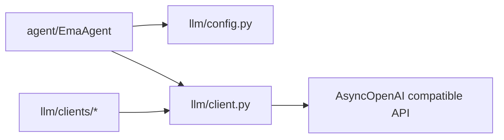

# llm 模块

`llm/` 提供模型配置解析与统一异步调用接口

---

## 文件说明

| 文件 | 作用 |
|---|---|
| `config.py` | `LLMConfig` 运行参数模型与合并解析 |
| `client.py` | 统一 `chat` `stream_chat` `chat_with_tools` |
| `clients/*.py` | provider 预设客户端（deepseek openai qwen） |

---

## 调用关系

---

## `LLMClient` 关键方法

- `chat(...)`
- `stream_chat(...)`
- `chat_with_tools(...)`

特性：

- tenacity 自动重试
- 统一参数拼装
- 认证/限流/API 错误分类日志

