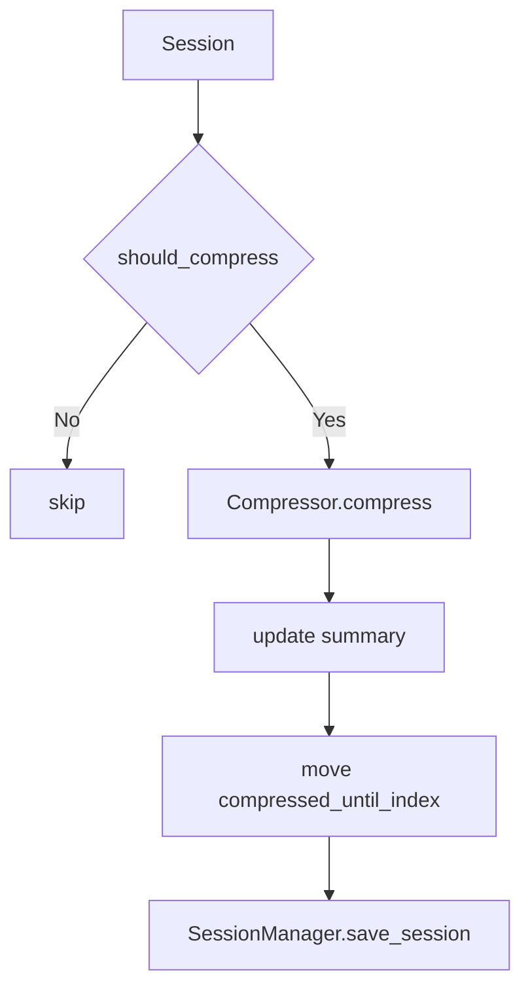

# memory 模块

`memory/` 管理消息模型、会话落盘、上下文压缩

---

## 文件说明

| 文件 | 作用 |
|---|---|
| `schema.py` | 消息 会话 压缩记录 Agent 运行态数据结构 |
| `manager.py` | 会话目录读写 缓存 清理与修复 |
| `compressor.py` | 历史对话摘要压缩 |

---

## 会话持久化结构

```text
data/sessions/<session_id>/
├─ session.json
├─ messages.json
└─ compression.json
```

---

## 压缩流程



---

## 对外关系

- 被 `api/services/session_service.py` 调用
- 被 `agent/EmaAgent.py` 在每次请求前后调用

