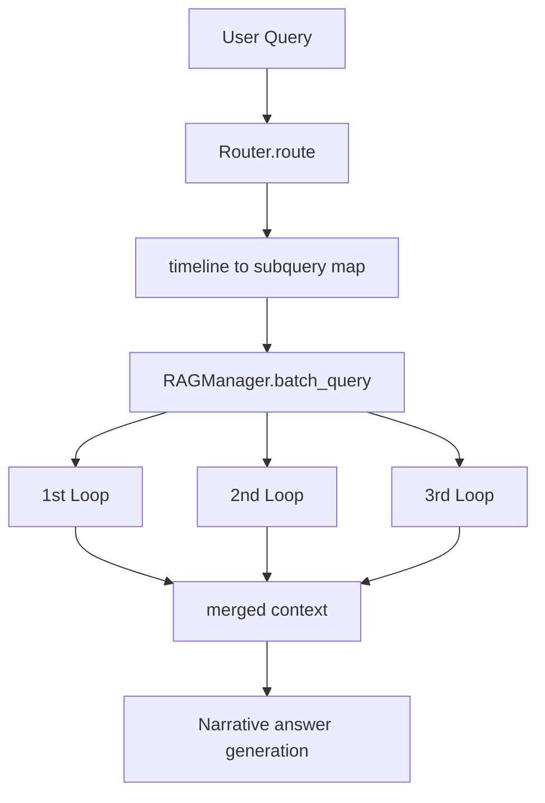

# narrative 模块

`narrative/` 提供剧情记忆检索能力，核心由 Router 和多周目 LightRAG 组成

---

## 文件说明

| 文件 | 作用 |
|---|---|
| `core.py` | `NarrativeMemory` 统一入口 |
| `router.py` | 查询路由到 `1st_Loop/2nd_Loop/3rd_Loop` |
| `rag_manager.py` | 多 LightRAG 实例生命周期与并发查询 |
| `embedding.py` | LightRAG embedding 回调 |
| `llm_function.py` | LightRAG LLM 回调 |
| `exceptions.py` | 叙事模块异常定义 |

---

## 叙事查询流程

---

## 关键设计点

- 路由结果强约束为 JSON 键集合 `{1st_Loop,2nd_Loop,3rd_Loop}`
- 每个周目使用独立 LightRAG 工作目录
- `batch_query` 并发检索，提高叙事模式响应速度

---

## 上下游关系

上游调用：

- `agent/EmaAgent.py` narrative 模式
- `api/main.py` startup 预热

下游依赖：

- `llm/client.py`
- `config/paths.py`
- LightRAG 存储目录 `narrative/memory/*_Loop/`

