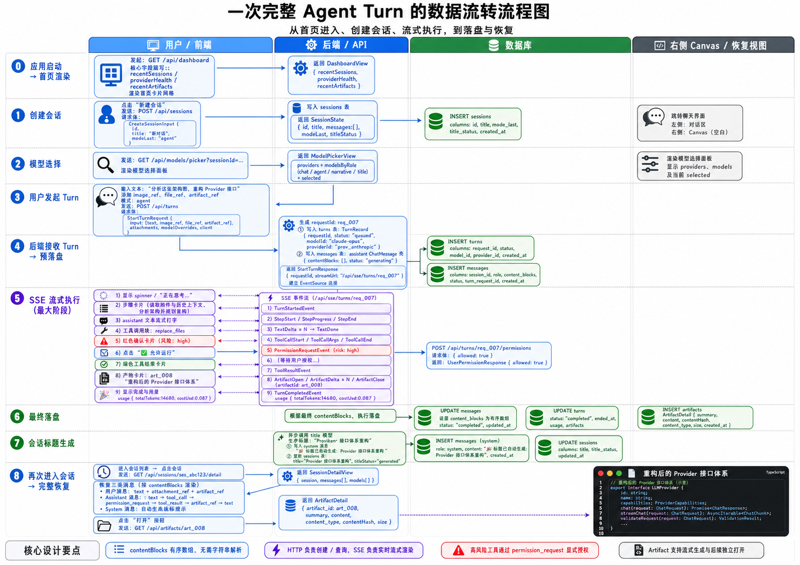

# @ema-agent/core-types

EmaAgent 全栈共享的类型契约层。前端、BFF、Runtime、仓储实现统一 `import type` 此包，保证接口一致性。

---

## 文件地图（13 文件）

| 文件 | 职责 | 产出物 |
|------|------|--------|
| `ids.ts` | 12 个 Brand 字符串 ID + `UnixMs` + `IsoDateTime` + `asId()` | 全包引用的基础类型 |
| `mode.ts` | 3 种执行模式 `chat \| agent \| narrative` + 选择状态 | `EmaMode`, `ModeSelectionState` |
| `session.ts` | 会话实体（已去除 messages[]）+ 摘要 + 仓储接口 | `SessionState`, `SessionSummary`, `SessionRepository` |
| `message.ts` | "一切皆区块"聊天流协议：10 种 `MessageContentBlock` | `ChatMessage`, `MessagePage` |
| `turn.ts` | 单轮回合发起/执行/持久化 + 仓储 | `StartTurnRequest`, `TurnRecord`, `TurnRepository` |
| `artifact.ts` | 产物类型/摘要/详情 + 仓储（代码、表格、diff、图表等） | `ArtifactSummary`, `ArtifactDetail`, `ArtifactRepository` |
| `event.ts` | 17 种 SSE 流事件 + `BaseEvent` | `SseEvent` 联合，`TurnStartedEvent` … `ImageEvent` |
| `memory.ts` | 四层记忆模型（L1-L4）+ Python Bridge + GraphRAG 占位 | `RecallResult`, `RollingSummary`, `ReflectionMemo` … |
| `model.ts` | Provider/Model 目录 + LLM ChatCompletion 底层协议 | `ProviderDescriptor`, `ModelDescriptor`, `ChatCompletionRequest` |
| `view.ts` | 8 个聚合视图（跨实体 join 的只读投影） | `DashboardView`, `SessionDetailView`, `ModelPickerView` … |
| `errors.ts` | UI 可理解的错误协议 + `EmaError` 基类 | `UiErrorView`, `toUiErrorView()` |
| `metadata.ts` | 版本信息 + 运行时环境 | `PackageVersion`, `RuntimeEnv` |
| `index.ts` | barrel 统一导出入口 | — |

---

## 数据流转全景图

```
┌──────────────────────────────────────────────────────────────────────────────┐
│                              EmaAgent 数据平面                                │
│                                                                              │
│  ┌────────────┐     HTTP POST        ┌──────────────┐                        │
│  │   前端 UI   │ ──────────────────▶  │    BFF 层     │                        │
│  │ (React)    │ ◀── SSE EventStream ─ │ (API Gateway) │                        │
│  └─────┬──────┘                      └──────┬───────┘                        │
│        │ 消费:                              │ 消费:                           │
│        │  view.ts   聚合视图                │  turn.ts   StartTurnRequest      │
│        │  event.ts  SSE 事件                │  session.ts SessionState         │
│        │  message.ts 消息区块               │  errors.ts UiErrorView          │
│        │                                    │                                 │
│        ▼                                    ▼                                 │
│  ┌──────────────────────────────────────────────────────────────┐            │
│  │                     @ema-agent/core-types                     │            │
│  │                     (纯类型层，零运行时)                        │            │
│  └──────────────────────────────────────────────────────────────┘            │
│                              ▲                                               │
│                              │                                               │
│                     ┌────────┴────────┐                                      │
│                     │                 │                                      │
│              ┌──────┴───────┐  ┌──────┴───────┐                              │
│              │  Runtime 层   │  │  仓储实现层   │                              │
│              │               │  │              │                              │
│              │ 消费:         │  │ 消费:        │                              │
│              │  model.ts     │  │  session.ts  │                              │
│              │  memory.ts    │  │  message.ts  │                              │
│              │  artifact.ts  │  │  turn.ts     │                              │
│              │  errors.ts    │  │  artifact.ts │                              │
│              └───────────────┘  └──────────────┘                              │
└──────────────────────────────────────────────────────────────────────────────┘
```

---

## 单次 Turn 完整数据流

```
用户点击发送
    │
    ▼
┌─────────────────────────────────────────────────────────────────┐
│ Step 1: 前端组装请求                                             │
│                                                                 │
│ StartTurnRequest {                                              │
│   sessionId, mode,                                              │
│   input: [ {type:"text", text:"帮我修复bug"},                    │
│            {type:"file_ref", attachmentId:...} ]                │
│ }                                                               │
│   → POST /api/turns                                              │
└────────────────────────────────┬────────────────────────────────┘
                                 │
                                 ▼
┌─────────────────────────────────────────────────────────────────┐
│ Step 2: BFF 创建 Turn + 返回 SSE URL                             │
│                                                                 │
│ StartTurnResponse { requestId, streamUrl }                       │
│   ← 200 + streamUrl                                              │
└────────────────────────────────┬────────────────────────────────┘
                                 │
                                 ▼
┌─────────────────────────────────────────────────────────────────┐
│ Step 3: 前端连接 SSE 流                                         │
│                                                                 │
│ EventSource(streamUrl)  开始接收 SseEvent 联合:                  │
│                                                                 │
│  ① TurnStartedEvent  { type:"turn_started", mode:"agent" }      │
│  ② StepStartEvent    { type:"step_start", title:"分析代码" }     │
│  ③ TextDeltaEvent    { type:"text_delta", delta:"我来" }        │
│  ④ TextDeltaEvent    { type:"text_delta", delta:"看看" }        │
│  ⑤ ToolCallStartEvent{ type:"tool_call_start", toolName:"read" }│
│  ⑥ ToolCallArgsEvent { type:"tool_call_args", argsDelta:"..." } │
│  ⑦ ToolCallEndEvent  { type:"tool_call_end" }                   │
│  ⑧ ToolResultEvent   { type:"tool_result", success:true }       │
│  ⑨ ArtifactCreateEvt { type:"artifact_create", summary:{...}}   │
│  ⑩ ArtifactDeltaEvt { type:"artifact_delta", delta:"..." }     │
│  ⑪ ArtifactFinalize  { type:"artifact_finalize" }               │
│  ⑫ TextDoneEvent     { type:"text_done", fullText:"..." }       │
│  ⑬ TurnCompletedEvt  { type:"turn_completed", usage:{...}}      │
│  ⑭ ErrorEvent        { type:"error", code:"tool_failed" }       │
│       (任意位置可插入错误)                                        │
│  ⑮ ImageEvent        { type:"image", url:"...", alt:"..." }     │
│       (模型生成的图片/图表)                                       │
└────────────────────────────────┬────────────────────────────────┘
                                 │
                                 ▼
┌─────────────────────────────────────────────────────────────────┐
│ Step 4: 前端渲染器逐事件消费                                     │
│                                                                 │
│ ChatMessage.contentBlocks[]  按到达顺序 append:                  │
│                                                                 │
│  [0] { type:"text", text:"我来看看这个bug" }                     │
│  [1] { type:"tool_call", toolCallId, toolName, args }           │
│  [2] { type:"tool_result", toolCallId, success, resultStr }     │
│  [3] { type:"artifact_ref", artifact: ArtifactSummary }         │
│  [4] { type:"text", text:"修复完成" }                            │
│                                                                 │
│ 渲染规则:                                                        │
│  • tool_call → 折叠卡片，点击展开参数 JSON                       │
│  • tool_result → 灰色小字，显示结果摘要                          │
│  • artifact_ref → 小卡片 (标题 + 打开按钮)                       │
│    点击打开 → 右侧 Canvas / 弹出浮窗显示完整代码/表格/diff       │
│  • image → 直接渲染                                         │
│  • permission_request → 红色/黄色确认按钮                        │
│  • error → 红色提示 + 重试按钮                                   │
└────────────────────────────────┬────────────────────────────────┘
                                 │
                                 ▼
┌─────────────────────────────────────────────────────────────────┐
│ Step 5: 用户打开产物 (Canvas 模式)                               │
│                                                                 │
│ 点击 artifact_ref 的"打开"按钮:                                  │
│  ① GET /api/artifacts/{artifactId}                              │
│     ← ArtifactDetail { summary, payload, binaryBase64? }        │
│                                                                 │
│  ② 右侧弹出独立窗口:                                             │
│     ┌─────────────────────────────────┐                         │
│     │ 顶部标题栏: Provider Errors  [🔗☁️📋] │                   │
│     │ ─────────────────────────────── │                         │
│     │   1 │ const x = 1              │                         │
│     │   2 │ ...                      │  代码/表格/diff 全屏显示  │
│     │   3 │ ...                      │                         │
│     └─────────────────────────────────┘                         │
│                                                                 │
│  ③ session 内的产物列表面板:                                     │
│     GET /api/sessions/{sid}/artifacts                           │
│     ← ArtifactListPanel { sessionId, items[], hasMore }          │
│     左侧显示所有产物卡片 (标题 + 种类图标 + 打开按钮)            │
└─────────────────────────────────────────────────────────────────┘
```

---

## 记忆系统四层架构

```
┌─────────────────────────────────────────────────────────┐
│  LLM system prompt 组装（按 priority 截断）               │
│                                                         │
│  ┌──────────────────────────────────────────────┐       │
│  │         ContextBlock[] 注入                  │       │
│  │  recall → RecallResult { blocks[], meta }    │       │
│  └────▲─────▲────────▲────────▲─────────────────┘       │
│       │     │        │        │                         │
│   ┌───┘     │        │        └──────────┐              │
│   │    ┌────┘        │                   │              │
│   │    │        ┌────┘                   │              │
│   ▼    ▼        ▼                        ▼              │
│  L1   L2       L3                       L4              │
│ 工作台 对话摘要 会话身份                 跨会话画像       │
│ (内存) (JSON)  (JSON)             (SQLite/Python Bridge)│
│                          ┌────────────┴──────────┐     │
│                          │                       │     │
│                      UserProfile           WorldState  │
│                    (偏好/技能/习惯)     (剧情/时间线)    │
│                          │                       │     │
│                          ▼                       ▼     │
│                    SQLite 持久化        Python lightrag │
└─────────────────────────────────────────────────────────┘
```

---

## 前端 UI 八面板 → 类型映射

| 面板 | UI 描述 | 消费的核心类型 |
|------|---------|---------------|
| ① 两栏卡片网格 (Dashboard) | 深灰圆角卡片，标题+图标+状态灯 | `DashboardView`, `SessionListItem` |
| ② 混合选择面板 (Mode) | 横向小卡片 + 蓝色选中边框 + 搜索栏 | `ModeSelectionState`, `EmaMode` |
| ③④ 三栏卡片墙 (Provider) | 半透明水印图标 + 健康状态 | `ProviderDescriptor`, `ProviderHealthView` |
| ⑤ 通栏列表 (Settings) | 单列深灰长条 + 右侧水印图标 | `ProviderDescriptor[]`, `ModelDescriptor[]` |
| ⑥ 代码容器 (Canvas Code) | 代码编辑器窗口 + 标题栏 + 行号 | `ArtifactDetail`, `ArtifactKind:"code"` |
| ⑦ 文件清单浮窗 (Sidebar) | 抽屉式文件列表 + 图标 + 日期 | `WorkspaceFileListView`, `WorkspaceFileEntry` |
| ⑧ 组件列表 (Canvas List) | 胶囊形卡片 + 蓝色"打开"按钮 | `ModelPickerView`, `ProviderAction{primary}` |

---

## 类型设计原则

1. **Brand ID 管控所有标识符** — `SessionId` / `TurnId` / `ArtifactId` 等 12 种，杜绝 `string` 误用
2. **`UnixMs` 标注所有时间字段** — `number` 只用于纯计数（token 数、优先级）
3. **实体与仓储分离** — `SessionState` 是数据，`SessionRepository` 是契约
4. **聚合视图不进实体** — `DashboardView` 等只在 `view.ts`，消费方不需要知道 join 逻辑
5. **"一切皆区块"** — `ChatMessage.contentBlocks[]` 的 `MessageContentBlock` 联合体是前端渲染的唯一数据源
6. **事件自包含** — 每个 `SseEvent` 携带全部渲染所需字段，前端无需二次 fetch
7. **文件职责单一** — 一个文件一个领域，不交叉污染

## EmaAgent 全链路数据流详解：一个 Agent 模式的完整示例

下面我用一个具体场景串联所有类型，说明数据在各层之间如何流转。

---

## 🌊 数据流转架构 (Data Flow)

下图展示了一次完整的 Agent Turn 从前端发起、流式执行 (SSE)、到最后拆分落盘 (`messages`, `turns`, `artifacts`) 的全生命周期：



### 场景设定

用户在 EmaAgent 中做一次 Agent 模式操作：**"分析这张架构截图，把里面提到的 Provider 接口重构为 TypeScript，生成产物"**。用户上传了 1 张图片附件 + 1 个 CSV 文件。

---

## 阶段 0：应用启动 → 首页渲染

### 后端 → 前端

**HTTP GET `/api/dashboard`**

后端组装 `DashboardView`：

```
DashboardView {
  recentSessions: [
    SessionListItem {
      summary: SessionSummary { id: "ses_001", title: "上周的 Debug 对话", messageCount: 34, ... },
      lastMessagePreview: "那个 bug 我已经修了..."
    },
    SessionListItem { ... }
  ],
  providerHealth: [
    { providerId: "prov_openai", displayName: "OpenAI", status: "ok" },
    { providerId: "prov_ollama", displayName: "Ollama", status: "degraded" }
  ],
  recentArtifacts: [
    ArtifactSummary { id: "art_001", kind: "code", title: "重构 Router", description: "Express → Fastify", ... }
  ]
}
```

前端用 `DashboardView` 渲染 Panel ① 的两栏卡片网格：左侧会话卡片、右侧 Provider 健康状态。`recentArtifacts` 显示最近的产物速览。

---

## 阶段 1：创建会话

用户点击"新建会话"。

### 前端 → 后端

**HTTP POST `/api/sessions`**

```typescript
CreateSessionInput {
  id: "ses_abc123",       // 前端预生成
  title: "新对话",
  modeLast: "agent"        // 默认用 agent 模式
}
```

### 后端 → 数据库

写入 `sessions` 表一行。

### 后端 → 前端

返回 `SessionState`：

```typescript
SessionState {
  id: "ses_abc123",
  title: "新对话",
  messages: [],            // 空
  createdAt: 1714000000000,
  updatedAt: 1714000000000,
  modeLast: "agent",
  fullAccess: true,
  activeSkills: [],
  titleStatus: "default"
}
```

前端拿到后跳转到聊天界面，左侧是窄栏对话区（空），右侧是 Canvas 画布（空）。

---

## 阶段 2：模型选择面板

用户在输入框上方展开模型选择器。

### 前端 → 后端

**HTTP GET `/api/models/picker?sessionId=ses_abc123`**

### 后端 → 前端

返回 `ModelPickerView`：

```typescript
ModelPickerView {
  providers: [
    { id: "prov_openai", displayName: "OpenAI" },
    { id: "prov_anthropic", displayName: "Anthropic" }
  ],
  modelsByRole: {
    chat: [ ModelDescriptor { id: "gpt-4o", displayName: "GPT-4o", ... } ],
    agent: [ ModelDescriptor { id: "claude-opus", displayName: "Claude Opus 4", ... } ],
    narrative: [ ... ],
    title: [ ... ]
  },
  selected: {
    chat: "gpt-4o",
    agent: "claude-opus",
    narrative: undefined,
    title: "gpt-4o-mini"
  }
}
```

对应 Panel ② 的上半卡片组（高亮选中的带蓝色边框）+ 下部模型列表。`modelsByRole` 按 chat/agent/narrative/title 四个角色分组渲染。

---

## 阶段 3：用户发起 Turn

用户完成以下操作：
1. 输入文本："分析这张架构图，重构 Provider 接口"
2. 拖入一张截图 `attach_img_01`（PNG）
3. 拖入一个 CSV `attach_csv_02`
4. 引用之前一个产物 `art_001`
5. 模式选为 `agent`

### 前端 → 后端

**HTTP POST `/api/turns`**

```typescript
StartTurnRequest {
  sessionId: "ses_abc123",
  mode: "agent",
  input: [
    { type: "text", text: "分析这张架构图，重构 Provider 接口" },
    { type: "image_ref", attachmentId: "attach_img_01" },
    { type: "file_ref", attachmentId: "attach_csv_02" },
    { type: "artifact_ref", artifactId: "art_001" }      // ← 新加的
  ],
  attachments: ["attach_img_01", "attach_csv_02"],
  modelOverrides: {
    agentModelId: "claude-opus"   // 用户手动覆盖
  },
  client: {
    locale: "zh-CN",
    timezone: "Asia/Shanghai",
    supportsMermaid: true,
    supportsLatex: false
  }
}
```

> 这里的 4 个 `TurnInputBlock` 分别映射到聊天区用户气泡：文本块 + 图片附件 + 文件附件 + 引用的产物。

---

## 阶段 4：后端接收 Turn → 创建 TurnRecord → 落盘

### 后端处理

1. 后端生成 `requestId: "req_007"`
2. 创建 `TurnRecord` 写入 `turns` 表：

```typescript
TurnRecord {
  requestId: "req_007",
  sessionId: "ses_abc123",
  mode: "agent",
  status: "queued",      // 初始状态
  modelId: "claude-opus",
  providerId: "prov_anthropic",
  startedAt: 1714000100000,
  // endedAt, usage, artifacts 暂为空
}
```

3. 后端同时创建一条 assistant `ChatMessage`（初始空壳）：

```typescript
ChatMessage {
  id: "msg_assist_007",
  role: "assistant",
  contentBlocks: [],       // 空，等待 SSE 事件填充
  requestId: "req_007",
  status: "generating",
  createdAt: 1714000100000
}
```

写入 `messages` 表。

4. 返回 `StartTurnResponse`：

```typescript
StartTurnResponse {
  requestId: "req_007",
  sessionId: "ses_abc123",
  acceptedAt: 1714000100000,
  streamUrl: "/api/sse/turns/req_007"
}
```

### 前端

前端收到 `streamUrl` 后建立 `EventSource` 连接。

---

## 阶段 5：SSE 流事件 → 前端实时渲染

现在进入核心的流式阶段。后端执行 Agent 循环，事件逐个推送到 `/api/sse/turns/req_007`。

### 5.1 生命周期事件

**Event 1：**

```typescript
TurnStartedEvent {
  type: "turn_started",
  requestId: "req_007",
  sessionId: "ses_abc123",
  messageId: "msg_assist_007"
}
```

前端：在 assistant 消息气泡框顶部显示 spinner / "正在思考..."。

---

### 5.2 Agent 步骤事件（Step Events — Panel ②/⑥ 步骤条渲染）

**Event 2：**

```typescript
StepStartEvent {
  type: "step_start",
  requestId: "req_007",
  stepId: "step_01",
  stepType: "context",
  title: "读取附件与历史上下文"
}
```

前端：在 assistant 消息内插入一个步骤展示卡片（标题："读取附件与历史上下文"，状态 icon 旋转中）。

**Event 3：**

```typescript
StepProgressEvent {
  type: "step_progress",
  requestId: "req_007",
  stepId: "step_01",
  detail: "已加载 screenshot.png 和 data.csv，调用视觉模型提取文字..."
}
```

前端：步骤卡片内概要文字更新。

**Event 4：**

```typescript
StepEndEvent {
  type: "step_end",
  requestId: "req_007",
  stepId: "step_01",
  status: "completed"
}
```

前端：步骤卡片打勾 ✅。

**Event 5：**

```typescript
StepStartEvent {
  type: "step_start",
  requestId: "req_007",
  stepId: "step_02",
  stepType: "thinking",
  title: "分析架构并规划重构"
}
```

（后续步骤类似，省略重复模式）

---

### 5.3 文本流事件

LLM 开始回复思考过程。

**Event 6-10（多条）：**

```typescript
TextDeltaEvent {
  type: "text_delta",
  requestId: "req_007",
  messageId: "msg_assist_007",
  delta: "我看到你的架构图中 Provider 接口有 4 个方法..."
}
```

每个 `TextDeltaEvent` 到达时，前端追加到一个文本 `MessageContentBlock`：

```typescript
{ type: "text", text: "我看到你的架构图中 Provider 接口有 4 个方法..." }
```

前端在 assistant 气泡里实时打字逐字显示（流式打字效果）。

**Event 11：**

```typescript
TextDoneEvent {
  type: "text_done",
  requestId: "req_007",
  messageId: "msg_assist_007",
  fullText: "我看到你的架构图中 Provider 接口有 4 个方法：listModels, chat, embed, healthCheck。我建议把它们拆成..."
}
```

前端确定文本块最终内容。

---

### 5.4 工具调用事件（Tool Call — 对应 Panel ⑥ 的 permission_request 气泡）

Agent 决定调用一个危险工具 `replace_files`（大规模文件写入，需要用户批准）。

**Event 12：**

```typescript
ToolCallStartEvent {
  type: "tool_call_start",
  requestId: "req_007",
  messageId: "msg_assist_007",
  toolCallId: "tc_001",
  toolName: "replace_files"
}
```

前端：在 assistant 消息内插入一个 `tool_call` 块（显示工具名称和旋转 icon）。

```typescript
{ type: "tool_call", toolCallId: "tc_001", toolName: "replace_files", args: {} }
```

**Event 13-14（流式参数片段）：**

```typescript
ToolCallArgsEvent {
  type: "tool_call_args",
  requestId: "req_007",
  messageId: "msg_assist_007",
  toolCallId: "tc_001",
  argsDelta: "{\"target\":\"src/providers/\",\"files\":..."
}
```

前端追加参数 JSON 显示。

**Event 15：**

```typescript
ToolCallEndEvent {
  type: "tool_call_end",
  requestId: "req_007",
  messageId: "msg_assist_007",
  toolCallId: "tc_001",
  args: { target: "src/providers/", files: [...], dryRun: false }
}
```

前端更新 `tool_call` 块的 `args` 字段为完整 JSON。

---

### 5.5 权限请求（Permission — 对应 Panel 中危险工具的红色/橙色确认气泡）

因为 `replace_files` 是高风险操作，后端暂停执行，发出权限请求。

**Event 16：**

```typescript
PermissionRequestEvent {
  type: "permission_request",
  requestId: "req_007",
  messageId: "msg_assist_007",
  toolCallId: "tc_001",
  toolName: "replace_files",
  summary: "将替换 src/providers/ 下 5 个文件，写入约 2000 行 TypeScript",
  risk: "high"
}
```

前端：在 assistant 消息内插入一个 `permission_request` 块：

```typescript
{
  type: "permission_request",
  toolCallId: "tc_001",
  toolName: "replace_files",
  summary: "将替换 src/providers/ 下 5 个文件...",
  risk: "high"
}
```

渲染为一个红色的卡片气泡，左右两个按钮："🔴 拒绝" 与 "✅ 允许运行"。risk 为 `high` 时按钮呈红色，`medium` 橙色，`low` 灰色。

---

### 5.6 用户批准权限 → HTTP POST 回传

用户点击"✅ 允许运行"。

### 前端 → 后端

**HTTP POST `/api/turns/req_007/permissions`**

```typescript
UserPermissionResponse {    // ← 新增的类型
  type: "user_permission_response",
  requestId: "req_007",
  toolCallId: "tc_001",
  allowed: true
}
```

后端收到后继续执行工具。

---

### 5.7 工具执行结果

工具执行完成。

**Event 17：**

```typescript
ToolResultEvent {
  type: "tool_result",
  requestId: "req_007",
  messageId: "msg_assist_007",
  toolCallId: "tc_001",
  toolName: "replace_files",
  success: true,
  resultStr: "5 files written: provider.ts, openai-provider.ts, anthropic-provider.ts, ollama-provider.ts, local-provider.ts",
  durationMs: 1320
}
```

前端：在 assistant 消息内插入 `tool_result` 块：

```typescript
{
  type: "tool_result",
  toolCallId: "tc_001",
  toolName: "replace_files",
  success: true,
  resultStr: "5 files written: ...",
  durationMs: 1320
}
```

渲染为一个折叠的工具结果卡片（绿色勾 + 文字 + 耗时 1.3s）。

---

### 5.8 产物事件（Artifact — 对应 Panel ⑥ 代码窗口 + Panel ⑧"打开"按钮胶囊卡片）

Agent 执行完工具后生成了一个大型代码产物，LLM 在回复中说"我已经重构完成，产物见下方"。该产物的内容通过 SSE 流式推送。

**Event 18：**

```typescript
ArtifactOpenEvent {
  type: "artifact_open",
  requestId: "req_007",
  messageId: "msg_assist_007",
  artifactId: "art_008",
  summary: ArtifactSummary {
    id: "art_008",
    sessionId: "ses_abc123",
    requestId: "req_007",
    kind: "code",
    title: "重构后的 Provider 接口体系",
    description: "将单一 Provider 接口拆分为 5 个子 Provider，每个对应独立协议",
    mime: "text/x-typescript",
    targetPaths: [
      "src/providers/provider.ts",
      "src/providers/openai-provider.ts",
      "src/providers/anthropic-provider.ts",
      "src/providers/ollama-provider.ts",
      "src/providers/local-provider.ts"
    ],
    params: {
      language: "typescript",
      diff: DiffMeta {
        files: [
          FileDiffSummary { path: "src/providers/provider.ts", changeType: "modified", stats: { additions: 120, deletions: 45 } },
          FileDiffSummary { path: "src/providers/openai-provider.ts", changeType: "added", stats: { additions: 350, deletions: 0 } },
          ...
        ]
      }
    },
    status: "draft",
    createdAt: 1714000150000,
    updatedAt: 1714000150000
  }
}
```

前端两件事同时发生：

1. **在聊天流中插入 `artifact_ref` 块**：

```typescript
{ type: "artifact_ref", artifactId: "art_008" }
```

渲染为一个胶囊形卡片（Panel ⑧ 样式），深灰色圆角矩形，显示：
- 左侧：方形深色图标 + 标题"重构后的 Provider 接口体系" + 副标题"将单一 Provider 接口拆分..." + 小字日期
- 右侧：亮蓝色胶囊按钮"打开"

2. **右侧 Canvas（Panel ⑥）自动打开**，准备接收流式内容。

**Event 19-25（多条流式增量）：**

```typescript
ArtifactDeltaEvent {
  type: "artifact_delta",
  requestId: "req_007",
  artifactId: "art_008",
  delta: "export interface Provider {\n  id: string\n..."
}
```

前端右侧 Canvas 逐行追加代码内容（类似代码编辑器实时打字效果），左侧有深灰色行号槽。

**Event 26：**

```typescript
ArtifactCloseEvent {
  type: "artifact_close",
  requestId: "req_007",
  artifactId: "art_008",
  status: "ready"
}
```

前端右侧 Canvas 代码窗口完成，状态标记为 ready。

---

### 5.9 纯文本回复（继续）

产物事件结束后，LLM 可能还有一段总结文字。

**Event 27-30：**

更多 `TextDeltaEvent` → 最终 `TextDoneEvent`。

---

### 5.10 Turn 完成

**Event 31：**

```typescript
TurnCompletedEvent {
  type: "turn_completed",
  requestId: "req_007",
  usage: {
    inputTokens: 8450,
    outputTokens: 6230,
    totalTokens: 14680,
    costUsd: 0.087
  }
}
```

前端：更新 assistant 消息状态为 `complete`，在气泡底部显示用量（14.7K tokens, $0.087）。

---

## 阶段 6：最终落盘（事件流结束后批量写入数据库）

SSE 流结束后，后端执行最终持久化：

### 更新 `messages` 表

```typescript
ChatMessage {
  id: "msg_assist_007",
  role: "assistant",
  contentBlocks: [
    { type: "text", text: "我看到你的架构图中 Provider 接口有 4 个方法..." },  // 第一段思考文本
    { type: "tool_call", toolCallId: "tc_001", toolName: "replace_files", args: {...} },
    { type: "permission_request", toolCallId: "tc_001", toolName: "replace_files", summary: "...", risk: "high" },
    { type: "tool_result", toolCallId: "tc_001", toolName: "replace_files", success: true, resultStr: "5 files written...", durationMs: 1320 },
    { type: "artifact_ref", artifactId: "art_008" },
    { type: "text", text: "重构完成。以上产物包含了完整的类型定义。" }  // 最后一段总结
  ],
  requestId: "req_007",
  status: "complete",
  createdAt: 1714000100000
}
```

> 关键：`contentBlocks` 是一个有序数组，前端恢复时按索引依次渲染出 6 个气泡块，无需任何字符串解析。

### 更新 `turns` 表

```typescript
TurnRecord {
  requestId: "req_007",
  sessionId: "ses_abc123",
  mode: "agent",
  status: "completed",
  modelId: "claude-opus",
  providerId: "prov_anthropic",
  startedAt: 1714000100000,
  endedAt: 1714000200000,
  usage: { inputTokens: 8450, outputTokens: 6230, totalTokens: 14680, costUsd: 0.087 },
  artifacts: [
    ArtifactSummary {
      id: "art_008",
      kind: "code",
      title: "重构后的 Provider 接口体系",
      description: "将单一 Provider 接口拆分为 5 个子 Provider...",
      mime: "text/x-typescript",
      status: "ready",
      ...
    }
  ]
}
```

### 写入 `artifacts` 表

```typescript
ArtifactDetail {
  summary: ArtifactSummary { id: "art_008", kind: "code", title: "...", ... },
  content: "export interface Provider {\n  id: string\n  displayName: string\n...",  // 完整源码字符串
  contentHash: "sha256:abc123..."
}
```

`content` 字段存完整代码文本（无论多大），供右侧 Canvas 重打开展示。

---

## 阶段 7：会话标题生成

后端异步调用 title 模型，自动生成标题。

### 后端 → `messages` 表

新增一条 system 消息：

```typescript
ChatMessage {
  id: "msg_sys_title",
  role: "system",
  contentBlocks: [
    { type: "text", text: "🔖 标题已自动生成: Provider 接口体系重构" }
  ],
  status: "complete",
  createdAt: 1714000250000
}
```

### 更新 `sessions` 表

```typescript
title: "Provider 接口体系重构",
titleStatus: "generated",
titleUpdatedAt: 1714000250000
```

---

## 阶段 8：用户再次进入会话 → 完整恢复

用户关闭后重新打开。

### 前端 → 后端

**HTTP GET `/api/sessions/ses_abc123/detail`**

### 后端 → 前端

返回 `SessionDetailView`：

```typescript
SessionDetailView {
  session: {
    id: "ses_abc123",
    title: "Provider 接口体系重构",
    modeLast: "agent",
    createdAt: 1714000000000,
    updatedAt: 1714000250000
  },
  messages: [
    // 用户消息
    ChatMessage {
      id: "msg_user_006",
      role: "user",
      contentBlocks: [
        { type: "text", text: "分析这张架构图，重构 Provider 接口" },
        { type: "attachment_ref", attachmentId: "attach_img_01" },
        { type: "attachment_ref", attachmentId: "attach_csv_02" },
        { type: "artifact_ref", artifactId: "art_001" }
      ],
      status: "complete",
      createdAt: 1714000090000
    },
    // assistant 消息（含 6 个 contentBlock）
    ChatMessage { id: "msg_assist_007", role: "assistant", contentBlocks: [...], status: "complete", ... },
    // system 消息（标题生成）
    ChatMessage { id: "msg_sys_title", role: "system", contentBlocks: [...], status: "complete", ... }
  ],
  hasMoreMessages: false,
  lastRequestId: "req_007",
  models: {
    chat: ModelDescriptor { id: "gpt-4o", ... },
    agent: ModelDescriptor { id: "claude-opus", ... }
  }
}
```

前端渲染：

- 左侧窄栏对话区：3 条消息按 `createdAt` 排列。
  - 用户气泡：文本"分析这张架构图" + 缩略图（attachment_ref 渲染为点击可预览的小图/文件图标） + 引用产物胶囊。
  - Assistant 气泡：按 `contentBlocks` 数组依次渲染：打字文本 → 工具调用卡片 → 红色危险确认卡片 → 绿色工具结果卡片 → "重构后的 Provider 接口体系"胶囊（带亮蓝色"打开"按钮） → 总结文本。
  - System 气泡：小字灰色"🔖 标题已自动生成..."

- 右上角会话标题栏：显示 `"Provider 接口体系重构"`

- 用户点击"打开"按钮后调用：

  **HTTP GET `/api/artifacts/art_008`** → 返回 `ArtifactDetail` → 右侧 Canvas（Panel ⑥）打开独立代码窗口，左侧深灰色行号槽，中间代码高亮，顶部标题栏显示"重构后的 Provider 接口体系"和复制/分享图标。

---

## 数据流转总结：一张表

| 步骤 | 发起方 | 去向 | 载体类型 | 关键字段 |
|------|--------|------|---------|---------|
| 首页 | HTTP GET | 后端→前端 | `DashboardView` | recentSessions, providerHealth, recentArtifacts |
| 创建会话 | HTTP POST | 前端→后端 | `CreateSessionInput` | id, modeLast |
| 创建会话 | 后端→DB | `sessions` 表 | `SessionState` | id, title, messages:[], modeLast |
| 选模型 | HTTP GET | 后端→前端 | `ModelPickerView` | providers, modelsByRole（按 chat/agent/narrative/title 分组） |
| 发起 Turn | HTTP POST | 前端→后端 | `StartTurnRequest` | input: [text, image_ref, file_ref, **artifact_ref**]; modelOverrides; client |
| Turn 落盘 | 后端→DB | `turns` 表 | `TurnRecord` | requestId, status:"queued", modelId, startedAt |
| 创建消息壳 | 后端→DB | `messages` 表 | `ChatMessage` | contentBlocks:[], status:"generating" |
| 返回流地址 | HTTP | 后端→前端 | `StartTurnResponse` | requestId, streamUrl |
| SSE 生命周期 | SSE | 后端→前端 | `TurnStartedEvent` | messageId |
| SSE 步骤 | SSE | 后端→前端 | `StepStartEvent` → `StepProgressEvent` → `StepEndEvent` | stepType, title, status |
| SSE 文本流 | SSE | 后端→前端 | `TextDeltaEvent` × N → `TextDoneEvent` | delta 增量拼接 |
| SSE 工具调用 | SSE | 后端→前端 | `ToolCallStartEvent` → `ToolCallArgsEvent` × N → `ToolCallEndEvent` | toolCallId, toolName, argsDelta, args |
| SSE 权限 | SSE | 后端→前端 | `PermissionRequestEvent` | toolCallId, summary, risk:"high" |
| **用户批准** | **HTTP POST** | **前端→后端** | **`UserPermissionResponse`** ← 新增 | **toolCallId, allowed** |
| SSE 工具结果 | SSE | 后端→前端 | `ToolResultEvent` | toolCallId, success, resultStr, durationMs |
| SSE 产物开始 | SSE | 后端→前端 | `ArtifactOpenEvent` | artifactId, summary（含 title, description, kind, params.diff） |
| SSE 产物增量 | SSE | 后端→前端 | `ArtifactDeltaEvent` × N → `ArtifactCloseEvent` | delta 增量, status:"ready" |
| SSE Turn 完成 | SSE | 后端→前端 | `TurnCompletedEvent` | usage（tokens, costUsd） |
| 落盘消息 | 后端→DB | `messages` 表更新 | `ChatMessage` | contentBlocks 合并为完整有序数组；status→"complete" |
| 落盘 Turn | 后端→DB | `turns` 表更新 | `TurnRecord` | status:"completed", endedAt, usage |
| 落盘产物 | 后端→DB | `artifacts` 表写入 | `ArtifactDetail` | summary + **content**（完整源码字符串）+ contentHash |
| 生成标题 | 后端→DB | `messages` 表追加 | `ChatMessage` (role:"system") | contentBlocks:[text] |
| 生成标题 | 后端→DB | `sessions` 表更新 | title, titleStatus | — |
| 重新打开会话 | HTTP GET | 后端→前端 | `SessionDetailView` | session + messages[] + models{} |
| 打开产物 | HTTP GET | 后端→前端 | `ArtifactDetail` | summary + content（Canvas 渲染） |

---

## 关键设计决策复述

- **ChatMessage.contentBlocks 是唯一的渲染数据源**：前端不解析 markdown，不猜类型，直接 map 渲染。工具调用、权限请求、产物引用全是强类型 discriminated union，一个 switch 搞定所有气泡样式。
- **SseEvent 的事件顺序就是 contentBlocks 的最终顺序**：Text → tool_call → permission_request → tool_result → artifact_ref → Text。落盘后前端下次打开无需重放 SSE，直接渲染 contentBlocks。
- **Artifact 分两层**：`ArtifactSummary` 是轻量卡片（聊天区显示标题+描述+打开按钮），`ArtifactDetail` 是重量级内容（Canvas 窗口的完整源码，按需加载）。避免出现在聊天流中塞入 2000 行代码。
- **IDS 单独管理**：所有跨边界标识符（SessionId, RequestId, ArtifactId, ToolCallId 等）都用 Brand 类型，防止 string 误用。I/O 边界使用 `asId()` 转换。
- **View 只是聚合投影**：`SessionDetailView` 不新增任何实体字段，只把 `SessionState` + `ChatMessage[]` + `ModelDescriptor` 拼在一起，前端一个请求拿到渲染所需全部数据。