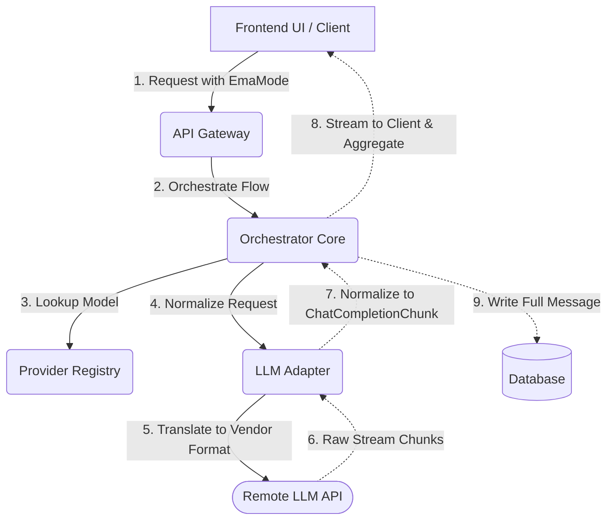

# 🧩 @ema/core-types

这是 EmaAgent 的核心类型包。这里定义了全栈共享的领域模型、接口契约和业务枚举。

## 🛑 1. 不可逾越的边界 (Architecture Boundaries)

**`core-types` 是整个 EmaAgent 的“底层宪法”。**

* **绝对禁止反向依赖**：它绝对不允许依赖任何外部业务包！（例如，绝不能 `import` 任何 `session-runtime`、`api-gateway` 或前端 UI 的内容）。
* **唯一沟通语言**：所有的前端 UI 和后端逻辑，都必须以这里的协议为唯一沟通语言。任何跨层传输的数据结构，都必须在这里有确切的类型定义。
* **零 Runtime 逻辑**：这里只允许存在 TypeScript 的 `type`、`interface`、`const enum` 和极其基础的纯函数工具（如类型判断函数 `isEmaMode`），禁止包含复杂的业务逻辑代码。

---

## 🗺️ 2. 核心领域模型地图 (Domain Map)

这里不罗列所有的接口字段，而是着重解释几个核心模块的设计意图和流转关系：

### 🎭 执行策略 (Execution Strategy)
**核心文件：`modes.ts`**

在 EmaAgent 中，`mode` 并不是 `session` 的固定配置，而是**每一轮对话 (Turn) 的执行策略**。
前端发起请求时（如 `StartTurnRequest`），会通过 `EmaMode` 决定这一轮的走向：
* **纯聊天 (`chat`)**：标准的 LLM 请求响应，最直接和快速。
* **智能体 (`agent`)**：带有复杂工具调用和自主决策的执行流。
* **叙事引擎 (`narrative`)**：带有记忆碎片、人物设定、情感状态流转等高级 Prompt 注入封装的深度执行流。

### 🧠 模型适配 (Model Adaptation)
**核心文件：`model.ts`**

为什么我们要把 `Provider`（供应商）和 `Model`（模型）解耦？
* **隔离性**：因为同一个 `Provider` (如 OpenAI) 可以提供多种能力的模型 (文本、视觉、TTS)，同一个 `Model` (如 Llama 3) 也可以由不同的 `Provider` (如 Ollama、Groq) 提供。通过 `ProviderDescriptor` 和 `ModelDescriptor` 解耦，能让 UI 面板和能力探针保持灵活性。
* **万能逃生舱 `providerOptions`**：底层协议需要归一化 (Normalize)，但不同大模型总有其独占的高级能力（例如 Claude 的 Prompt Caching 或特定厂商的 json_object 强制输出）。`providerOptions: Record<string, unknown>` 就是留给底层的“逃生舱”，允许上层通过这个字段把特定厂商需要的非标参数透传下去，兼顾了通用性与特殊性。

### 🌊 状态流转 (State Flow)
大语言模型的响应天然是流式 (Streaming) 的。我们通过统一的 `ChatCompletionChunk` 对各个大模型厂商千奇百怪的原始分块数据进行**洗线与归一化**。
在运行时（Runtime）的生命周期中：
1. 底层 Adapter 吐出干净统一的 `Chunk` 粒子。
2. 拼流器（Stream Aggregator）在内存中将 `delta.content` 和 `toolCalls` 增量源源不断地拼接组装。
3. 直到流结束（收到 `finishReason`），组装成一条完整的 `ChatCompletionMessage`。
4. 最终拿着这根完整的 Message 落盘到数据库。

---

## 📦 导出的 API 与 IO

### 核心类型
* **Models**: `ChatCompletionRequest`, `ChatCompletionChunk`, `ProviderDescriptor`, `ModelDescriptor`, `ChatCompletionMessage`
* **Enums/Types**: `EmaMode`, `ProviderCategory`, `ProviderKind`, `ModelRole`

### 数据示例 (Data Example)
```json
{
  "requestId": "req_abc123",
  "sessionId": "ses_456def",
  "modelId": "gpt-4.5-turbo",
  "messages": [
    {
      "role": "user",
      "content": "帮我规划一下核心逻辑"
    }
  ],
  "providerOptions": {
    "temperature": 0.7,
    "seed": 42
  }
}
```

---

## 📊 核心流程 (Mermaid Flow)


