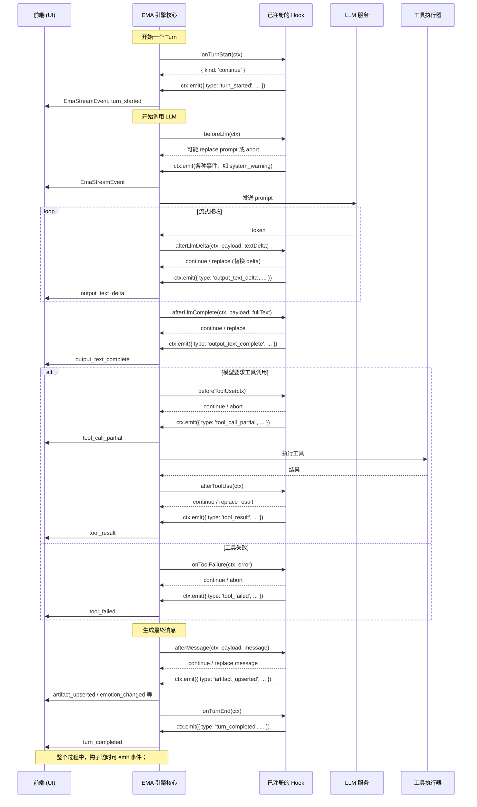

```mermaid
sequenceDiagram
    participant 前端 as 前端 (UI)
    participant 引擎 as EMA 引擎核心
    participant 钩子 as 已注册的 Hook
    participant 大模型 as LLM 服务
    participant 工具 as 工具执行器

    Note over 引擎: 开始一个 Turn
    引擎->>钩子: onTurnStart(ctx)
    钩子-->>引擎: { kind: 'continue' }
    钩子->>引擎: ctx.emit({ type: 'turn_started', ... })
    引擎->>前端: EmaStreamEvent: turn_started

    Note over 引擎: 开始调用 LLM
    引擎->>钩子: beforeLlm(ctx)
    钩子-->>引擎: 可能 replace prompt 或 abort
    钩子->>引擎: ctx.emit(各种事件，如 system_warning)
    引擎->>前端: EmaStreamEvent

    引擎->>大模型: 发送 prompt
    loop 流式接收
        大模型-->>引擎: token
        引擎->>钩子: afterLlmDelta(ctx, payload: textDelta)
        钩子-->>引擎: continue / replace (替换 delta)
        钩子->>引擎: ctx.emit({ type: 'output_text_delta', ... })
        引擎->>前端: output_text_delta
    end
    引擎->>钩子: afterLlmComplete(ctx, payload: fullText)
    钩子-->>引擎: continue / replace
    钩子->>引擎: ctx.emit({ type: 'output_text_complete', ... })
    引擎->>前端: output_text_complete

    alt 模型要求工具调用
        引擎->>钩子: beforeToolUse(ctx)
        钩子-->>引擎: continue / abort
        钩子->>引擎: ctx.emit({ type: 'tool_call_partial', ... })
        引擎->>前端: tool_call_partial
        引擎->>工具: 执行工具
        工具-->>引擎: 结果
        引擎->>钩子: afterToolUse(ctx)
        钩子-->>引擎: continue / replace result
        钩子->>引擎: ctx.emit({ type: 'tool_result', ... })
        引擎->>前端: tool_result
    else 工具失败
        引擎->>钩子: onToolFailure(ctx, error)
        钩子-->>引擎: continue / abort
        钩子->>引擎: ctx.emit({ type: 'tool_failed', ... })
        引擎->>前端: tool_failed
    end

    Note over 引擎: 生成最终消息
    引擎->>钩子: afterMessage(ctx, payload: message)
    钩子-->>引擎: continue / replace message
    钩子->>引擎: ctx.emit({ type: 'artifact_upserted', ... })
    引擎->>前端: artifact_upserted / emotion_changed 等

    引擎->>钩子: onTurnEnd(ctx)
    钩子->>引擎: ctx.emit({ type: 'turn_completed', ... })
    引擎->>前端: turn_completed

    Note over 引擎,前端: 整个过程中，钩子随时可 emit 事件；
```