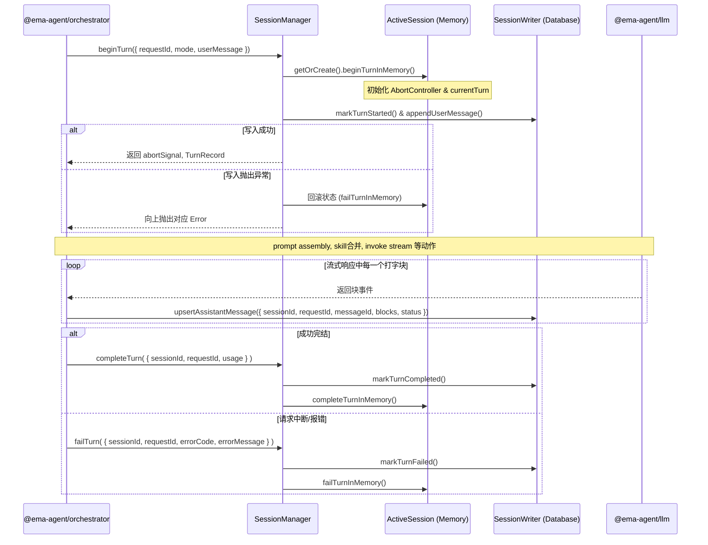

# @ema-agent/session

负责 session 生命周期、历史读取、turn 状态和活跃 session 内存态的领域核心。

明确边界：本模块**不**负责 mode 编排、skill 合并、prompt 组装、LLM 调用或 SSE 转换。这些职责分别属于 `@ema-agent/orchestrator`, `@ema-agent/tool`, `@ema-agent/llm` 等上层或远端模块。

所有公共实体协议（跨模块或被前端复用的事实源数据）皆定义于 `@ema-agent/core-types`。本包只提供操作 API 并封装独有的内存运行状态。

---

## 职责边界

### 只管

| 职责 | 对应文件 |
|---|---|
| Session 生命周期（create / load / delete / unload） | `session-manager.ts` |
| 内存中活跃 session 的轻量状态（currentTurn、abortController） | `active-session.ts` |
| 同一 session 下的 turn 并发控制锁 | `turn-lock.ts` |
| 历史消息与实体数据的只读分页查询 | `session-reader.ts` |
| 消息与 turn 状态的落盘（数据库写入映射） | `session-writer.ts` |

### 不管（这些属于其他包）

| 职责 | 归属 |
|---|---|
| skill 合并与解析 | `@ema-agent/tool` |
| system prompt 与 RAG 上下文拼装 | `@ema-agent/orchestrator` |
| Agent 思考与执行的 loop 编排 | `@ema-agent/orchestrator` |
| LLM API 网络请求详情 | `@ema-agent/llm` |
| 打字机 SSE 转换为 Block 格式 | `@ema-agent/orchestrator` 内部 |

---

## 目录结构

第一版极简主义结构：

```text
packages/session/src/
  index.ts              # 模块导出入口
  session-manager.ts    # 业务外观: 提供 beginTurn 等动作组合内存态与数据库
  active-session.ts     # ActiveSession: 仅限内存态（currentTurn、Aborts），不碰 DB
  turn-lock.ts          # turn 并发锁：保证同一 session 同时最多一个 running turn
  session-reader.ts     # SessionReader: 只读查询聚合查询
  session-writer.ts     # SessionWriter: 仅纯 DB 写入，含 fallback title（纯函数）
```

---

## 核心实现笔记

1. **组合而非上帝类 (Facade over Gods)**：
   `ActiveSession` 是纯内存状态机，**不会注入 SQLite 存储**。`SessionWriter` 是纯 DB 映射写手，不管内存。`SessionManager` 提供如 `beginTurn()` 这样面向上层的统一方法，利用 `try...catch` 实现内存对持久化失败的级联回滚。这样既不让调用方繁琐，也不让某一个类越界成为上帝类。

2. **按需加载 (Lazy Allocation)**：
   仅在用户打开具体 Session、订阅其运行状态，或向该 Session 发起 Turn 时，才实例化 `ActiveSession` 并放进 `activeSessions` 映射。此内存储备专用来抵挡高并发请求及其打断，并防范产生脏的 SQLite 数据。长时间闲置即触发 `unloadSession()` 被 GC 垃圾回收。

3. **Title 计算与状态**：
   目前的 Fallback title（取首句、是否该写 Title 的规则特征判断）作为普通的纯函数存在于 `session-writer.ts` 或 `manager` 内。等以后接入更复杂的模型提取或重试机制时再去单独拆分专用服务。

4. **绝不放纵内存态进协议包**：
   `AbortController` 是 Javascript 引擎层的异步中断对象，`currentTurn` 表示内存流转的临时断点。因为其无法被 JSON 序列化为跨进程信息，绝对禁止将此类非真实存储特质的内容定义引入共用的 `@ema-agent/core-types`。它仅属于本包内部私域机制。

---

## 核心流转图

上层模块无需再零碎地拼装状态机制，直接统一呼叫 `SessionManager`：



---

## 导出的核心 API (Orchestrator 视角)

提供给外部模块的接口遵循严谨的聚合设计：

```typescript
export interface BeginTurnInput {
  sessionId: SessionId
  requestId: RequestId
  mode: EmaMode
  userMessage: ChatMessage
  lockStrategy?: "reject" | "abort-previous"
}

export interface BeginTurnResult {
  turn: TurnRecord
  abortSignal: AbortSignal
}

export interface CompleteTurnInput {
  sessionId: SessionId
  requestId: RequestId
  usage?: UsageView
}

export interface FailTurnInput {
  sessionId: SessionId
  requestId: RequestId
  errorCode: string
  errorMessage?: string
}

export class SessionManager {
  constructor(storage: SqliteStorage)

  beginTurn(input: BeginTurnInput): Promise<BeginTurnResult>
  completeTurn(input: CompleteTurnInput): Promise<void>
  failTurn(input: FailTurnInput): Promise<void>
  abortTurn(sessionId: SessionId): void
  unloadSession(sessionId: SessionId): void
}
```

**使用代码样例：**

```typescript
import { createSqliteStorage } from "@ema-agent/storage-sql";
import { SessionManager, SessionReader } from "@ema-agent/session";

const storage = createSqliteStorage("...");
const manager = new SessionManager(storage);
// 读取器亦可直接提供给前台展示聚合页面使用
const reader = new SessionReader(storage); 

// --- 例如：在外部路由入口的调用 ---
async function handleUserChat(req) {
    // 保证 requestId 由服务端安全生成可溯源
    const requestId = createRequestId();
    
    // 1. 自动执行锁保护、内存建立、落盘记录与消息回存
    const { turn, abortSignal } = await manager.beginTurn({
        sessionId: req.sessionId,
        requestId,
        mode: req.mode,
        userMessage: req.msg,
        lockStrategy: "abort-previous" // 打断该 session 当前正在运行的 turn
    });

    try {
        // 2. 将安全打点发给大模型调度器
        const res = await runOrchestratorLLMStream({ ...turn, abortSignal });
        
        // 3. 正常结束封账
        await manager.completeTurn({ 
            sessionId: req.sessionId, 
            requestId, 
            usage: res.usage 
        });
    } catch(err) {
        // 4. 用户手动打断或网络崩溃的统一善后机制
        await manager.failTurn({ 
            sessionId: req.sessionId, 
            requestId, 
            errorCode: "llm_stream_failed",
            errorMessage: String(err instanceof Error ? err.message : err)
        });
    }
}
```
