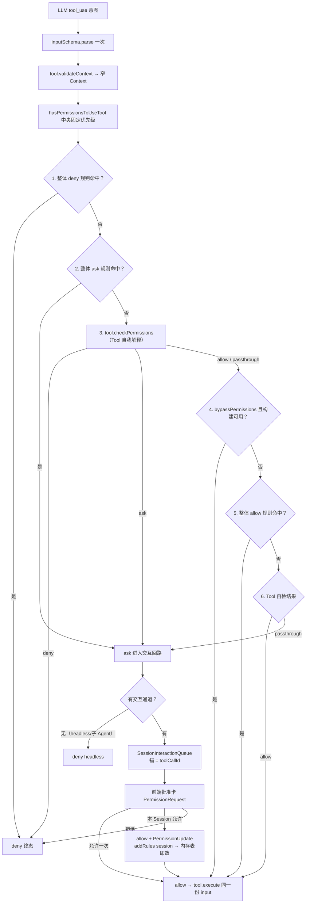

# Permission

`src/permission` 是 Ema 的权限判定域：一张**中央固定优先级表** + 各 Tool 的**自我解释权**（`checkPermissions`）+ 规则的配置沉淀（`PermissionUpdate`）。中央永远不知道"这条命令危不危险"——它只知道规则命中顺序和模式语义；具体输入（命令、路径、URL）由 Tool 自己解释。

## 为什么这么设计

- **中央靠抽象字段（riskLevel/accessType/targets）猜所有 Tool 语义已被判死** 每个 Tool 自己最懂自己的输入：Bash 拆命令、文件 Tool 解路径、WebFetch 解域名。中央只保留不可破坏的判定顺序。
- **规则是原始字符串**（`'Tool'` 或 `'Tool(content)'`），context 里按 source 分桶存放，**解析推迟到各 Tool 家族 match 时**——中央因此永远不需要懂 ruleContent 的语义。
- **"本 Session 允许"不是特殊决策**：一次 `allow` 附带一条 session destination 规则（内存表，本 Turn 即效，进程退出即消失）。没有指纹机、没有 SessionGrantStore。
- **Permission 永不修改 Tool 输入**（无 updatedInput）；Permission/Sandbox 物理分层（批准 ≠ 已隔离）。

## 主流程



## Tool 契约

每个 Tool 把权限意图从"声明抽象字段"改为"自我解释"：

```ts
// 取代旧 getPermissionIntent。执行链在 validateContext 之后、execute 之前调用。
checkPermissions(
  input: TInput,
  context: TContext,                      // validateContext 投影出的窄 Context（宿主能力）
  permissionContext: ToolPermissionContext, // 模式 + 冻结规则桶
): Promise<PermissionResult>;
```

`ToolPermissionContext`：

```ts
interface ToolPermissionContext {
  mode: PermissionMode;                     // 'default' | 'acceptEdits' | 'bypassPermissions'
  alwaysAllowRules: ToolPermissionRulesBySource;  // 原始规则字符串桶
  alwaysDenyRules: ToolPermissionRulesBySource;
  alwaysAskRules: ToolPermissionRulesBySource;
  isBypassPermissionsModeAvailable: boolean;
  workspaceRoot?: string;
}
// ToolPermissionRulesBySource = Partial<Record<'userSettings'|'projectSettings'|'session', readonly string[]>>
// source 优先级：session > projectSettings > userSettings（具体先生效）
// 调用身份（sessionId/turnId/toolCallId）不在这里——Tool 自检不需要；
// 批准卡身份由执行链装配进 PermissionRequest。
```

`PermissionResult` 四种返回：

| 返回 | 语义 | 何时用 |
|---|---|---|
| `{ behavior: 'allow', decisionReason? }` | Tool 自己放行（如：工作区内读取、规则命中 allow） | 自检确认安全 |
| `{ behavior: 'deny', message, decisionReason? }` | Tool 自己拒绝 | 危险输入（AST 硬拦、敏感路径） |
| `{ behavior: 'ask', message, decisionReason?, ruleSuggestion? }` | 需要用户确认（**先于 bypass 生效**）。`ruleSuggestion` 是"本 Session 允许"要沉淀的规则（只有 Tool 知道同类输入的边界）；缺省时卡片只给允许一次/拒绝 | 写操作、命中 ask 规则、必须交互 |
| `{ behavior: 'passthrough', message }` | Tool 没有允许/拒绝的理由，交中央收口 | MCP、无特殊语义的 Tool |

`decisionReason` 窄联合：`rule / mode / workingDir / safetyCheck / user / headless / other`。

## 可用的匹配器（rules/，直接用，不要自己重写）

| 函数 | 用途 |
|---|---|
| `permissionRuleValueFromString / ToString` | `'Bash(npm:*)'` ↔ `{toolName, ruleContent}` |
| `matchesWholeTool(ruleValue, toolName)` | 整体 Tool 规则判定（ruleContent 空 + 同名） |
| `matchShellRule(ruleContent, command)` | shell 命令 × 规则（exact / `npm:*` 前缀 / wildcard） |
| `matchWildcardPattern(pattern, command)` | wildcard 底层（`git *` 兼容裸 `git`） |
| `matchPathRule(ruleContent, candidatePath, workspaceRoot?)` | 路径 × gitignore 规则（`'./src/**'`、`'//abs/path/**'`） |

内容级规则匹配的标准姿势：从桶里取 `alwaysAllowRules` 等原始字符串 → `permissionRuleValueFromString` 解析出 `ruleContent` → 喂对应家族的 matcher。

## 各 Tool 的 checkPermissions 分布

| Tool | checkPermissions 内容 |
|---|---|
| Bash / PowerShellTool | 用户自研安全分析（AST/命令拆解，**用户本人正在写**）+ `matchShellRule` 内容规则匹配 |
| FileRead / FileEdit / FileWrite | `paths/` 语料 + `matchPathRule`；检查顺序照抄 Claude filesystem.ts：危险路径 → read 专属 deny → read 专属 ask → edit 蕴含 read → 工作区读 allow（default）/ 工作区写（acceptEdits）→ 内部路径 → allow 规则 → 默认 ask |
| WebFetch | 域名规则匹配（URL host × 规则） |
| MCP Tool | `passthrough`；自报 annotations 只能升风险（`readOnlyHint` 只进 UI，`destructiveHint` 可升 ask，不可降） |
| AskUser | 固定 `ask`（必须交互） |
| Task / Skill / Subagent / 其余 | `passthrough`（由整体规则或模式收口） |

acceptEdits 模式语义归文件 Tool（"工作区内写入放行"）；default/bypassPermissions 归中央。

## 规则存储与生命周期

- **settings KV 六个 key**：`permission.rules.user.{allow,deny,ask}`（`string[]`）、`permission.rules.project.{allow,deny,ask}`（`Record<projectId, string[]>`）；`apply: 'nextTurn'`（settings 源次 Turn 冻结生效）。
- **session 规则**：`rules/update.ts` 的内存 per-session 表（本 Turn 即效，不落盘）。
- `applyPermissionUpdate(store, update, {sessionId, projectId?})`：addRules/removeRules/setMode 的唯一写入点。
- 项目删除 → `purgeProjectRules(store, projectId)`；开机 → `reconcileProjectRules(store, existingProjectIds)`（崩溃收敛，装配层注入项目列表）。
- `loadPermissionRuleBuckets(store, sessionId, projectId?)`：Turn 准备时装配三桶（settings 源冻结 + session 并入 allow 桶）。

## 文件结构

```text
src/permission/
├─ types.ts                    词汇：Behavior/Mode/Source/Rule/Update/Result/DecisionReason/ToolPermissionContext/PermissionRequest
├─ hasPermissionsToUseTool.ts  中央固定优先级（外层无通道 ask→deny）
├─ rules/
│  ├─ permissionRuleParser.ts  规则字符串 ↔ 结构 + 整体匹配
│  ├─ shellRuleMatching.ts     shell 三形态匹配
│  ├─ pathRuleMatching.ts      路径 gitignore 匹配（POSIX 盘符归一）
│  ├─ loader.ts                settings 读出装配桶 + reconcileProjectRules
│  └─ update.ts                PermissionUpdate 应用 + session 内存表 + purgeProjectRules
├─ settings.ts                 7 个 settings key（mode/rules×6/askTimeoutMs，全带 describe）
├─ events.ts                   permission_required/resolved（PermissionRequest + toolCallId）
├─ paths/                      pathSafety/workspaceBoundary/platformPaths/internalPaths（文件 Tool 语料）
└─ tests/                      六组测试（parser/shell/path/update/loader/central，29 条）
```
