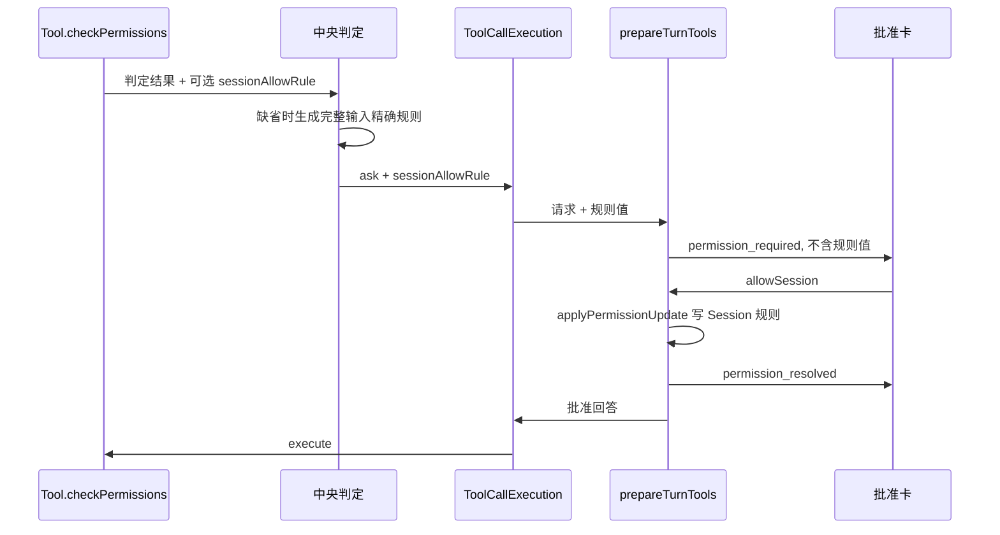

# Permission

`@ema-agent/permission` 负责权限规则、中央判定和规则存储. Tool 通过现有 `checkPermissions` 解释文件、命令或网络操作; 中央管理判定顺序, 不推断这些操作的语义.

## 一次批准怎样执行

工具调用先完成输入解析、Context 投影和输入校验, 再进入权限检查. Tool 可以在非拒绝结果中携带 `sessionAllowRule`, 表示本次操作可批准的具体范围. 缺省时中央按已校验的完整输入生成精确规则.

最终 `ask` 决策保证带有这条规则. 执行链把规则值交给后端批准通道, 不把规则或生成回调送到前端. 前端始终显示本会话允许, 只提交 `allow`、`allowSession` 或 `deny`.

```mermaid
sequenceDiagram
    participant Tool as Tool.checkPermissions
    participant Permission as 中央判定
    participant Execution as ToolCallExecution
    participant Turn as prepareTurnTools
    participant UI as 批准卡
    Tool->>Permission: 判定结果 + 可选 sessionAllowRule
    Permission->>Permission: 缺省时生成完整输入精确规则
    Permission->>Execution: ask + sessionAllowRule
    Execution->>Turn: 请求 + 规则值
    Turn->>UI: permission_required, 不含规则值
    UI->>Turn: allowSession
    Turn->>Turn: applyPermissionUpdate 写 Session 规则
    Turn->>UI: permission_resolved
    Turn->>Execution: 批准回答
    Execution->>Tool: execute
```

仅本次允许不保存规则; 拒绝、超时和未回答即取消也不保存. 会话批准先保存, 再发布 resolved 和继续执行. 保存后仍遵守执行取消信号, 不重新启动已取消的调用.

## 判定顺序

1. 整个工具的配置 deny 优先.
2. Tool 检查内容级 deny. 显式拒绝不被会话批准或模式覆盖.
3. 已命中的 Session 内容批准放行. 专门范围由工具家族匹配; 缺省完整输入范围由中央精确匹配.
4. 未命中会话批准时, 检查整个工具的配置 ask 和 Tool 的 ask.
5. bypassPermissions 放行剩余非询问调用.
6. 检查整个工具的配置 allow, 最后使用 Tool 的 allow 或把 passthrough 转成 ask.
7. 无交互通道时, 最终 ask 转成 deny(headless).

Session 批准覆盖同一范围的重复询问, 包括整个工具的配置 ask 和敏感路径确认; 不把原本需要批准的操作改成新的硬拒绝. 用户和项目的普通 allow 配置仍不跳过 ask.

权限批准不修改输入, 也不等于 OS 沙箱隔离. 输入本身的校验、实际执行限制和沙箱策略仍在各自模块处理.

## Tool 返回结果

`Tool.checkPermissions(input, context, permissionContext)` 使用现有 `PermissionResult`:

| behavior | 含义 |
|---|---|
| allow | 工具确认可执行, 如工作区读取或匹配内容规则 |
| deny | 明确拒绝, 不进入批准交互 |
| ask | 需要用户批准, 未命中 Session 批准时先于 bypass |
| passthrough | 交给中央配置与模式判断, 无放行理由时询问 |

非 deny 结果可以携带 `sessionAllowRule`. 即使当前结果是 allow, 中央也可能因配置 ask 而询问, 因此工具应在这些结果中保留专门范围. 最终 `PermissionAskDecision.sessionAllowRule` 必填.

`SessionAllowRule` 复用 `PermissionRuleValue`, 只把 `ruleContent` 约束为必填. Session 的新增规则仅支持带内容的 allow; 用户和项目配置仍支持整个工具规则.

## 批准范围与匹配

| 工具 | 本会话允许保存的范围 |
|---|---|
| Read / Edit / Write / PdfRead | `file:绝对路径`, 仅当前工具的当前文件 |
| Glob | `directory:绝对路径`, 当前搜索目录及子目录 |
| Grep | 实际目标是文件则 file, 是目录则 directory |
| Bash / PowerShell | 转义后的完整命令, 不自动扩大成前缀或通配符 |
| WebFetch | `domain:hostname`, 不含协议、端口和网页路径 |
| WebSearch | `search:` 加搜索词及允许/排除域名列表 |
| 无专门范围的工具, 包括 MCP | `input:` 加已校验完整输入的确定性 JSON |

文件规则不扩大到父目录, 也不隐式批准其他文件工具. Read 行号和长度、Edit 替换内容不参与文件范围; Shell 超时和后台参数不参与命令范围. 搜索过滤模式不把目录批准转换成任意其他目录的批准.

Grep 的 UNC 路径在批准前不查询目标类型, 使用完整输入精确规则. 共享路径权限检查也不对网络路径做 exists、stat 或 realpath, 避免在用户回答前访问网络.

WebFetch 精确匹配 hostname, 同主机的不同协议、端口、路径可以复用, 其他域名和子域名不能. WebSearch 去除搜索词首尾空格, 域名小写、去重、排序, 缺省列表按空列表处理. 不判断搜索词语义相似, 不把搜索结果当成 WebFetch 批准.

默认精确输入只忽略对象键顺序, 递归保留参数值和数组顺序. 工具名和完整输入共同匹配, 不猜 path、URL 或 command 字段. 专门范围仍使用对应家族 matcher, 不能统一改成字符串相等.

可复用的规则函数位于 `rules/`: `permissionRuleValueFromString/ToString` 负责字符串序列化, `matchPathRule` 负责具体文件、目录和路径模式, `matchShellRule` 负责完整命令、已有前缀及通配规则. 配置规则不会因为本次批准而自动扩大.

## Session 与配置生命周期

`applyPermissionUpdate(store, update, { sessionId, projectId? })` 是规则更新入口. Session 规则存入 `rules/update.ts` 的进程内 Map, 序列化为 `Tool(content)` 后去重. 不使用 LRU、额外指纹或数据库表.

`loadPermissionRuleBuckets` 冻结本 Turn 的用户/项目配置, Session allow 桶通过 getter 读取当前内存规则. 已创建的根执行器和子执行器立即看到新批准, 后续 Turn 继续复用; 不同 Session 隔离. Turn 完成、中断、Goal 续接和 Compact 不清除批准; Session 删除时释放, 进程退出后不恢复.

用户配置使用 `permission.rules.user.{allow,deny,ask}`, 项目配置使用 `permission.rules.project.{allow,deny,ask}`. 设置修改在下一根 Turn 生效, 不把会话批准写入永久配置. Session 模式保存在 `sessions.permission_mode`, 在 Turn 准备时读取.

`workspaceRoots` 从当前项目文件夹确定; 无项目或空项目使用 Session cwd. cwd 用于相对路径解析, 不自动扩大工作区批准.

## 交互队列与模式

批准请求与已保存规则是两种状态. 根 Agent 和前后台子代理的 Permission/AskUser 共用所属 Session 的 FIFO. 队列为空时释放等待状态, 不清除 Session 批准.

请求以 toolCallId 定位, 携带 sessionId/turnId; 子请求额外成对携带 subagentId/runId. required/resolved 通过 Session 出口交付, 不依赖父 Turn 存活. 根收尾只取消自己的等待, 子执行收尾按 runId 取消, 删除 Session 取消所属等待.

default 和 bypassPermissions 由中央判断; acceptEdits 的工作区写入语义由路径工具判断. plan 在 Turn 准备时收窄只读 ToolPool, 模型定义和执行查找共用这个池. 批准规则不能把 Shell、写入、Subagent、AskUser 或 MCP 加回 Plan 池. 菜单切换模式只影响下一根 Turn.

## 验证入口

中央判定、序列化和 Session 存储在本模块 tests 中验证. 具体工具范围在 builtin-tools 的 sessionAllowRules、shellPermissions 和 Web 测试中验证. ToolCallExecution 检查规则传递, prepareTurnTools 测试真实批准队列以及当前 Turn、子代理和后续 Turn 的共享. MCP 适配和聊天/桌宠按钮分别有各自的运行测试.
