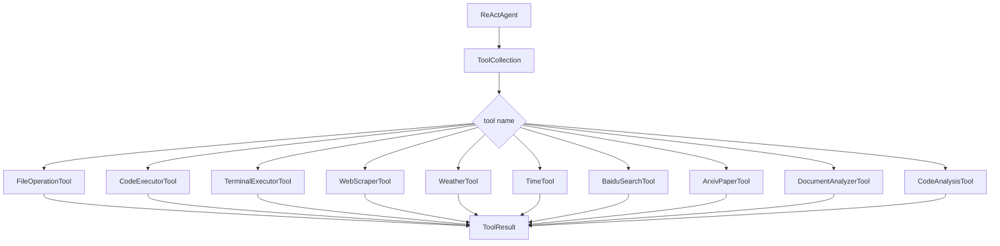
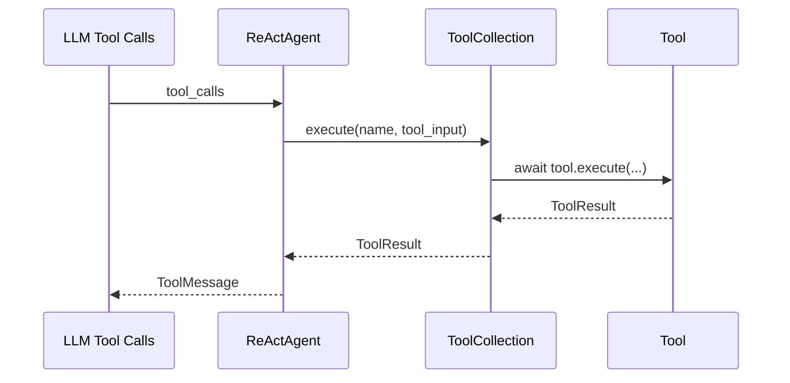

# tools 模块

`tools/` 是 Agent 的外部能力层，把文件、终端、代码、搜索、网页与分析能力统一抽象为可调度工具

---

## 架构图

---

## 分层设计

| 层级 | 文件 | 说明 |
|---|---|---|
| 抽象层 | `base.py` | `BaseTool` `ToolResult` 统一输入输出协议 |
| 调度层 | `tool_collection.py` | 多工具注册 路由执行 错误包装 |
| 错误层 | `tool_error.py` | 工具统一异常模型 |
| 能力层 | `builtin/` `search/` `file_analysis/` | 具体工具实现 |

---

## 主要工具

| 工具 | 文件 | 核心能力 |
|---|---|---|
| `file_operations` | `builtin/file_ops.py` | 文件读写 删除 列表 目录感知 |
| `execute_code` | `builtin/code_exec.py` | Python 代码执行 安全拦截 |
| `run_terminal` | `builtin/terminal_exec.py` | 终端命令执行 超时与危险命令控制 |
| `read_webpage` | `webscraper.py` | 网页正文抓取与清洗 |
| `get_weather` | `builtin/weather.py` | 天气查询 |
| `get_current_time` | `time.py` | 时间与日期信息 |
| `baidu_search` | `search/baidusearch.py` | 百度搜索 |
| `arxiv_paper` | `search/arxiv_paper.py` | arXiv 论文检索与详情读取 |
| `analyze_document` | `file_analysis/DocumentAnalyzer.py` | PDF Word PPT CSV Excel 分析 |
| `analyze_code` | `file_analysis/CodeAnalyzer.py` | 代码结构与复杂度分析 |

---

## 与 Agent 的调用关系

---

## 新增工具指南

1. 继承 `BaseTool`
2. 定义 `name` `description` `parameters`
3. 实现异步 `execute(...) -> ToolResult`
4. 在 `agent/react.py` 的 `ToolCollection(...)` 注册

---

## 安全建议

- 终端与代码执行工具仍需在受控环境使用
- 对外开放时建议增加命令白名单和目录沙箱
- 避免把高权限系统目录暴露给工具调用

